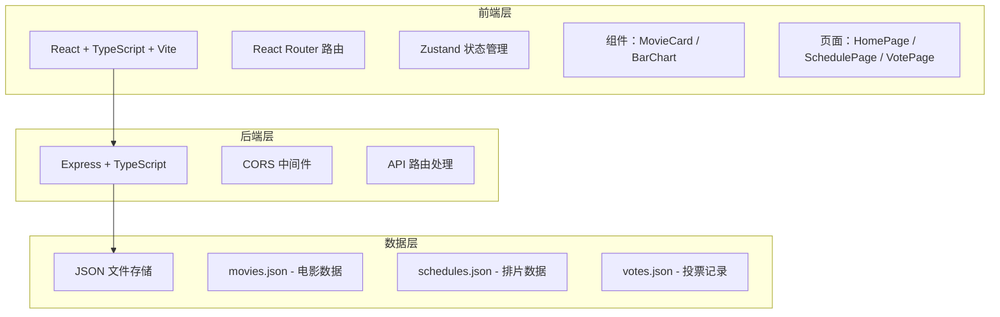
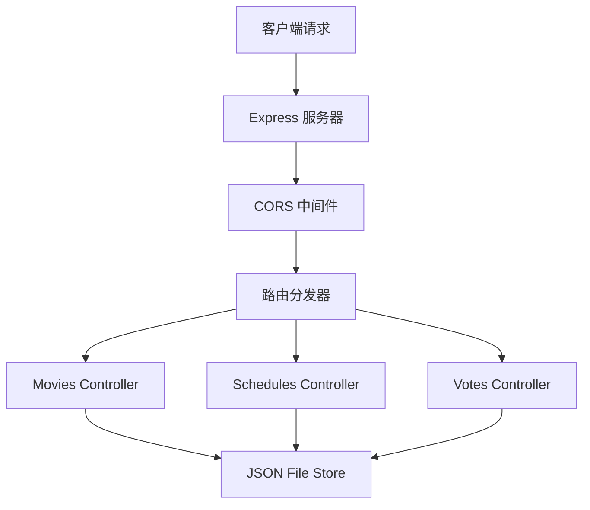
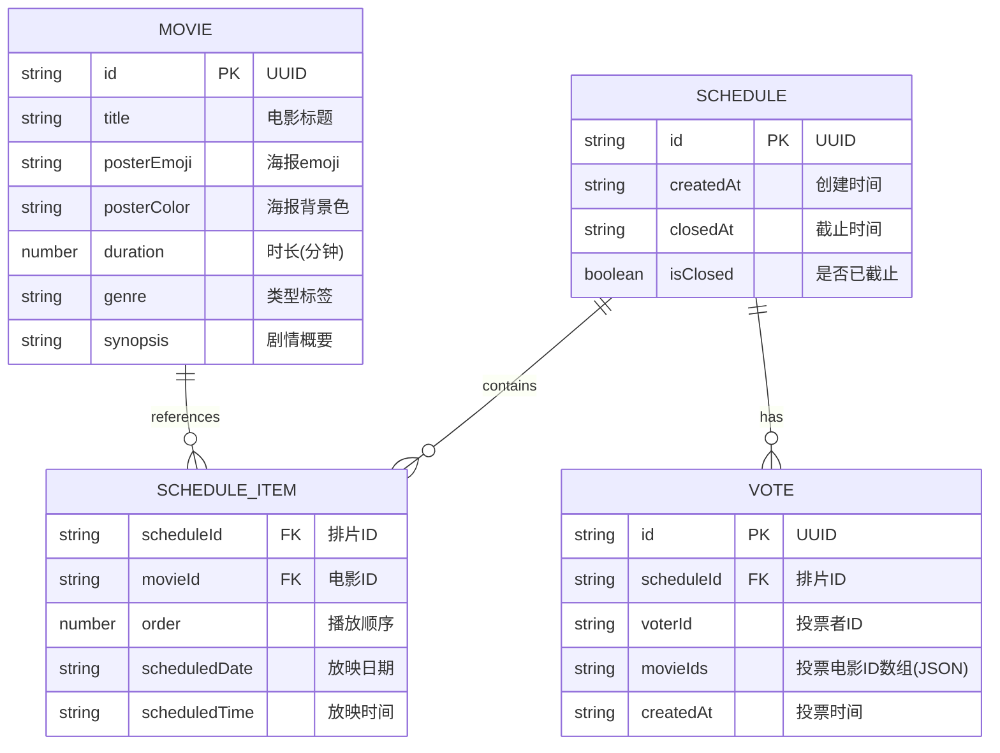

## 1. 架构设计



## 2. 技术说明

- **前端**：React 18 + TypeScript + Vite + React Router DOM + Zustand
- **后端**：Express 4 + TypeScript + CORS
- **数据存储**：JSON 文件（movies.json, schedules.json, votes.json）
- **工具库**：uuid（唯一ID生成）
- **构建工具**：Vite 配置 React 插件

## 3. 路由定义

| 前端路由 | 页面 | 用途 |
|----------|------|------|
| / | HomePage | 首页，浏览电影和排片预览 |
| /schedule/:id | SchedulePage | 排片页面，管理排片和查看结果 |
| /vote/:id | VotePage | 投票页面，好友投票 |

| 后端API | 方法 | 用途 |
|---------|------|------|
| /api/movies | GET | 获取所有电影列表 |
| /api/schedules | POST | 创建新排片 |
| /api/schedules/:id | GET | 获取指定排片信息 |
| /api/schedules/:id | PUT | 更新排片信息 |
| /api/schedules/:id/close | POST | 截止投票 |
| /api/votes/:scheduleId | GET | 获取指定排片的投票记录 |
| /api/votes/:scheduleId | POST | 提交投票 |

## 4. API 定义

### 类型定义

```typescript
type MovieGenre = '动作' | '喜剧' | '科幻' | '悬疑' | '动画';

interface Movie {
  id: string;
  title: string;
  posterEmoji: string;
  posterColor: string;
  duration: number;
  genre: MovieGenre;
  synopsis: string;
}

interface ScheduleItem {
  movieId: string;
  order: number;
  scheduledDate?: string;
  scheduledTime?: string;
}

interface Schedule {
  id: string;
  items: ScheduleItem[];
  createdAt: string;
  closedAt?: string;
  isClosed: boolean;
}

interface Vote {
  id: string;
  scheduleId: string;
  voterId: string;
  movieIds: string[];
  createdAt: string;
}

interface VoteResult {
  movieId: string;
  count: number;
}
```

## 5. 服务器架构图



## 6. 数据模型

### 6.1 数据模型定义



### 6.2 初始数据

电影库包含至少20部预设电影，涵盖动作、喜剧、科幻、悬疑、动画五种类型，每部电影时长90-180分钟，使用UUID标识。

