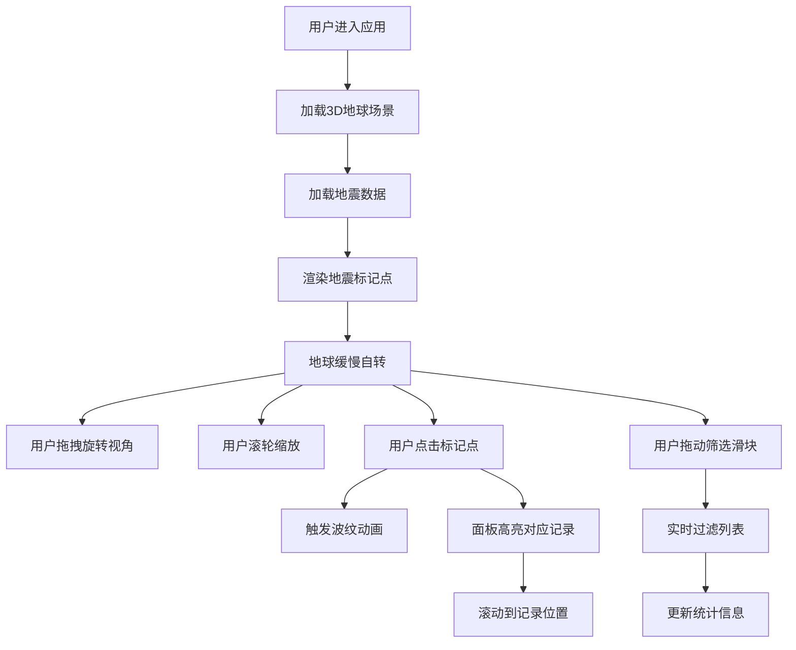

## 1. 产品概述

全球3D地震可视化应用，基于地震台网实时数据展示最近7天内全球地震事件的位置、震级、深度和发生时间。通过动态波纹和颜色编码直观呈现地震强度分布，帮助用户快速了解全球地震活动态势。

- 主要目的：以三维可视化方式展示全球地震数据，提供直观的地震活动监测体验
- 目标用户：地震研究人员、教育工作者、灾害预警相关从业者及对地震活动感兴趣的公众
- 产品价值：将抽象的地震数据转化为直观的3D视觉呈现，提升数据理解效率和用户体验

## 2. 核心功能

### 2.1 用户角色

| 角色 | 注册方式 | 核心权限 |
|------|----------|----------|
| 普通用户 | 无需注册 | 浏览3D地球场景、查看地震列表、使用筛选功能、点击查看详情 |

### 2.2 功能模块

1. **3D地球场景**：可旋转缩放的3D地球模型，展示地震标记点和波纹动画
2. **地震标记系统**：根据震级用不同颜色和大小的球体标记地震位置
3. **波纹动画效果**：点击标记点时触发动态波纹动画，直观展示地震影响范围
4. **地震列表面板**：右侧展示地震详细信息列表，支持交互联动
5. **震级筛选功能**：通过滑块实时筛选震级大于等于指定值的地震记录
6. **统计信息展示**：底部展示当前筛选后的地震总数、最大震级和平均深度

### 2.3 页面详情

| 页面名称 | 模块名称 | 功能描述 |
|----------|----------|----------|
| 主页面 | 3D地球场景 | 渲染可交互的3D地球，支持鼠标拖拽旋转、滚轮缩放，自动缓慢自转 |
| 主页面 | 地震标记点 | 根据经纬度在地球表面放置标记点，颜色和大小随震级变化，始终面向相机 |
| 主页面 | 波纹动画 | 点击标记点发射半透明环形波纹，半径扩大同时透明度衰减 |
| 主页面 | 控制面板 | 右侧320px宽度面板，显示地震列表和筛选滑块 |
| 主页面 | 统计信息栏 | 页面底部居中展示筛选统计数据，每秒更新并带淡入动画 |

## 3. 核心流程

用户进入应用后，3D地球自动加载并缓慢自转，地震标记点按经纬度分布在地球表面。用户可通过鼠标拖拽旋转视角、滚轮缩放查看不同区域。点击任意标记点触发波纹动画，同时右侧面板高亮对应记录并滚动定位。用户可拖动顶部筛选滑块实时过滤地震列表，底部统计信息同步更新。

## 4. 用户界面设计

### 4.1 设计风格

- **主色调**：深蓝色暗色主题，背景色 `#0a0e27`，营造科技感和沉浸式体验
- **强调色**：地震等级颜色编码 - 红色 `#ff4444`（≥6级）、橙色 `#ff8833`（4-6级）、黄色 `#ffdd55`（<4级）
- **面板样式**：右侧控制面板背景 `#0a1628`，圆角12px，内边距20px
- **字体**：使用现代无衬线字体，保证数字和文字清晰可读
- **动效**：所有交互元素带有0.2-0.3秒平滑过渡动画，波纹动画使用requestAnimationFrame驱动

### 4.2 页面设计概述

| 页面名称 | 模块名称 | UI元素 |
|----------|----------|--------|
| 主页面 | 3D场景区域 | 左侧70%宽度，蓝色半透明地球 `#1a5276` 带经纬网线，相机距离8-20单位，X轴旋转限制±60度 |
| 主页面 | 地震标记点 | Sprite方案，始终面向相机，半径随震级0.1-0.2单位 |
| 主页面 | 波纹动画 | 半透明环形，半径0.5→2单位，透明度0.8→0，持续1.5秒 |
| 主页面 | 控制面板 | 右侧30%宽度，地震列表项高48px，浅分隔线，悬浮背景 `#1a2a4a` |
| 主页面 | 筛选滑块 | 范围3.0-8.0，步长0.1，轨道240×6px圆角3px背景 `#2a3a5a`，按钮直径20px圆形 `#ff8833` |
| 主页面 | 统计信息栏 | 底部居中，字体14px颜色 `#8899aa`，透明度淡入动画0.5→1过渡0.3s |

### 4.3 响应性

- 桌面端优先设计，3D场景自适应左侧70%区域
- 控制面板固定宽度320px，在小屏幕上可考虑垂直布局
- 鼠标交互优化：左键拖拽旋转、滚轮缩放、点击选中
- 性能优化：3D帧率稳定30FPS以上，波纹动画无卡顿，列表渲染<50ms

### 4.4 3D场景指导

- **环境与氛围**：深蓝色星空背景，营造宇宙空间感，地球使用半透明蓝色材质
- **光照设置**：环境光 + 方向光组合，确保地球表面和标记点清晰可见
- **相机设置**：PerspectiveCamera，初始距离12单位，fov 60度，支持轨道控制
- **构图与焦点**：地球居中，标记点作为视觉焦点，波纹动画强化点击反馈
- **交互与动画**：地球Y轴自转0.01弧度/秒，用户交互时暂停或减速
- **后期处理**：适度抗锯齿，保证视觉质量同时控制性能开销
- **资源来源**：使用程序化生成的地球纹理和经纬网格，无需外部贴图资源
