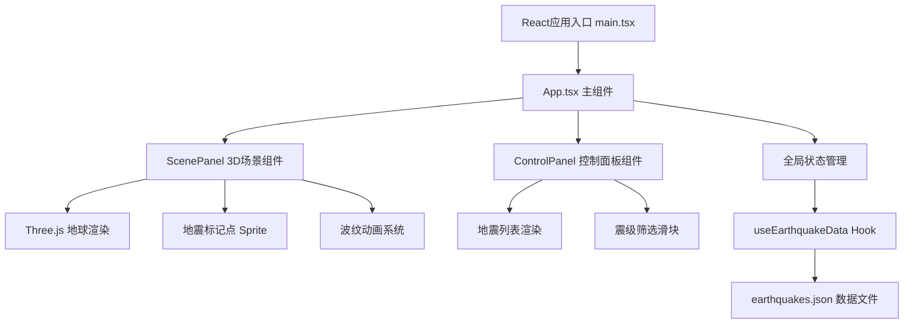
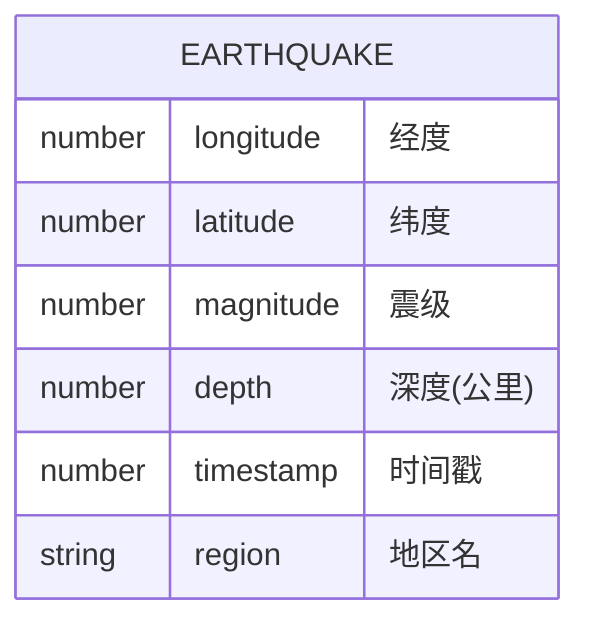

## 1. 架构设计



## 2. 技术描述

- **前端框架**：React 18 + TypeScript
- **构建工具**：Vite 5
- **3D引擎**：Three.js + @react-three/fiber + @react-three/drei
- **状态管理**：React useState/useEffect 局部状态管理
- **样式方案**：原生CSS + CSS变量，不使用Tailwind（按用户需求）
- **数据来源**：静态JSON文件模拟地震数据，20条记录

**核心依赖版本**：
- react: ^18.2.0
- react-dom: ^18.2.0
- three: ^0.160.0
- @react-three/fiber: ^8.15.0
- @react-three/drei: ^9.92.0
- typescript: ^5.3.0
- vite: ^5.0.0
- @vitejs/plugin-react: ^4.2.0

## 3. 路由定义

| 路由 | 用途 |
|------|------|
| / | 主页面，包含3D地球场景和控制面板 |

本应用为单页面应用，无需多路由配置。

## 4. 数据模型

### 4.1 数据模型定义



### 4.2 TypeScript 类型定义

```typescript
interface Earthquake {
  longitude: number;
  latitude: number;
  magnitude: number;
  depth: number;
  timestamp: number;
  region: string;
}

interface RippleAnimation {
  id: string;
  longitude: number;
  latitude: number;
  startTime: number;
  duration: number;
}

interface AppState {
  earthquakes: Earthquake[];
  filteredEarthquakes: Earthquake[];
  selectedEarthquake: Earthquake | null;
  minMagnitude: number;
  ripples: RippleAnimation[];
}
```

### 4.3 数据文件结构

`src/data/earthquakes.json` 包含20条模拟地震记录，每条包含：
- `longitude`: 经度（-180 到 180）
- `latitude`: 纬度（-90 到 90）
- `magnitude`: 震级（3.0 到 8.0）
- `depth`: 深度（0 到 700公里）
- `timestamp`: Unix时间戳（最近7天内）
- `region`: 地区名称字符串

## 5. 核心模块说明

### 5.1 useEarthquakeData Hook

- 负责异步加载 `earthquakes.json` 数据
- 按时间戳降序排序返回地震数组
- 处理加载状态和错误处理

### 5.2 ScenePanel 组件

- 使用 `@react-three/fiber` 创建3D场景
- 渲染半径5单位的蓝色半透明地球，带经纬网格
- 实现地球Y轴自转动画（0.01弧度/秒）
- 使用 `OrbitControls` 实现相机控制（X轴±60度限制，距离8-20单位）
- 为每条地震数据创建Sprite标记点，颜色和大小随震级变化
- 管理波纹动画状态，使用requestAnimationFrame驱动
- 处理标记点点击事件，触发波纹和面板联动

### 5.3 ControlPanel 组件

- 渲染地震列表，每条记录高48px
- 格式化时间显示（MM-DD HH:mm）
- 震级颜色编码显示（红/橙/黄）
- 实现震级筛选滑块（3.0-8.0，步长0.1）
- 列表项点击与3D场景联动
- 支持虚拟列表优化性能

### 5.4 App 组件

- 管理全局状态：地震数据、筛选条件、选中项、波纹动画
- 组合ScenePanel和ControlPanel
- 计算并展示底部统计信息
- 每秒更新统计数据，带淡入动画
