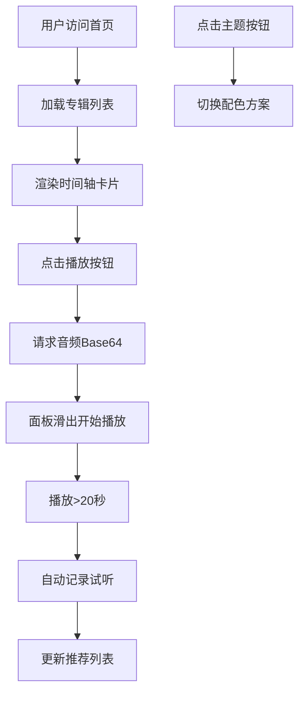

## 1. 产品概述

本项目为海外独立音乐人打造交互式作品集网站，通过时间轴形式展示专辑发行历史，支持实时试听和个性化推荐，帮助粉丝深度探索音乐作品。

- 核心目标：通过沉浸式交互体验，展示音乐人创作历程，增强粉丝粘性
- 目标用户：音乐爱好者、独立音乐人粉丝、潜在合作方

## 2. 核心功能

### 2.1 用户角色
| 角色 | 注册方式 | 核心权限 |
|------|----------|----------|
| 访客 | 无需注册 | 浏览专辑时间轴、试听音乐、切换主题、查看个性化推荐 |

### 2.2 功能模块
1. **首页时间轴**：纵向时间轴展示专辑发行历史，按年份排序
2. **试听播放器**：固定试听面板，支持30秒音频预览和频谱可视化
3. **主题切换**：多主题配色方案，一键切换整体视觉风格
4. **试听记录与推荐**：自动记录试听偏好，智能推荐未试听曲目
5. **响应式布局**：适配桌面端和移动端不同屏幕尺寸

### 2.3 页面详情
| 页面名称 | 模块名称 | 功能描述 |
|----------|----------|----------|
| 首页 | 推荐区域 | 基于试听历史展示"你可能还会喜欢"推荐卡片 |
| 首页 | 专辑时间轴 | 纵向中央时间轴，两侧交替排列专辑卡片 |
| 首页 | 试听面板 | 右侧固定面板，展示当前播放专辑、频谱动画、进度条 |
| 首页 | 主题切换 | 底部浮动按钮，弹出主题色选项 |

## 3. 核心流程

用户访问首页 → 浏览时间轴专辑卡片 → 点击播放按钮 → 试听面板滑出播放30秒片段 → 播放超过20秒自动记录 → 首页展示个性化推荐 → 用户可切换主题配色

## 4. 用户界面设计

### 4.1 设计风格
- **主色调**：深色背景 #0d0d1a，时间轴 #3a3a4a
- **强调色**：频谱渐变 #ff6b6b → #feca57
- **按钮风格**：圆形图标按钮，悬浮旋转15度或缩放1.1
- **字体**：系统无衬线字体，专辑标题18px粗体白色，年份48px粗体半透明灰色
- **布局**：卡片式布局，圆角统一16px，内边距20px，卡片间距32px
- **动效**：卡片悬浮上移4px，主题切换渐变过渡1秒，面板滑入滑出0.4s ease-out

### 4.2 页面设计概述
| 页面名称 | 模块名称 | UI元素 |
|----------|----------|--------|
| 首页 | 推荐区域 | 圆角12px卡片，内边距16px，小喇叭图标，最多3张推荐 |
| 首页 | 时间轴卡片 | 封面色块、48px年份标签、专辑名、圆形播放按钮、悬浮动效 |
| 首页 | 试听面板 | 宽400px背景#1e1e2e、专辑名、Canvas频谱、进度条 |
| 首页 | 主题切换 | 56x56圆形浮动按钮、3个主题色选项、平滑过渡动画 |

### 4.3 响应式
- **桌面端（≥768px）**：中央时间轴两侧交替排列卡片，右侧固定试听面板
- **移动端（<768px）**：左侧时间轴，卡片全部靠左，底部抽屉式试听面板（高60%屏幕，滑动开关）

### 4.4 性能优化
- 时间轴50张卡片初始加载≤1秒
- 频谱可视化帧率≥30fps
- 音频文件压缩为MP3，单文件≤500KB
