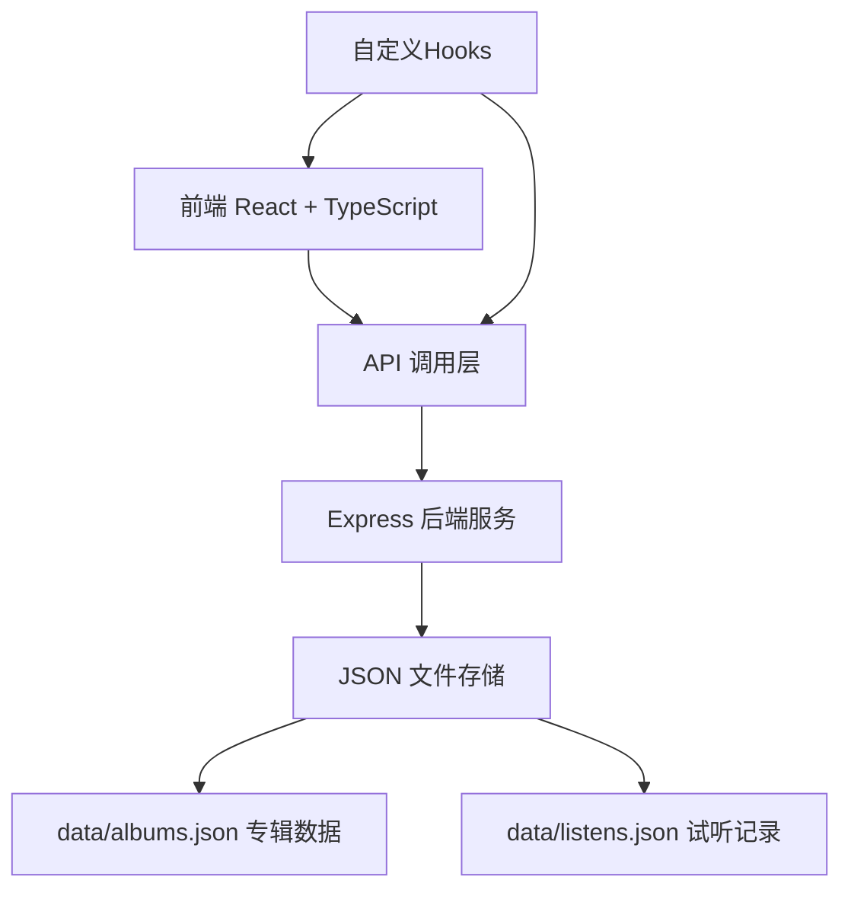
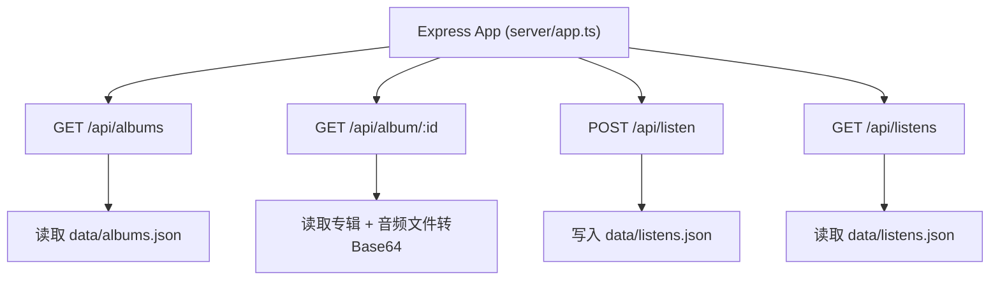
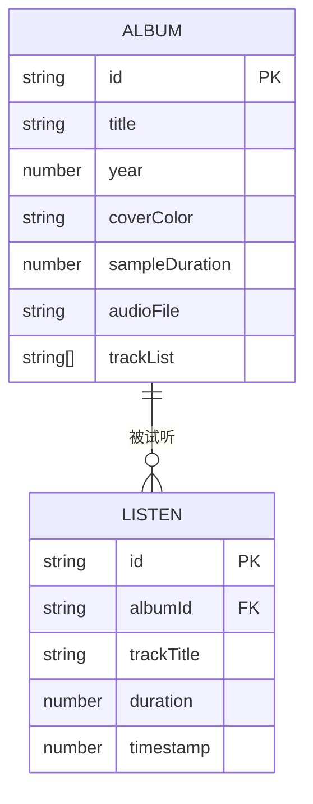

## 1. 架构设计



## 2. 技术描述

- **前端**：React@18 + TypeScript + Vite + React Router DOM
- **后端**：Express@4 + TypeScript + CORS
- **数据存储**：JSON 文件（albums.json、listens.json）
- **构建工具**：Vite
- **状态管理**：React Hooks + 自定义 Hook
- **图标**：lucide-react

## 3. 路由定义

| 路由 | 用途 |
|------|------|
| / | 首页 - 时间轴专辑展示、试听播放器、推荐区域 |

## 4. API 定义

### 4.1 获取全部专辑
```typescript
// GET /api/albums
interface Album {
  id: string;
  title: string;
  year: number;
  coverColor: string;
  sampleDuration: number;
  audioFile: string;
  trackList: string[];
}

// Response: Album[]
```

### 4.2 获取单张专辑详情及音频
```typescript
// GET /api/album/:id
interface AlbumDetail extends Album {
  audioBase64: string;
}

// Response: AlbumDetail | { error: string }
```

### 4.3 记录试听事件
```typescript
// POST /api/listen
interface ListenRecord {
  albumId: string;
  trackTitle: string;
  duration: number;
  timestamp: number;
}

// Request: Omit<ListenRecord, 'timestamp'>
// Response: { success: boolean; record: ListenRecord }
```

### 4.4 获取试听历史
```typescript
// GET /api/listens
// Response: ListenRecord[]
```

## 5. 服务器架构图



## 6. 数据模型

### 6.1 数据模型定义



### 6.2 初始数据

**data/albums.json** - 预置5张专辑数据：
```json
[
  {
    "id": "album-001",
    "title": "Midnight Echoes",
    "year": 2019,
    "coverColor": "#6366f1",
    "sampleDuration": 30,
    "audioFile": "midnight_echoes.mp3",
    "trackList": ["Neon Dreams", "Silent Rain", "Electric Soul"]
  },
  {
    "id": "album-002",
    "title": "Ocean Depths",
    "year": 2020,
    "coverColor": "#0ea5e9",
    "sampleDuration": 30,
    "audioFile": "ocean_depths.mp3",
    "trackList": ["Deep Blue", "Coral Reef", "Tidal Wave"]
  },
  {
    "id": "album-003",
    "title": "Urban Pulse",
    "year": 2021,
    "coverColor": "#f97316",
    "sampleDuration": 30,
    "audioFile": "urban_pulse.mp3",
    "trackList": ["City Lights", "Subway Groove", "Skyline View"]
  },
  {
    "id": "album-004",
    "title": "Forest Whispers",
    "year": 2022,
    "coverColor": "#22c55e",
    "sampleDuration": 30,
    "audioFile": "forest_whispers.mp3",
    "trackList": ["Morning Mist", "Ancient Trees", "Bird Song"]
  },
  {
    "id": "album-005",
    "title": "Cosmic Journey",
    "year": 2023,
    "coverColor": "#a855f7",
    "sampleDuration": 30,
    "audioFile": "cosmic_journey.mp3",
    "trackList": ["Stellar Dust", "Nebula Dance", "Black Hole"]
  }
]
```

**data/listens.json** - 初始空数组：
```json
[]
```

## 7. 文件结构

```
.
├── package.json
├── vite.config.js
├── tsconfig.json
├── index.html
├── src/
│   ├── App.tsx              # 主组件，路由管理
│   ├── components/
│   │   ├── AlbumTimeline.tsx   # 时间轴组件
│   │   ├── PlayerPanel.tsx     # 试听面板组件
│   │   ├── RecommendSection.tsx # 推荐区域组件
│   │   └── ThemeSwitcher.tsx   # 主题切换组件
│   ├── hooks/
│   │   ├── usePlayHistory.ts   # 试听记录Hook
│   │   └── useAudioPlayer.ts   # 音频播放Hook
│   ├── types/
│   │   └── index.ts            # 类型定义
│   └── utils/
│       └── audio.ts            # 音频工具函数
├── server/
│   └── app.ts              # Express服务器
└── data/
    ├── albums.json         # 专辑数据
    ├── listens.json        # 试听记录
    └── audio/              # 音频文件目录
```

## 8. 数据流向

1. **App.tsx** → 调用 `GET /api/albums` → 获取专辑列表 → 传递给 AlbumTimeline
2. **AlbumTimeline** → 用户点击播放 → 传递albumId给 PlayerPanel
3. **PlayerPanel** → 调用 `GET /api/album/:id` → 获取音频Base64 → 播放并渲染频谱
4. **usePlayHistory** → 监听播放进度 → >20秒时调用 `POST /api/listen` → 保存记录
5. **App.tsx** → 调用 `GET /api/listens` → 生成推荐列表 → 传递给 RecommendSection
