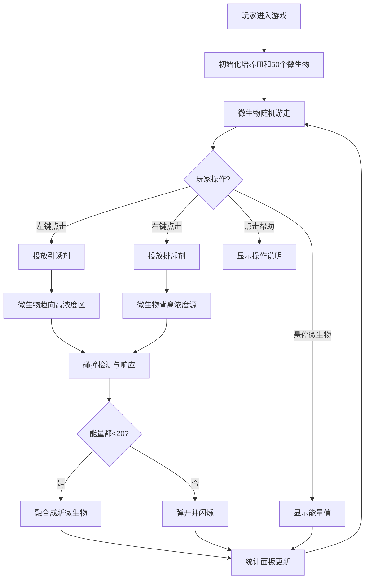

## 1. 产品概述

微生物趋化性模拟游戏，模拟微观生物在液体环境中受化学梯度影响而运动的行为，解决现有模拟游戏对生物趋化性、随机游走和群体涌现行为表现不足的问题。

- 主要目的：提供一个沉浸式的微观生物世界模拟器，让玩家通过投放化学物质观察微生物的群体行为
- 目标用户：对生物学、复杂性科学、人工生命感兴趣的爱好者和学生
- 产品价值：通过可视化交互帮助理解趋化性、群体涌现等生物学和复杂系统概念

## 2. 核心功能

### 2.1 用户角色

| 角色 | 注册方式 | 核心权限 |
|------|----------|----------|
| 玩家 | 无需注册 | 进行游戏、投放化学物质、查看统计数据 |

### 2.2 功能模块

1. **游戏主场景**：Canvas渲染的二维培养皿，包含微生物和化学场
2. **化学物质投放系统**：玩家点击投放引诱剂/排斥剂
3. **微生物行为系统**：随机游走、趋化性响应、碰撞检测、融合机制
4. **实时统计面板**：微生物数量、平均能量、化学物质剩余、能量直方图
5. **帮助系统**：操作说明弹窗

### 2.3 页面详情

| 页面名称 | 模块名称 | 功能描述 |
|----------|----------|----------|
| 游戏主页 | 页眉标题区 | 显示游戏标题，分隔线装饰 |
| 游戏主页 | 游戏画布区 | 900x600px Canvas，渲染培养皿、微生物、化学场 |
| 游戏主页 | 统计面板 | 实时显示微生物总数、平均能量、化学物剩余、能量直方图 |
| 游戏主页 | 帮助按钮 | 点击显示操作说明弹窗 |
| 游戏主页 | 帮助弹窗 | 显示操作指南和游戏说明 |

## 3. 核心流程

玩家进入游戏后，观察50个初始微生物在培养皿中随机游走。玩家可以左键点击空白处投放引诱剂（绿色），或右键点击投放排斥剂（红色）。微生物会根据化学浓度梯度改变运动方向，高浓度区域会加速运动。微生物之间会发生碰撞弹开或低能量融合。右下角统计面板实时更新数据。

## 4. 用户界面设计

### 4.1 设计风格

- **主色调**：暗色主题，背景 #0d1117
- **强调色**：荧光绿 #00ff88（引诱剂/高能量）、荧光蓝 #00aaff（微生物渐变）、荧光红 #ff6b6b（排斥剂/低能量）
- **按钮风格**：圆角，悬浮时缩放1.05倍+亮度1.2，过渡0.2s
- **字体**：monospace 等宽字体，标题24px白色
- **布局风格**：卡片式布局，培养皿居中，统计面板右下角悬浮
- **视觉效果**：辉光边框、脉动网格、光晕闪烁、半透明渐变

### 4.2 页面设计概述

| 页面名称 | 模块名称 | UI元素 |
|----------|----------|--------|
| 游戏主页 | 页眉标题 | monospace白色24px，下方#30363d分隔线 |
| 游戏主页 | 培养皿画布 | 900x600px，背景#0d1117，1px #30363d实线圆角8px，#00ff8820阴影，半透明脉动网格 |
| 游戏主页 | 微生物 | 圆形6-12px，#00ff88到#00aaff渐变，悬停显示能量标签 |
| 游戏主页 | 化学场 | 80px半径浓度场，引诱剂绿色渐变，排斥剂红色渐变 |
| 游戏主页 | 统计面板 | #161b22背景圆角12px内边距12px，实时数据+直方图 |
| 游戏主页 | 帮助按钮 | 36px圆形#21262d背景，悬浮动画 |
| 游戏主页 | 帮助弹窗 | #161b22背景圆角12px内边距16px，#8b949e文字14px |

### 4.3 响应式

- 桌面端优先设计（>768px）：培养皿900x600px居中，统计面板右下角悬浮
- 移动端（<768px）：培养皿宽度100%，高度按比例缩放，统计面板移至底部
- 触摸优化：化学物质投放支持触摸事件

### 4.4 性能要求

- 维持60FPS帧率
- 微生物数量上限200个时不卡顿
- 化学浓度场更新频率≥15次/秒
