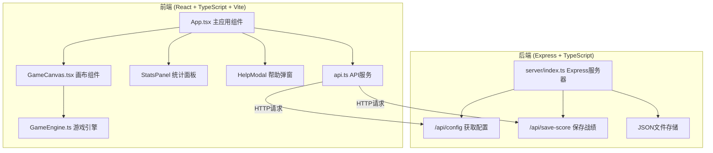
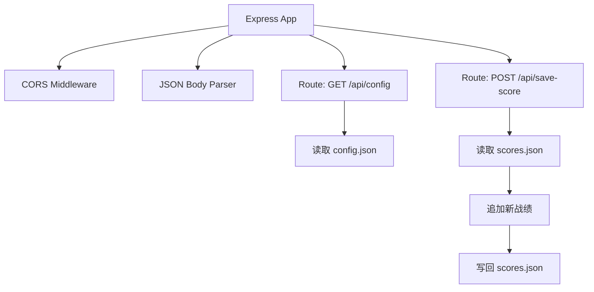
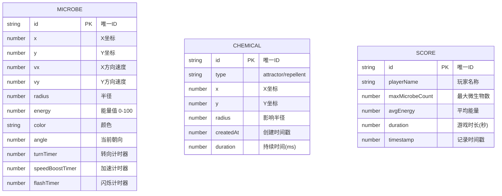

## 1. 架构设计



## 2. 技术说明

- **前端框架**：React@18 + TypeScript
- **构建工具**：Vite@5 + @vitejs/plugin-react
- **渲染引擎**：Canvas 2D API
- **状态管理**：React useState/useRef（局部状态）
- **路由**：react-router-dom（预留扩展）
- **后端框架**：Express@4 + TypeScript
- **数据存储**：JSON文件（server/data/*.json）
- **工具库**：uuid（唯一ID生成）、cors（跨域支持）

## 3. 路由定义

| 路由 | 用途 |
|------|------|
| / | 游戏主页（唯一页面） |

## 4. API 定义

### 4.1 获取微生物配置
- **端点**：`GET /api/config`
- **响应**：
```typescript
interface MicrobeConfig {
  initialCount: number;
  minRadius: number;
  maxRadius: number;
  minSpeed: number;
  maxSpeed: number;
  turnFrequency: number;
  energyDecayRate: number;
}

interface GameConfig {
  microbe: MicrobeConfig;
  chemical: {
    maxAttractors: number;
    maxRepellents: number;
    radius: number;
    duration: number;
    highConcentrationThreshold: number;
    speedBoost: number;
    speedBoostDuration: number;
  };
  collision: {
    bounceSpeedFactor: number;
    flashDuration: number;
    flashRadiusMultiplier: number;
    fusionEnergyThreshold: number;
    fusionEnergyFactor: number;
  };
}
```

### 4.2 保存玩家战绩
- **端点**：`POST /api/save-score`
- **请求体**：
```typescript
interface SaveScoreRequest {
  playerName: string;
  maxMicrobeCount: number;
  avgEnergy: number;
  duration: number;
  timestamp: number;
}
```
- **响应**：
```typescript
interface SaveScoreResponse {
  success: boolean;
  id: string;
  rank: number;
}
```

## 5. 服务器架构图



## 6. 数据模型

### 6.1 数据模型定义



### 6.2 项目文件结构

```
.
├── package.json
├── index.html
├── vite.config.ts
├── tsconfig.json
├── src/
│   ├── main.tsx          # React应用入口
│   ├── App.tsx           # 主应用组件
│   ├── components/
│   │   └── GameCanvas.tsx # 游戏画布组件
│   ├── engine/
│   │   └── GameEngine.ts  # 游戏引擎核心
│   └── services/
│       └── api.ts         # API服务封装
└── server/
    ├── index.ts           # Express服务器
    └── data/
        ├── config.json    # 游戏配置
        └── scores.json    # 战绩数据
```
