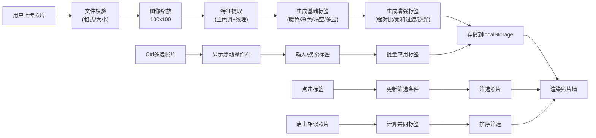

## 1. 产品概述

云端相册应用，帮助摄影爱好者自动整理天空照片。系统根据照片主色调和纹理特征自动生成标签，支持手动修正和多标签组合筛选，快速找到特定氛围的天空照片。

- 目标用户：摄影爱好者，需要管理大量天空照片
- 核心价值：自动分类、智能标签、快速检索、相似发现
- 市场价值：为摄影爱好者提供专业的照片管理工具，基于图像特征的智能分类

## 2. 核心功能

### 2.1 用户角色
| 角色 | 注册方式 | 核心权限 |
|------|----------|----------|
| 普通用户 | 无需注册，本地使用 | 上传照片、自动打标签、手动修正标签、多标签筛选、查看相似照片 |

### 2.2 功能模块
1. **照片上传模块**：拖拽/点击上传，文件校验，特征提取
2. **图像处理模块**：主色调提取（RGB平均值）、纹理复杂度计算（灰度梯度标准差）
3. **标签管理模块**：自动生成标签（基础+增强）、手动增删标签、多标签筛选、相似照片匹配
4. **数据存储模块**：localStorage持久化照片元数据和标签
5. **照片墙展示模块**：瀑布流布局、虚拟化渲染、卡片交互、详情模态框
6. **批量操作模块**：Ctrl多选、批量添加标签、浮动操作栏

### 2.3 页面详情
| 页面名称 | 模块名称 | 功能描述 |
|----------|----------|----------|
| 主页面 | 标签筛选区 | 左侧标签列表（可折叠），胶囊按钮，多标签组合筛选，显示匹配数量 |
| 主页面 | 照片墙区 | 瀑布流布局，虚拟化渲染，卡片悬浮效果，标签指示器，相似照片按钮 |
| 主页面 | 上传区 | 虚线边框，拖拽高亮，文件格式/大小校验 |
| 主页面 | 批量操作栏 | 底部浮动，实时搜索标签，批量应用标签 |
| 详情模态框 | 照片详情 | 全尺寸图片，标签列表（可编辑），拍摄时间，动画效果 |

## 3. 核心流程

### 3.1 照片上传与打标签流程
用户上传照片 → 系统校验文件格式和大小 → 缩放至100x100像素 → 提取主色调（平均RGB）→ 计算纹理复杂度（灰度梯度标准差）→ 生成基础标签（色彩+纹理）→ 生成增强标签（强对比/柔和过渡/逆光/顺光等）→ 存储到localStorage → 渲染到照片墙

### 3.2 多标签筛选流程
用户点击标签胶囊 → 更新选中标签集合 → 按"同时包含所有选中标签"筛选 → 更新照片墙显示 → 显示匹配数量

### 3.3 相似照片查找流程
用户点击"相似照片"按钮 → 记录参考照片ID → 获取该照片所有标签 → 计算其他照片与参考照片的共同标签数量 → 按共同标签数量降序排序 → 筛选显示最相似的照片

### 3.4 流程图

## 4. 用户界面设计

### 4.1 设计风格
- 极简主义设计，干净清爽
- 主背景色：#f8fafc（极浅灰蓝）
- 主文字色：#1e293b（深蓝灰）
- 主色调：#4338ca（靛蓝）
- 卡片背景：#ffffff
- 分割线：#e2e8f0（浅灰）
- 按钮圆角：8px，卡片圆角：12px

### 4.2 交互细节
- 标签胶囊：未选中背景#e0e7ff，文字#4338ca；选中背景#4338ca，文字白色；过渡0.2s
- 卡片悬浮：上移6px，阴影从0 2px 8px变为0 8px 24px，过渡0.3s
- 标签点击动画：瞬间缩小至0.95倍，再恢复1倍，0.15s ease-out
- 模态框动画：从底部上滑0.3s ease-out，半透明遮罩#00000080
- 上传区域：虚线边框，拖入时变为实线并亮起#4338ca
- 批量操作栏：从底部升起0.2s，背景#1e293b，圆角16px向上20px

### 4.3 页面设计概述
| 页面名称 | 模块名称 | UI元素 |
|----------|----------|--------|
| 主页面 | 标签筛选区 | 220px宽左侧栏，标签胶囊按钮，选中计数，响应式折叠为顶部滚动条 |
| 主页面 | 照片墙区 | 瀑布流布局，240px列宽，16px间距，虚拟化渲染，卡片悬浮效果，标签指示器，相似照片按钮 |
| 主页面 | 上传区 | 虚线边框区域，拖拽提示文字，文件格式说明 |
| 主页面 | 批量操作栏 | 底部浮动，标签搜索输入框，应用按钮 |
| 详情模态框 | 照片详情 | 全尺寸图片，标签列表（可添加删除），拍摄时间，关闭按钮 |

### 4.4 响应式设计
- **桌面端（>768px）**：左侧220px标签栏，右侧照片墙（自适应列数）
- **平板端（480px-768px）**：标签栏折叠为顶部横向滚动条，照片墙2列
- **移动端（<480px）**：标签栏顶部滚动，照片墙1列

### 4.5 增强标签规则
| 特征组合 | 生成标签 | 说明 |
|----------|----------|------|
| 纹理复杂度高（>50）+ 主色调偏暖 | 强对比 | 云层丰富且色彩温暖，对比强烈 |
| 纹理复杂度低（<20）+ 主色调偏蓝 | 柔和过渡 | 天空纯净，色彩渐变柔和 |
| 纹理复杂度中等（20-50）+ 主色调偏冷 | 顺光 | 光线均匀，云层柔和 |
| 纹理复杂度高 + 主色调偏红/橙 | 逆光 | 色彩浓烈，可能是日出日落 |
| 纹理复杂度高 + 色彩跨度大 | 层次丰富 | 云层层次多，色彩变化大 |
| 纹理复杂度低 + 主色调中性 | 静谧 | 平静的天空，适合冥想氛围 |

## 5. 性能约束
- 照片墙加载和筛选响应时间：≤200ms（500张照片）
- 特征提取时间：≤1秒（缩放至100x100像素）
- 渲染优化：使用react-virtualized虚拟化技术，只渲染可视区域
- 主线程不阻塞：图像处理使用Canvas API，避免阻塞UI
