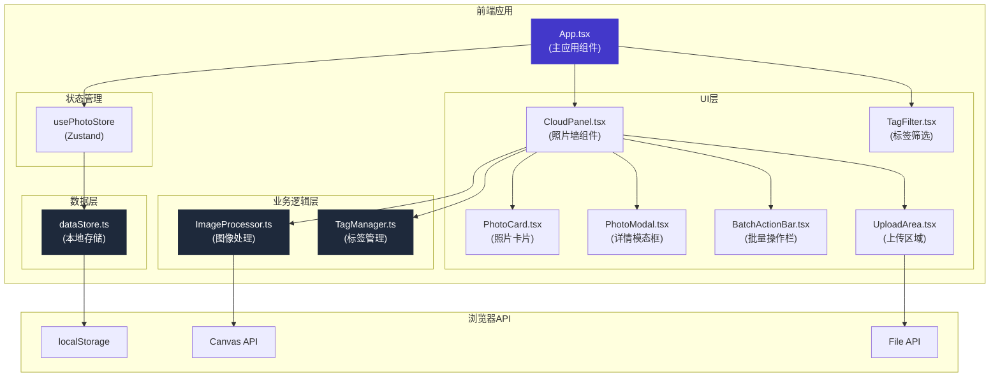
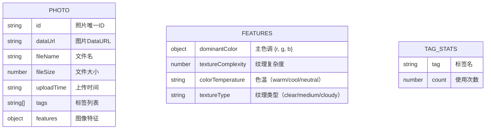

## 1. 架构设计



**调用关系和数据流向：**
1. `App.tsx` → 管理全局状态，调用 `CloudPanel.tsx`、`TagManager.ts`、`dataStore.ts`
2. `CloudPanel.tsx` → 接收上传文件 → 调用 `ImageProcessor.extractFeatures()` → 调用 `TagManager.generateTags()` → 渲染照片墙
3. `ImageProcessor.ts` → 接收图片数据 → 提取主色调、纹理复杂度 → 返回特征对象
4. `TagManager.ts` → 接收特征对象 → 根据规则生成基础+增强标签 → 提供按标签筛选、相似照片匹配方法
5. `dataStore.ts` → 使用 localStorage 持久化 → 提供增删改查方法 → 被 `App.tsx` 和 `usePhotoStore` 调用

## 2. 技术描述

- **前端框架**：React 18 + TypeScript
- **构建工具**：Vite 5
- **状态管理**：Zustand
- **样式方案**：TailwindCSS 3 + CSS Modules（关键组件）
- **虚拟化渲染**：react-virtualized（或自定义实现）
- **图标库**：lucide-react
- **本地存储**：localStorage
- **图像处理**：Canvas API

## 3. 数据模型

### 3.1 数据模型定义



### 3.2 TypeScript 类型定义

```typescript
// 图像特征
interface ImageFeatures {
  dominantColor: { r: number; g: number; b: number };
  textureComplexity: number;
  colorTemperature: 'warm' | 'cool' | 'neutral';
  textureType: 'clear' | 'medium' | 'cloudy';
}

// 照片元数据
interface Photo {
  id: string;
  dataUrl: string;
  fileName: string;
  fileSize: number;
  uploadTime: string;
  tags: string[];
  features: ImageFeatures;
}

// 应用状态
interface PhotoState {
  photos: Photo[];
  selectedTags: string[];
  selectedPhotoIds: string[];
  referencePhotoId: string | null;
  isModalOpen: boolean;
  currentPhotoId: string | null;
  isDragging: boolean;
}
```

## 4. 目录结构

```
src/
├── App.tsx                    # 主应用组件
├── main.tsx                   # 应用入口
├── index.css                  # 全局样式
├── types.ts                   # 类型定义
├── components/
│   ├── CloudPanel.tsx         # 照片墙主组件
│   ├── TagFilter.tsx          # 标签筛选组件
│   ├── PhotoCard.tsx          # 照片卡片组件
│   ├── PhotoModal.tsx         # 详情模态框
│   ├── BatchActionBar.tsx     # 批量操作栏
│   ├── UploadArea.tsx         # 上传区域
│   └── MasonryGrid.tsx        # 瀑布流网格（虚拟化）
├── modules/
│   ├── ImageProcessor.ts      # 图像处理模块
│   └── TagManager.ts          # 标签管理模块
├── store/
│   └── usePhotoStore.ts       # Zustand状态管理
└── utils/
    ├── dataStore.ts           # 本地数据存储
    └── mockData.ts            # Mock数据生成
```

## 5. 核心模块设计

### 5.1 ImageProcessor.ts

```typescript
// 提取主色调：缩放至100x100后取平均RGB
export function extractDominantColor(imageData: ImageData): { r: number; g: number; b: number }

// 计算纹理复杂度：灰度图相邻像素差的标准差
export function calculateTextureComplexity(imageData: ImageData): number

// 综合提取特征
export async function extractFeatures(file: File): Promise<ImageFeatures>
```

### 5.2 TagManager.ts

```typescript
// 根据主色调判断色温
export function getColorTemperature(r: number, g: number, b: number): 'warm' | 'cool' | 'neutral'

// 根据纹理复杂度判断纹理类型
export function getTextureType(complexity: number): 'clear' | 'medium' | 'cloudy'

// 生成基础标签（色彩+纹理）
export function generateBaseTags(features: ImageFeatures): string[]

// 生成增强标签（强对比、柔和过渡、逆光、顺光等）
export function generateEnhancedTags(features: ImageFeatures): string[]

// 综合生成所有标签
export function generateTags(features: ImageFeatures): string[]

// 按标签筛选照片（同时包含所有选中标签）
export function filterPhotosByTags(photos: Photo[], selectedTags: string[]): Photo[]

// 查找相似照片（按共同标签数量排序）
export function findSimilarPhotos(photos: Photo[], referencePhotoId: string): Photo[]

// 获取所有标签统计
export function getAllTagStats(photos: Photo[]): { tag: string; count: number }[]
```

### 5.3 dataStore.ts

```typescript
const STORAGE_KEY = 'sky_album_photos';

// 加载所有照片
export function loadPhotos(): Photo[]

// 保存所有照片
export function savePhotos(photos: Photo[]): void

// 添加照片
export function addPhoto(photo: Photo): void

// 更新照片
export function updatePhoto(id: string, updates: Partial<Photo>): void

// 删除照片
export function deletePhoto(id: string): void

// 批量添加标签
export function batchAddTags(photoIds: string[], tag: string): void
```

## 6. 关键算法

### 6.1 主色调提取算法
1. 将图片绘制到 100x100 的 Canvas 上
2. 获取 ImageData，遍历所有像素
3. 计算 R、G、B 三个通道的平均值
4. 返回平均 RGB 值

### 6.2 纹理复杂度计算
1. 将图片转换为灰度图（Gray = 0.299*R + 0.587*G + 0.114*B）
2. 计算相邻像素（水平和垂直）的灰度差值
3. 计算所有差值的标准差
4. 标准差越大，纹理越复杂

### 6.3 增强标签生成规则
| 条件 | 标签 |
|------|------|
| 纹理复杂度 > 50 且 (R > 200 或 R-G > 30) | 强对比 |
| 纹理复杂度 < 20 且 (B > R 且 B > G) | 柔和过渡 |
| 纹理复杂度 20-50 且 B > 150 | 顺光 |
| 纹理复杂度 > 50 且 R > 180 且 G < 150 | 逆光 |
| 纹理复杂度 > 40 且 (max(R,G,B) - min(R,G,B)) > 80 | 层次丰富 |
| 纹理复杂度 < 25 且 色温为 neutral | 静谧 |

### 6.4 相似照片匹配
1. 获取参考照片的所有标签
2. 对每张其他照片，计算与参考照片的共同标签数量
3. 按共同标签数量降序排序
4. 过滤掉共同标签为0的照片
5. 返回排序后的照片列表

### 6.5 瀑布流布局
1. 计算容器宽度和列数（响应式）
2. 维护每列的当前高度
3. 每张照片放入高度最小的列
4. 使用 CSS transform 定位每张卡片
5. 使用虚拟化技术只渲染可视区域

## 7. 性能优化

1. **图像缩放**：使用 Canvas 将图片缩放至 100x100 用于特征提取，减少计算量
2. **防抖处理**：标签搜索输入使用防抖，避免频繁计算
3. **虚拟化渲染**：只渲染可视区域的照片卡片，使用 IntersectionObserver
4. **Memo优化**：使用 React.memo、useMemo、useCallback 避免不必要的重渲染
5. **Web Worker**：特征提取可考虑使用 Web Worker（可选，根据性能测试）
6. **本地缓存**：照片数据使用 localStorage 持久化，避免重复计算

## 8. 配置文件

### package.json 依赖
- react: ^18.2.0
- react-dom: ^18.2.0
- typescript: ^5.0.0
- vite: ^5.0.0
- @vitejs/plugin-react: ^4.0.0
- @types/react: ^18.2.0
- @types/react-dom: ^18.2.0
- zustand: ^4.4.0
- lucide-react: ^0.290.0
- react-virtualized: ^9.22.5
- @types/react-virtualized: ^9.21.23

### vite.config.js
- 开发服务器端口：3000
- 路径别名：@ → src

### tsconfig.json
- 严格模式：true
- target：ES2020
- module：ESNext
- JSX：react-jsx
