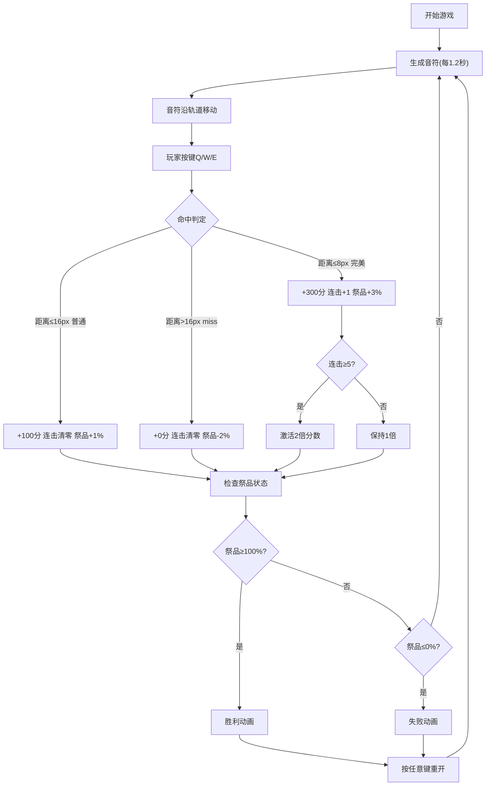

## 1. 产品概述
图腾节拍是一款以史前部落祭祀仪式为背景的节奏游戏，玩家通过在正确时机敲击图腾柱来取悦神明、求得降雨。
- 面向独立游戏爱好者和休闲玩家，提供沉浸式的原始部落仪式体验
- 融合节奏玩法与文化主题，通过视觉特效和音效反馈创造强烈的仪式感

## 2. 核心功能

### 2.1 用户角色
| 角色 | 注册方式 | 核心权限 |
|------|----------|----------|
| 玩家 | 无需注册 | 游戏游玩、成绩记录（本地存储） |

### 2.2 功能模块
1. **游戏主界面**：图腾柱渲染、音符轨道、粒子特效、状态面板
2. **节奏玩法系统**：音符生成、移动判定、按键响应、命中检测
3. **计分与连击系统**：分数计算、连击倍数、完美命中奖励
4. **祭品进度系统**：进度条管理、胜利/失败条件判定
5. **音效反馈系统**：Web Audio API实现的鼓声、音阶特效
6. **状态管理**：游戏开始/结束/重置状态切换

### 2.3 页面详情
| 页面名称 | 模块名称 | 功能描述 |
|----------|----------|----------|
| 游戏主页 | 图腾柱渲染 | 三根图腾柱，带部落纹样装饰，顶部圆环轨道 |
| 游戏主页 | 音符系统 | Q/W/E三轨道音符生成，沿圆形轨道向中心移动 |
| 游戏主页 | 粒子特效 | 命中火花、火焰特效、胜利/失败动画 |
| 游戏主页 | 状态面板 | 分数、连击数、倍数、祭品进度条显示 |
| 游戏主页 | 音效反馈 | 鼓声、音阶、胜利/失败音效 |

## 3. 核心流程
玩家按下任意键开始游戏 → 音符按1.2秒节奏从轨道外沿生成 → 音符沿圆形轨道向中心移动 → 玩家在音符到达中心时按下对应按键(Q/W/E) → 系统判定命中结果(完美/普通/miss) → 更新分数、连击数、祭品进度 → 祭品满时触发胜利动画/祭品归零时触发失败动画 → 按下任意键重新开始

## 4. 用户界面设计

### 4.1 设计风格
- **主色调**：深棕色渐变(#1a0a00 → #2d1b0e)背景，营造原始部落篝火氛围
- **强调色**：图腾柱使用#8b5a2b、#a0522d、#cd853f三色交替，装饰纹样金色#c0a060
- **音符色**：Q轨道火红#ff4444，W轨道土黄#ffbb33，E轨道墨绿#44bb44
- **按钮风格**：无物理按钮，采用全屏Canvas交互
- **字体**：使用具有原始感的装饰性字体搭配清晰易读的正文字体
- **布局风格**：Canvas居中，顶部半透明状态面板，整体庄重对称
- **图标风格**：几何纹样、图腾图案，采用三角形、波浪线等原始部落元素

### 4.2 页面设计概述
| 页面名称 | 模块名称 | UI元素 |
|----------|----------|---------|
| 游戏主页 | 图腾柱区域 | 三根40×200px图腾柱，间距40px，金色几何纹样装饰，柱顶80px半径圆环轨道 |
| 游戏主页 | 音符系统 | 12px半径圆点，沿圆环轨道移动，命中时白色闪烁 |
| 游戏主页 | 状态面板 | 顶部半透明#0a0a0a背景，圆角12px，皮革纹理边框，显示分数(32px粗体#e0c080)、连击数(24px#bb9944/#ffaa00)、倍数(18px#ff6600)、祭品进度条(200×16px圆角8px) |
| 游戏主页 | 粒子特效 | 命中火花(8-12粒子，寿命0.3秒)、火焰特效(20-40粒子，连击5/10/20时触发)、胜利图腾虚影(240×360px渐显) |
| 游戏主页 | 状态过渡 | 开始/结束/重置0.4秒渐隐动画 |

### 4.3 响应式设计
- 桌面优先设计，宽屏时游戏区域640×640px居中显示，背景延伸填满
- 窄屏适配(宽度<700px)：游戏区域自动缩放至屏幕宽度90%，保持1:1宽高比
- 图腾柱使用Canvas矢量绘制，确保不同分辨率下视觉清晰
- 触摸设备支持屏幕按键映射

### 4.4 Canvas渲染指南
- **环境**：深棕色径向渐变背景，中心略亮模拟篝火光效
- **光照**：图腾柱顶部高光效果，命中时中心闪烁
- **相机**：固定视角，640×640px画布，居中布局
- **动画**：音符移动使用requestAnimationFrame，粒子系统使用物理模拟
- **后期处理**：图腾虚影使用半透明叠加，胜利全屏闪烁使用全局合成
- **性能预算**：每帧最多9个音符，最多100个粒子，单帧渲染≤12ms
