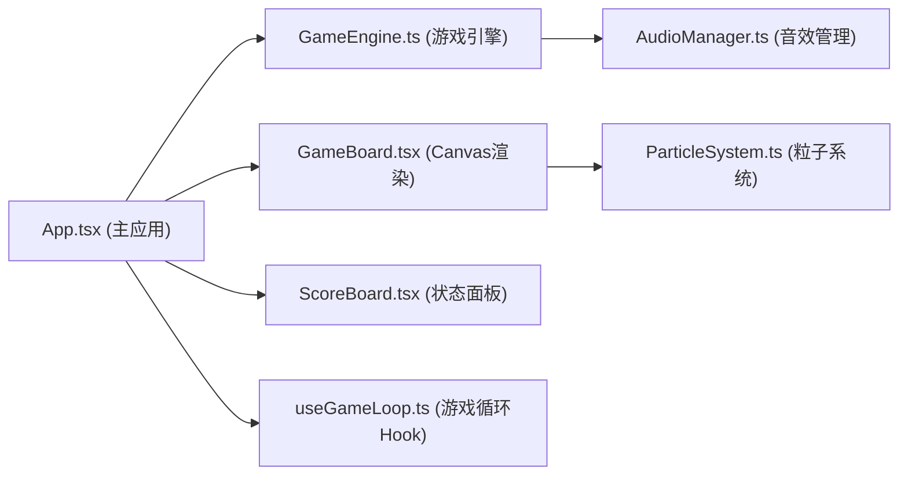

## 1. 架构设计



**数据流向：**
- 键盘事件 → App.tsx → GameEngine.handleKeyPress() → 游戏状态更新
- GameEngine 帧更新 → 音符位置/分数/连击 → App 状态 → GameBoard/ScoreBoard 渲染
- 命中判定 → ParticleSystem 生成特效 → GameBoard 渲染
- 命中/状态变化 → AudioManager 播放音效

**调用关系：**
- [App.tsx](file:///d:/SoloAutoDemo/tasks/auto10/src/App.tsx) 依赖 [GameEngine.ts](file:///d:/SoloAutoDemo/tasks/auto10/src/GameEngine.ts)、[GameBoard.tsx](file:///d:/SoloAutoDemo/tasks/auto10/src/components/GameBoard.tsx)、[ScoreBoard.tsx](file:///d:/SoloAutoDemo/tasks/auto10/src/components/ScoreBoard.tsx)
- [GameEngine.ts](file:///d:/SoloAutoDemo/tasks/auto10/src/GameEngine.ts) 依赖 [AudioManager.ts](file:///d:/SoloAutoDemo/tasks/auto10/src/utils/AudioManager.ts)、[types.ts](file:///d:/SoloAutoDemo/tasks/auto10/src/types.ts)
- [GameBoard.tsx](file:///d:/SoloAutoDemo/tasks/auto10/src/components/GameBoard.tsx) 依赖 [ParticleSystem.ts](file:///d:/SoloAutoDemo/tasks/auto10/src/utils/ParticleSystem.ts)、[types.ts](file:///d:/SoloAutoDemo/tasks/auto10/src/types.ts)
- [ScoreBoard.tsx](file:///d:/SoloAutoDemo/tasks/auto10/src/components/ScoreBoard.tsx) 仅依赖 [types.ts](file:///d:/SoloAutoDemo/tasks/auto10/src/types.ts)

## 2. 技术描述

### 技术栈
- **前端框架**：React 18 + TypeScript 5
- **构建工具**：Vite 5 + @vitejs/plugin-react 4
- **类型定义**：@types/react 18、@types/react-dom 18
- **渲染方式**：HTML5 Canvas 2D API（游戏主视图）+ React DOM（状态面板）
- **音效**：Web Audio API（原生，无第三方库）
- **状态管理**：React useState + useRef（游戏引擎内部状态）

### 核心技术决策
1. **Canvas渲染游戏视图**：保证60FPS性能，支持复杂粒子特效和动画
2. **GameEngine独立类**：纯逻辑不依赖UI，便于测试和维护，通过requestAnimationFrame驱动
3. **Web Audio API音效**：零依赖实现鼓声、音阶等音效，性能优异
4. **模块化架构**：游戏逻辑、渲染、音效、工具函数分离，职责清晰
5. **响应式Canvas**：通过CSS transform缩放适配不同屏幕尺寸

## 3. 项目结构

```
src/
├── main.tsx              # React入口
├── App.tsx               # 主应用组件
├── GameEngine.ts         # 游戏核心引擎
├── types.ts              # 类型定义
├── components/
│   ├── GameBoard.tsx     # 游戏主视图(Canvas)
│   └── ScoreBoard.tsx    # 分数面板
├── utils/
│   ├── AudioManager.ts   # 音效管理器
│   └── ParticleSystem.ts # 粒子系统
└── hooks/
    └── useGameLoop.ts    # 游戏循环Hook
```

## 4. 核心数据模型

### 4.1 类型定义

```typescript
// 游戏状态
type GameState = 'idle' | 'playing' | 'victory' | 'defeat';

// 音符轨道
type TrackId = 'Q' | 'W' | 'E';

// 音符
interface Note {
  id: string;
  track: TrackId;
  angle: number;         // 当前角度(弧度)
  speed: number;         // 角速度(px/s转换)
  hit: boolean;          // 是否已被击中
  missed: boolean;       // 是否已错过
}

// 命中结果
type HitResult = 'perfect' | 'normal' | 'miss';

// 粒子
interface Particle {
  id: string;
  x: number;
  y: number;
  vx: number;
  vy: number;
  life: number;          // 剩余寿命(秒)
  maxLife: number;       // 总寿命
  color: string;
  size: number;
}

// 游戏状态快照
interface GameSnapshot {
  notes: Note[];
  score: number;
  combo: number;
  comboMultiplier: number;
  offeringProgress: number;
  gameState: GameState;
  hitEffects: HitEffect[];
}

// 命中特效
interface HitEffect {
  id: string;
  track: TrackId;
  type: HitResult;
  time: number;          // 触发时间
  duration: number;      // 持续时间
}
```

### 4.2 核心常量

```typescript
// 游戏配置
const CONFIG = {
  WAVE_INTERVAL: 1.2,        // 音符生成间隔(秒)
  NOTE_SPEED: 60,            // 音符移动速度(px/s)
  ORBIT_RADIUS: 80,          // 轨道半径(px)
  PERFECT_THRESHOLD: 8,      // 完美判定距离(px)
  NORMAL_THRESHOLD: 16,      // 普通判定距离(px)
  PERFECT_SCORE: 300,        // 完美命中分数
  NORMAL_SCORE: 100,         // 普通命中分数
  COMBO_THRESHOLD: 5,        // 连击倍数触发阈值
  PERFECT_OFFERING: 3,       // 完美祭品增量(%)
  NORMAL_OFFERING: 1,        // 普通祭品增量(%)
  MISS_OFFERING: -2,         // miss祭品减量(%)
  CANVAS_SIZE: 640,          // Canvas尺寸
  TOTEM_COUNT: 3,            // 图腾柱数量
};
```

## 5. 核心模块设计

### 5.1 GameEngine 游戏引擎

**职责**：管理游戏状态、音符生成与移动、命中判定、计分逻辑

**关键方法**：
- `start()`: 启动游戏，重置状态
- `stop()`: 停止游戏
- `handleKeyPress(key: string)`: 处理按键输入
- `update(deltaTime: number)`: 每帧更新游戏逻辑
- `getState(): GameSnapshot`: 获取当前状态快照

**内部逻辑**：
- 每1.2秒为三个轨道各生成一个音符
- 音符沿圆形轨道从外圈(角度0)向中心(角度π)移动
- 按键时检查最近未命中音符的角度距离
- 根据命中结果更新分数、连击、祭品进度
- 检查胜利/失败条件

### 5.2 GameBoard Canvas渲染

**职责**：绘制游戏场景、图腾柱、音符、粒子特效

**关键方法**：
- `render(state: GameSnapshot)`: 渲染一帧
- `drawBackground()`: 绘制渐变背景
- `drawTotems()`: 绘制三根图腾柱及装饰纹样
- `drawOrbits()`: 绘制圆环轨道
- `drawNotes(notes: Note[])`: 绘制音符
- `drawParticles(particles: Particle[])`: 绘制粒子
- `drawVictoryEffect(progress: number)`: 绘制胜利动画
- `drawDefeatEffect(progress: number)`: 绘制失败动画

### 5.3 ScoreBoard 状态面板

**职责**：显示分数、连击数、倍数、祭品进度条

**Props**：
- `score: number`
- `combo: number`
- `comboMultiplier: number`
- `offeringProgress: number`

### 5.4 AudioManager 音效管理

**职责**：使用Web Audio API播放游戏音效

**方法**：
- `playDrum(isPerfect: boolean)`: 播放鼓声
- `playMiss()`: 播放miss音效
- `playVictory()`: 播放胜利音阶
- `playDefeat()`: 播放失败音阶

### 5.5 ParticleSystem 粒子系统

**职责**：管理粒子生成、更新、回收

**方法**：
- `spawnHitParticles(x, y, type: HitResult)`: 生成命中火花
- `spawnFlameParticles(x, y, intensity: number)`: 生成火焰特效
- `update(deltaTime: number)`: 更新粒子位置和寿命
- `getParticles(): Particle[]`: 获取当前粒子列表

## 6. 性能优化策略

1. **对象池模式**：音符和粒子对象复用，避免频繁GC
2. **Canvas分层渲染**：静态背景预渲染到离屏Canvas
3. **requestAnimationFrame驱动**：与显示器刷新率同步
4. **状态快照**：每帧生成不可变状态快照，避免渲染阻塞逻辑
5. **粒子数量限制**：最多同时100个粒子，超出时回收最旧的
6. **CSS transform缩放**：响应式适配使用GPU加速

## 7. 浏览器兼容性

- 支持Chrome 90+、Firefox 88+、Safari 14+
- Web Audio API 自动处理用户交互触发限制
- Canvas 2D API 基础特性全支持
