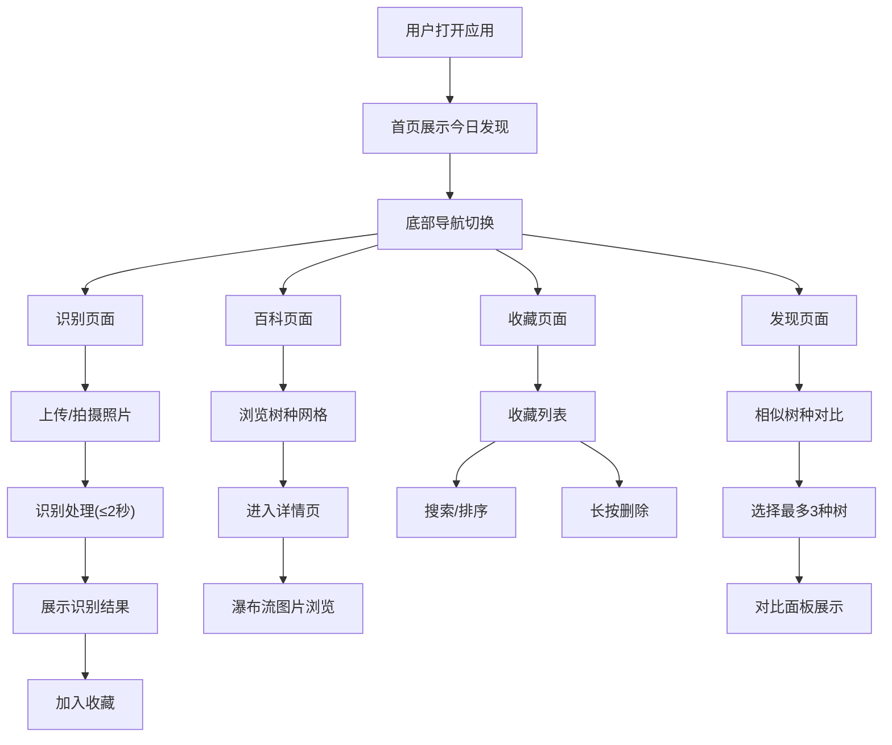

## 1. 产品概述

行道树识别应用，帮助城市居民通过植物叶片形态和颜色快速识别常见行道树，解决公众在户外散步时看到树木却不认识、无法获取植物知识的痛点。

- 核心目标：提供便捷的树木识别工具，普及植物知识
- 目标用户：城市居民、植物爱好者、学生

## 2. 核心功能

### 2.1 功能模块

1. **识别页面**：图片上传/拍摄区、识别结果卡片
2. **百科页面**：树种网格列表、树种详情页（瀑布流照片、文字描述）
3. **收藏页面**：收藏列表、搜索、删除
4. **发现页面**：今日发现随机推荐、相似树种对比

### 2.2 页面详情

| 页面名称 | 模块名称 | 功能描述 |
|-----------|-------------|---------------------|
| 识别页 | 图片上传区 | 支持拖拽上传、点击上传、摄像头拍摄 |
| 识别页 | 识别结果卡片 | 展示树种名称、学名、分布地区、常见用途、置信度条 |
| 百科页 | 树种网格列表 | 宽220px高320px卡片，圆角12px，展示叶片图片+中文名+学名 |
| 百科页 | 树种详情页 | 瀑布流布局展示叶片、树皮、果实、花朵照片，左右滑动切换 |
| 收藏页 | 收藏列表 | 左侧缩略图40*40px圆角6px，右侧树种名+收藏日期，支持搜索和时间倒序 |
| 收藏页 | 删除确认气泡 | 圆角8px，浅红色背景#fee2e2，显示"确定移除？"和"是""否"按钮 |
| 发现页 | 今日发现卡片 | 水平滑入动画，"新"字徽章（橙色#f97316），2秒后淡出 |
| 发现页 | 相似对比面板 | 横向三列并排，彩色标签区分对比项 |

## 3. 核心流程

用户打开应用 → 首页展示今日发现推荐 → 可切换到底部导航栏的四个页面
- 识别：上传/拍摄照片 → 模拟识别（≤2秒）→ 展示结果卡片 → 可加入收藏
- 百科：浏览网格列表 → 点击卡片进入详情 → 滑动浏览图片和描述
- 收藏：查看收藏列表 → 搜索/排序 → 长按删除确认
- 发现：查看今日发现 → 进入相似对比 → 选择最多3种树对比

## 4. 用户界面设计

### 4.1 设计风格

- 主色调：暖绿色 #4ade80，辅色 #22c55e
- 背景色：浅米色 #fefce8
- 字体色：深灰色 #1f2937，正文 #374151
- 卡片：白色背景 #ffffff，阴影 0 2px 12px rgba(0,0,0,0.10)，圆角12px
- 卡片悬浮效果：上移2px，加深阴影，0.2s ease
- 页面切换：左右滑动过渡，0.3秒
- 标题栏：半透明玻璃效果，背景 rgba(255,255,255,0.6)，毛玻璃模糊10px
- 底部导航栏：固定，激活时灰色变绿色，0.2秒过渡
- 图片懒加载：骨架屏灰色#e5e7eb圆角块，闪烁动画1.5s infinite

### 4.2 页面设计概览

| 页面名称 | 模块名称 | UI元素 |
|-----------|-------------|-------------|
| 识别页 | 上传区 | 虚线边框，上传图标，提示文字，摄像头按钮 |
| 识别页 | 结果卡片 | 树种名（大标题），学名（斜体），置信度进度条，详细信息 |
| 百科页 | 网格列表 | 响应式网格，220*320px卡片，3:2叶片图片，中文名+学名 |
| 百科页 | 详情页 | 瀑布流图片，文字描述（行高1.8，#374151），左右滑动 |
| 收藏页 | 列表项 | 40*40px缩略图（圆角6px），树种名，收藏日期，搜索框 |
| 收藏页 | 删除气泡 | #fee2e2背景，圆角8px，"是""否"按钮，0.2s过渡 |
| 发现页 | 今日发现卡片 | 右侧滑入（0.4s ease-out），"新"徽章（#f97316），2秒后淡出（0.5s） |
| 发现页 | 对比面板 | 三列均分，彩色标签（#3b82f6叶片/#f59e0b叶缘/#10b981叶脉/#8b5cf6果实），悬浮放大1.05倍 |

### 4.3 响应式

采用移动优先设计，适配桌面端和移动端，触摸优化交互。

## 5. 性能要求

- 叶片识别响应时间：≤2秒
- 百科列表滚动：60帧/秒
- 收藏夹打开时间：≤0.5秒
