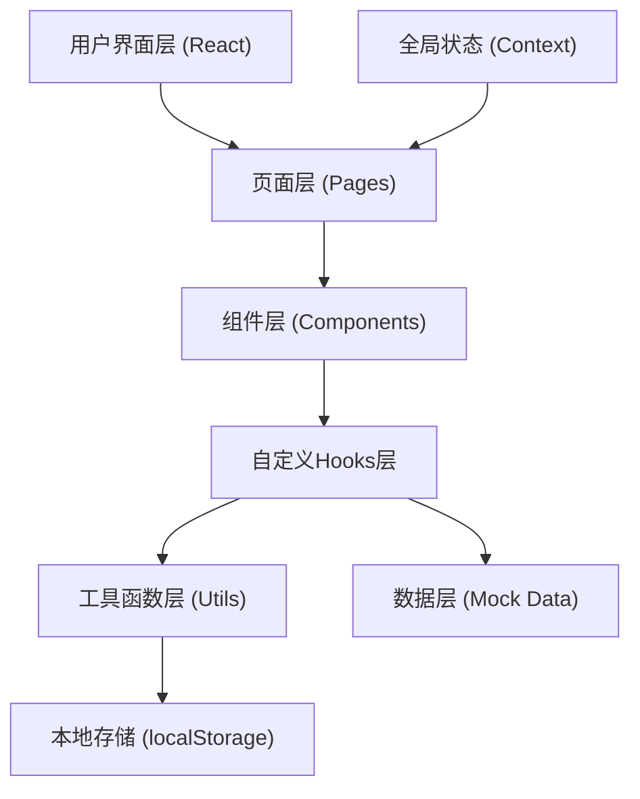

## 1. 架构设计



## 2. 技术描述

- 前端框架：React 18 + TypeScript
- 构建工具：Vite（开发服务器端口3000）
- 路由管理：React Router DOM
- 状态管理：React Context（全局状态） + 自定义Hooks（局部状态）
- 样式方案：Tailwind CSS 3 + 内联样式
- 日期处理：Day.js
- 唯一ID：uuid
- HTTP请求：axios（预留，当前使用Mock数据）
- 数据来源：Mock数据模拟后端

## 3. 路由定义

| 路由 | 用途 |
|-------|---------|
| / | 重定向到识别页 |
| /recognition | 叶片识别页面 |
| /encyclopedia | 树种百科网格列表 |
| /encyclopedia/:id | 树种详情页 |
| /favorites | 收藏列表页面 |
| /discovery | 今日发现 + 相似对比页面 |
| /comparison | 相似树种对比面板 |

## 4. 数据模型

### 4.1 TypeScript类型定义

```typescript
// 树种卡片
interface PlantCard {
  id: string;
  name: string;           // 中文名
  scientificName: string; // 学名
  leafImage: string;      // 叶片特征图片URL
  distribution: string;   // 分布地区
  uses: string;           // 常见用途
  description: string;    // 详细描述
}

// 识别结果
interface RecognitionResult {
  plant: PlantCard;
  confidence: number;     // 置信度 0-1
  featureVector: number[]; // 叶片特征向量
}

// 对比项
interface ComparisonItem {
  plantId: string;
  leafShape: string;      // 叶片形状图URL
  leafMargin: string;     // 叶缘锯齿图URL
  leafVein: string;       // 叶脉类型图URL
  fruit: string;          // 果实形态图URL
}

// 收藏项
interface FavoriteItem {
  plantId: string;
  addedAt: string;        // ISO日期字符串
}

// 树种详情扩展
interface PlantDetail extends PlantCard {
  gallery: {
    leaves: string[];
    bark: string[];
    fruits: string[];
    flowers: string[];
  };
  comparison: ComparisonItem;
}
```

## 5. 文件结构

```
auto15/
├── package.json
├── index.html
├── vite.config.js
├── tsconfig.json
├── tailwind.config.js
├── postcss.config.js
└── src/
    ├── main.tsx
    ├── App.tsx
    ├── index.css
    ├── types.ts
    ├── mockData.ts
    ├── utils.ts
    ├── hooks.ts
    ├── context/
    │   └── AppContext.tsx
    ├── components/
    │   ├── BottomNav.tsx
    │   ├── PlantCard.tsx
    │   ├── Skeleton.tsx
    │   ├── GlassHeader.tsx
    │   └── ConfirmBubble.tsx
    └── pages/
        ├── Recognition.tsx
        ├── Encyclopedia.tsx
        ├── PlantDetail.tsx
        ├── Favorites.tsx
        ├── Discovery.tsx
        └── Comparison.tsx
```

## 6. 核心Hooks设计

- **useRecognition**：封装识别逻辑，处理图片上传、模拟识别、返回结果和置信度
- **usePlantList**：加载树种列表数据，支持筛选和搜索
- **useFavorites**：收藏增删查改，本地存储读写，搜索排序
- **useDiscovery**：今日发现逻辑，随机推荐本周未浏览树种
