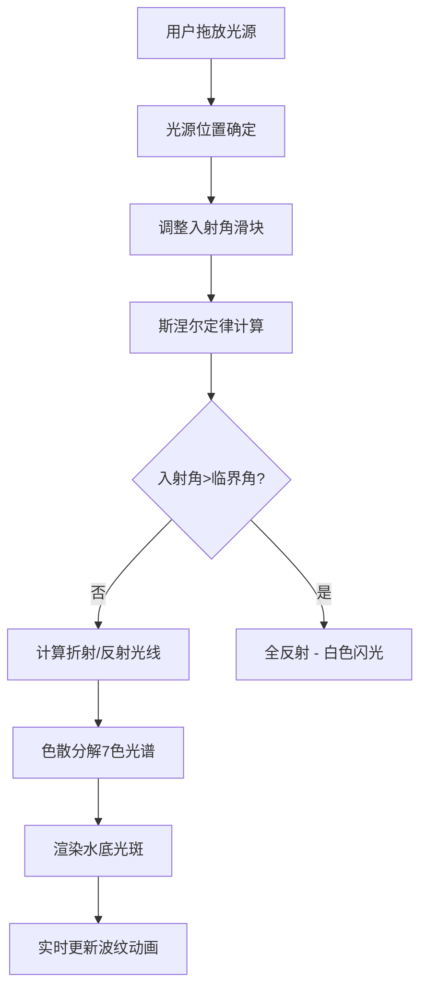

## 1. 产品概述

水下光源折射与光谱分解三维模拟器是一款基于WebGL的交互式物理实验仿真应用，用于模拟白光从空气射入水中时的折射、色散和全反射现象，并实时呈现水下光谱斑驳效果。

- 主要目标用户：物理教学人员、学生、物理爱好者
- 产品价值：将抽象的光学原理通过直观可交互的3D可视化，让用户直观理解斯涅尔定律、色散现象和全反射原理

## 2. 核心功能

### 2.1 功能模块

1. **3D场景模块：透明水体、动态波纹水面、沙地底部、可拖放光源
2. **物理模拟模块：斯涅尔定律折射计算、色散光谱分解、全反射判断
3. **交互控制模块：入射角滑块控制、光源位置拖放、数值实时反馈
4. **视觉效果模块：光谱光斑、粒子系统、辉光特效

### 2.2 页面详情

| 页面名称 | 模块名称 | 功能描述 |
|-----------|-------------|---------------------|
| 主页面 | 3D场景渲染 | Canvas渲染Three.js 3D水下场景，包含水体、沙地、光源 |
| 主页面 | 控制面板 | 左侧浮动毛玻璃面板，入射角滑块、重置按钮、数值显示 |
| 主页面 | 光线渲染 | 反射光线（虚线）、折射光线（实线彩色光谱 |
| 主页面 | 光斑效果 | 水底7色光谱光斑、随波纹抖动 |
| 主页面 | 全反射特效 | 超过临界角时的白色闪光光晕 |

## 3. 核心流程

用户从左侧工具栏拖放光源图标到水面任意位置 → 调整入射角滑块 → 系统实时计算折射/反射光线并渲染 → 用户观察水下光谱光斑 → 超过临界角触发全反射特效。

## 4. 用户界面设计

### 4.1 设计风格

- 主色调：深海科技暗色调
- 主背景：深蓝色 #0b0f1a
- 侧边栏：半透明 #1a2235，圆角10px
- 控制面板：毛玻璃效果（背景 #1e293b，模糊10px，边框1px solid rgba(255,255,255,0.1)
- 水体颜色：#1a6b8a，透明度0.6
- 交互反馈：悬浮时上移4px + 发光 0 0 8px #6366f1，过渡0.25s

### 4.2 页面设计概述

| 页面名称 | 模块名称 | UI元素 |
|-----------|-------------|-------------|
| 主页面 | 3D场景 | Canvas全屏渲染，相机透视视角 |
| 主页面 | 控制面板 | 左侧固定，毛玻璃面板，滑块控件 |
| 主页面 | 入射角信息展示 | 数值标签，半透明黑底，圆角4px |
| 主页面 | 滑块控件 | 渐变轨道(#6366f1→#818cf8，圆形把手 |

### 4.3 响应式

桌面端优先设计，3D场景自适应窗口大小，控制面板固定左侧固定宽度。

### 4.4 3D场景设计指南

- 环境：深蓝色水下环境，柔和环境光+方向光
- 光照：环境光(0x404040)，方向光模拟太阳光
- 相机：PerspectiveCamera，fov 60度
- 交互：OrbitControls允许视角旋转缩放
- 动画：水面顶点位移波纹动画，光斑抖动动画，粒子漂移
- 特效：辉光postprocessing Bloom
- 性能：光斑更新率≥30FPS，整体帧率≥45FPS，最多100条粒子
