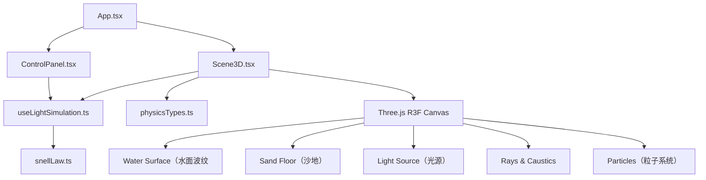

## 1. 架构设计



## 2. 技术说明

- 前端框架：React 18 + TypeScript
- 3D渲染：Three.js + @react-three/fiber + @react-three/drei
- 构建工具：Vite
- 开发服务器端口：3000

## 3. 项目结构

```
src/
├── types/
│   └── physicsTypes.ts
├── utils/
│   └── snellLaw.ts
├── hooks/
│   └── useLightSimulation.ts
├── components/
│   ├── Scene3D.tsx
│   └── ControlPanel.tsx
├── App.tsx
└── main.tsx
└── index.css
```

## 4. 核心数据模型

### 物理类型定义（physicsTypes.ts）：
- LightSourceParams：光源位置、入射角、强度
- RaySegment：射线起点、方向、颜色、强度
- RefractionAngles：入射角、折射角、临界角
- SpectrumColor：光谱色RGB映射
- CausticSpot：水底光斑参数

### 物理计算函数（snellLaw.ts）：
- calculateRefraction：斯涅尔定律计算
- calculateDispersion：色散偏移计算
- calculateReflectivity：反射率计算
- isTotalReflection：全反射判断

### 状态管理Hook（useLightSimulation.ts）：
- 光源位置状态
- 射线分段数据
- 光斑数据
- 动画帧更新逻辑
