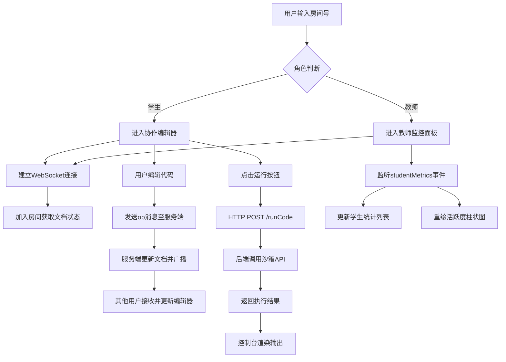

## 1. 产品概述

学生代码实时协作练习系统，为在线教育平台编程课程设计的多人协作编码环境。支持学生协同编辑代码、运行调试，教师实时监控进度并给予反馈。

- 核心价值：打破传统单人编程练习的孤立状态，通过实时协作提升学习效率，教师可精准掌握每位学生的学习情况
- 目标用户：编程课程教师、参与协作学习的学生群体

## 2. 核心功能

### 2.1 用户角色

| 角色 | 登录方式 | 核心权限 |
|------|----------|----------|
| 学生用户 | 房间号加入 | 协作编辑代码、运行代码、查看其他协作者光标 |
| 教师用户 | 教师账号登录 | 进入监控面板、查看所有学生编辑统计、光标位置、活跃度图表 |

### 2.2 功能模块

1. **协作编辑器页面**：代码编辑区、协作者光标、侧边栏用户列表、房间信息标签
2. **代码运行控制台**：运行按钮、语言切换、stdout/stderr输出区、运行耗时状态栏
3. **教师监控面板**：学生统计列表、实时光标位置、编辑活跃度柱状图

### 2.3 页面详情

| 页面名称 | 模块名称 | 功能描述 |
|----------|----------|----------|
| 协作编辑器 | Ace代码编辑区 | 支持Python/JavaScript语法高亮，实时同步文本操作 |
| 协作编辑器 | 协作者光标层 | 彩色圆点+用户名标签，跟随光标位置实时更新 |
| 协作编辑器 | 侧边栏用户列表 | 头像、姓名、在线状态、教师监控入口 |
| 协作编辑器 | 房间信息栏 | 显示当前房间号、在线人数标签 |
| 代码运行控制台 | 运行按钮 | 绿色渐变按钮，触发代码执行请求 |
| 代码运行控制台 | 语言选择器 | 切换Python/JavaScript运行环境 |
| 代码运行控制台 | 输出区域 | 黑底等宽字体显示stdout和stderr |
| 代码运行控制台 | 状态栏 | 显示代码执行耗时 |
| 教师监控面板 | 学生统计列表 | 连接时长、操作次数、当前光标位置 |
| 教师监控面板 | 活跃度图表 | Canvas绘制近5分钟编辑活跃度柱状图 |

## 3. 核心流程

用户进入系统后，输入房间号加入协作房间。学生端可以实时编辑代码，所有文本操作通过WebSocket同步到其他用户。教师端进入监控面板，实时接收各学生的编辑数据和光标位置。点击运行按钮时，代码通过HTTP POST发送到后端沙箱执行，结果返回显示。

## 4. 用户界面设计

### 4.1 设计风格

- 主色调：深色主题，背景#1e1e2e，编辑框#252535
- 文字颜色：#e2e8f0，选中高亮#475569，边框#334155
- 强调色：运行按钮绿色#22c55e→悬停#16a34a，图表蓝青渐变#3b82f6→#06b6d4
- 按钮样式：圆角6px，内边距适中，悬停状态平滑过渡
- 字体：等宽字体用于代码区，无衬线字体用于UI文字
- 布局：侧边栏30% + 编辑器70%，桌面端优先设计
- 动效：光标切换0.1s平滑过渡，悬停微交互

### 4.2 页面设计概览

| 页面名称 | 模块名称 | UI元素 |
|----------|----------|--------|
| 协作编辑器 | 代码编辑区 | Ace编辑器集成，深色主题，语法高亮 |
| 协作编辑器 | 光标层 | 8px彩色圆点+白色用户名标签（阴影0 1px 3px rgba(0,0,0,0.4)） |
| 协作编辑器 | 侧边栏 | 1px分隔线#334155，用户头像50%圆角，在线状态指示 |
| 协作编辑器 | 房间标签 | 背景#334155，圆角4px，内边距4px 12px |
| 代码运行控制台 | 运行按钮 | 绿色背景#22c55e，白色字体，圆角6px，悬停#16a34a |
| 代码运行控制台 | 输出区 | 黑底#1e1e1e，等宽字体14px，行高1.6 |
| 教师监控面板 | 统计卡片 | 列表布局，关键指标突出显示 |
| 教师监控面板 | 活跃度图表 | Canvas绘制，柱宽20px，间隔8px，颜色梯度 |

### 4.3 响应式设计

- 桌面端（>768px）：左侧30%侧边栏 + 右侧70%编辑器
- 移动端（≤768px）：侧边栏折叠为顶部导航栏，编辑器占满宽度
- 触摸优化：运行按钮增大点击区域，滚动流畅

### 4.4 性能指标

- 文本同步延迟 < 200ms
- 代码运行响应时间 < 3秒
- 页面首次加载 < 2秒（代码拆分优化）
