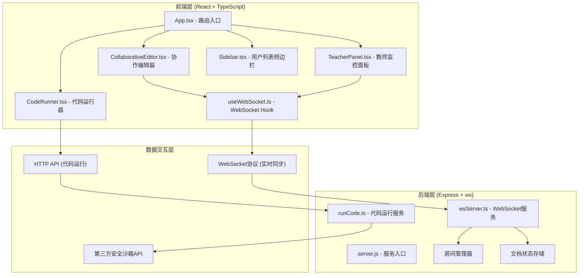
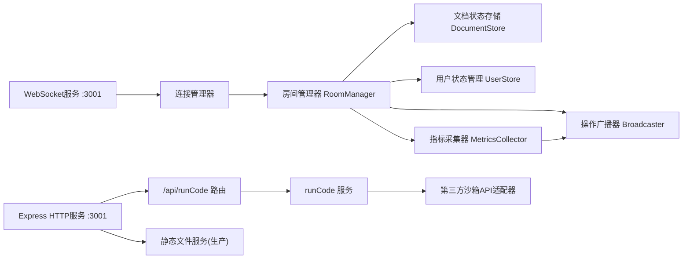

## 1. 架构设计



## 2. 技术描述

- **前端框架**: React@18 + TypeScript + Vite@5
- **构建工具**: Vite@5 + @vitejs/plugin-react
- **编辑器**: react-ace + ace-builds
- **路由**: react-router-dom@6
- **后端框架**: Express@4
- **WebSocket**: ws@8
- **跨域**: cors
- **唯一标识**: uuid
- **类型定义**: @types/react, @types/react-dom, @types/ws, @types/cors, @types/uuid
- **初始化方式**: 手动配置package.json + Vite

## 3. 路由定义

| 路由路径 | 页面组件 | 用途 |
|----------|----------|------|
| `/` | RoomEntryPage | 输入房间号和用户信息 |
| `/editor/:roomId` | CollaborativeEditor + CodeRunner + Sidebar | 学生协作编辑页面 |
| `/monitor/:roomId` | TeacherPanel | 教师监控面板 |

## 4. API 定义

### 4.1 WebSocket 消息协议

```typescript
// 客户端发送 -> 服务端
type ClientMessage =
  | { type: 'join'; roomId: string; userId: string; username: string; role: 'student' | 'teacher' }
  | { type: 'op'; roomId: string; userId: string; op: TextOperation }
  | { type: 'cursor'; roomId: string; userId: string; position: CursorPosition }
  | { type: 'leave'; roomId: string; userId: string }

// 服务端发送 -> 客户端
type ServerMessage =
  | { type: 'init'; document: string; users: UserInfo[] }
  | { type: 'op'; userId: string; op: TextOperation }
  | { type: 'cursor'; userId: string; position: CursorPosition; color: string }
  | { type: 'userJoin'; user: UserInfo }
  | { type: 'userLeave'; userId: string }
  | { type: 'studentMetrics'; metrics: StudentMetrics[] }

// 文本操作（简化版CRDT操作）
interface TextOperation {
  type: 'insert' | 'delete'
  position: number
  text?: string      // insert时需要
  length?: number    // delete时需要
  timestamp: number
}

// 光标位置
interface CursorPosition {
  row: number
  column: number
  position: number   // 文档中的绝对位置
}

// 用户信息
interface UserInfo {
  userId: string
  username: string
  role: 'student' | 'teacher'
  color: string
  connectedAt: number
}

// 学生指标数据
interface StudentMetrics {
  userId: string
  username: string
  connectedDuration: number  // 秒
  operationCount: number
  cursorPosition: CursorPosition
  activityHistory: number[]  // 近5分钟，每分钟操作数
}
```

### 4.2 HTTP API 定义

```typescript
// POST /api/runCode - 运行代码
interface RunCodeRequest {
  code: string
  language: 'python' | 'javascript'
}

interface RunCodeResponse {
  stdout: string
  stderr: string
  exitCode: number
  executionTime: number  // 毫秒
  error?: string
}
```

## 5. 服务端架构



## 6. 文件结构与调用关系

```
项目根目录/
├── package.json              # 依赖管理
├── vite.config.js            # Vite构建配置
├── tsconfig.json             # TypeScript配置
├── index.html                # 入口HTML
├── server/
│   ├── server.js             # 服务入口(Express+WS)
│   ├── wsServer.ts           # WebSocket核心逻辑
│   └── runCode.ts            # 代码运行服务
└── src/
    ├── main.tsx              # React入口
    ├── App.tsx               # 根组件+路由
    ├── styles/
    │   └── global.css        # 全局样式
    ├── collaboration/
    │   ├── CollaborativeEditor.tsx  # 编辑器组件
    │   ├── useWebSocket.ts          # WebSocket Hook
    │   └── CodeRunner.tsx           # 代码运行组件
    ├── monitor/
    │   └── TeacherPanel.tsx         # 教师监控面板
    ├── components/
    │   ├── Sidebar.tsx              # 用户列表侧边栏
    │   └── RoomEntry.tsx            # 房间入口页
    └── types/
        └── index.ts                 # 类型定义
```

**调用关系与数据流向：**

1. **协作编辑数据流**：
   - `CollaborativeEditor.tsx` (用户输入) → `useWebSocket.ts` (sendMessage) → WebSocket → `wsServer.ts` (处理op消息) → 更新`DocumentStore` → `Broadcaster`广播 → 其他客户端`useWebSocket.ts` (onMessage) → 更新`CollaborativeEditor.tsx`

2. **代码运行数据流**：
   - `CodeRunner.tsx` (点击运行) → HTTP POST `/api/runCode` → `runCode.ts` → 第三方沙箱API → 返回结果 → `CodeRunner.tsx` (渲染控制台)

3. **教师监控数据流**：
   - `wsServer.ts` (操作/光标事件) → `MetricsCollector` → 定时`studentMetrics`广播 → `TeacherPanel.tsx` (更新统计和图表)

## 7. 性能优化策略

1. **代码拆分**：`TeacherPanel.tsx` 懒加载，减少首屏包体积
2. **WebSocket优化**：操作合并（20ms内的连续操作打包发送）
3. **渲染优化**：光标位置使用requestAnimationFrame批量更新
4. **防抖节流**：编辑器onChange事件防抖10ms
5. **Vite优化**：开启build.codeSplit，依赖预构建优化
