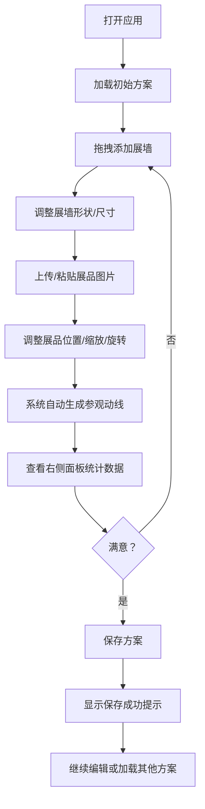

## 1. 产品概述

博物馆展览空间布局设计器是一款面向博物馆策展人的专业设计工具，解决传统平面图无法直观展示展品摆放顺序、参观动线和空间利用率的痛点。通过2D可视化画布、智能寻路算法和实时统计分析，帮助策展人高效规划展览空间。

- 目标用户：博物馆策展人、展览设计师、空间规划师
- 核心价值：可视化设计、智能动线规划、方案快速迭代、数据驱动决策

## 2. 核心功能

### 2.1 用户角色

| 角色 | 注册方式 | 核心权限 |
|------|----------|----------|
| 策展人 | 本地使用，无需注册 | 创建/编辑展览方案、拖拽展墙展品、查看动线统计、保存加载方案 |

### 2.2 功能模块

1. **画布编辑区**：2D俯视画布，网格吸附，展墙/展品拖拽、缩放、旋转
2. **左侧工具栏**：展墙形状选择（矩形、L形、弧形）、操作工具（选择、删除、保存/加载）
3. **右侧信息面板**：动线统计（长度、预计时间、可达性）、展品详情、方案列表
4. **动线生成系统**：A*寻路算法自动生成最优参观路径，虚线动画展示
5. **方案管理系统**：JSON格式保存/加载多个展览方案，浮动提示反馈

### 2.3 页面详情

| 页面名称 | 模块名称 | 功能描述 |
|----------|----------|----------|
| 主编辑器 | 画布区域 | 2D俯视视角，支持拖拽添加展墙（矩形、L形、弧形），粘贴/上传展品图片，展品缩放旋转，网格吸附（20px间距），弹性动画（0.2s ease-out） |
| 主编辑器 | 左侧工具栏 | 64px宽，展墙形状选择、操作工具，图标白色#94a3b8，悬浮变#6366f1 |
| 主编辑器 | 右侧信息面板 | 320px宽，动线统计（长度、预计参观时间、展品视线可达性），展品详情编辑，方案列表 |
| 主编辑器 | 顶部导航条 | 宽度<1024px时显示，替代左侧工具栏 |
| 主编辑器 | 浮动提示条 | 保存成功时显示，2秒后向上淡出 |

## 3. 核心流程

## 4. 用户界面设计

### 4.1 设计风格

- **设计主题**：深色科技风，专业、精准、高效
- **主背景**：#0f172a（深蓝灰）
- **卡片背景**：#1e293b（中深蓝灰）
- **边框颜色**：#334155（浅蓝灰边框）
- **主色调**：#6366f1（靛蓝，高亮、动线、交互）
- **成功色**：#22c55e（绿色，保存提示）
- **网格色**：#d0d0d0（半透明灰色）
- **文字主色**：#f1f5f9（近白）
- **文字次色**：#94a3b8（浅灰蓝）
- **圆角**：12px（卡片）、8px（提示条）
- **过渡动画**：0.2s ease（所有交互）、0.2s ease-out（拖拽弹性）

### 4.2 字体选择

- **标题字体**：Orbitron（科技感无衬线字体）
- **正文字体**：JetBrains Mono（等宽字体，专业精准感）
- **字体层级**：
  - 页面标题：20px / 600
  - 面板标题：16px / 600
  - 正文内容：14px / 400
  - 辅助文字：12px / 400

### 4.3 页面设计概览

| 页面名称 | 模块名称 | UI元素 |
|----------|----------|----------|
| 主编辑器 | 画布区域 | 深色背景、半透明网格线、可拖拽展墙（选中时#6366f1高亮边框2px）、展品图片、虚线路径动画 |
| 主编辑器 | 左侧工具栏 | 垂直64px宽、深色卡片、图标按钮（矩形/L形/弧形/选择/保存/加载）、悬浮高亮效果 |
| 主编辑器 | 右侧信息面板 | 320px宽、深色卡片、动线统计（数值+进度条）、展品详情（缩略图+参数）、方案列表 |
| 主编辑器 | 浮动提示条 | 200x50px、#22c55e背景、白色文字、圆角8px、2秒向上淡出动画 |

### 4.4 响应式设计

- **断点**：1024px
- **桌面端（>1024px）**：左侧工具栏64px + 画布区域 + 右侧面板320px
- **平板端（≤1024px）**：顶部导航条 + 画布区域 + 可折叠右侧面板
- **触摸优化**：增加触摸目标尺寸至44x44px，支持双指缩放旋转

### 4.5 动画与交互

- **拖拽弹性**：0.2s ease-out，释放时吸附到网格
- **路径动画**：虚线每秒移动30px，#6366f1，线宽4px
- **提示条动画**：从底部滑入，2秒后向上淡出（translateY + opacity）
- **按钮过渡**：0.2s ease，hover时背景/颜色变化
- **选中效果**：展墙选中时边框2px solid #6366f1，轻微发光效果

## 5. 性能指标

- 拖拽操作帧率：≥60fps
- 保存/加载响应时间：≤200ms
- 动线计算响应时间：≤500ms
- 首次加载时间：≤2s
