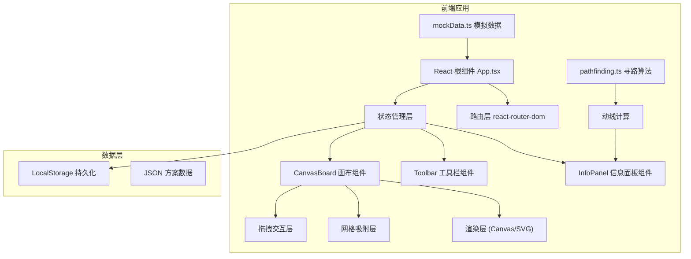

## 1. 架构设计



## 2. 技术描述

- **前端框架**：React 18 + TypeScript 5
- **构建工具**：Vite 5
- **路由管理**：react-router-dom 6
- **UI渲染**：原生Canvas API + React组件混合
- **状态管理**：React useState/useReducer（本地状态）
- **唯一标识**：uuid v4
- **数据持久化**：LocalStorage
- **路径别名**：@/src 指向 src 目录

## 3. 目录结构

```
├── package.json
├── vite.config.js
├── tsconfig.json
├── index.html
└── src/
    ├── App.tsx              # 根组件，路由和全局状态
    ├── main.tsx             # 应用入口
    ├── components/
    │   ├── CanvasBoard.tsx  # 画布组件（核心）
    │   ├── Toolbar.tsx      # 左侧工具栏
    │   ├── InfoPanel.tsx    # 右侧信息面板
    │   └── Toast.tsx        # 浮动提示组件
    ├── utils/
    │   └── pathfinding.ts   # A*寻路算法
    ├── types/
    │   └── index.ts         # TypeScript类型定义
    └── data/
        └── mockData.ts      # 模拟数据
```

## 4. 类型定义

```typescript
// 展墙类型
type WallShape = 'rectangle' | 'L-shape' | 'arc';

interface Wall {
  id: string;
  shape: WallShape;
  x: number;
  y: number;
  width: number;
  height: number;
  rotation: number;
  arcRadius?: number;     // 弧形展墙半径
  arcStartAngle?: number; // 弧形起始角度
  arcEndAngle?: number;   // 弧形结束角度
  lShapeSecondWidth?: number;  // L形第二段宽度
  lShapeSecondHeight?: number; // L形第二段高度
}

// 展品类型
interface Exhibit {
  id: string;
  wallId: string;
  x: number;
  y: number;
  width: number;
  height: number;
  rotation: number;
  imageUrl: string;
  name: string;
  description?: string;
}

// 方案类型
interface Exhibition {
  id: string;
  name: string;
  createdAt: number;
  updatedAt: number;
  walls: Wall[];
  exhibits: Exhibit[];
  entrance: { x: number; y: number };
  exit: { x: number; y: number };
}

// 动线统计
interface PathStats {
  pathLength: number;      // 动线长度（像素）
  estimatedTime: number;   // 预计时间（分钟）
  visibilityScores: {      // 展品可达性
    exhibitId: string;
    visibility: number;    // 百分比
  }[];
}

// 工具类型
type ToolType = 'select' | 'rectangle' | 'L-shape' | 'arc' | 'save' | 'load' | 'delete';
```

## 5. 核心算法

### 5.1 A*寻路算法

```
输入: 展墙列表、入口点、出口点、画布尺寸
输出: 路径点数组 [{x, y}, ...]

1. 构建网格地图（20px为单位）
2. 标记展墙占用的网格为障碍物
3. 使用A*算法搜索最优路径：
   - 启发函数：曼哈顿距离
   - 移动代价：直线1，对角线√2
   - 考虑路径宽度（4px）
4. 对路径进行平滑处理
5. 返回路径点数组
```

### 5.2 网格吸附算法

```
输入: 当前坐标(x, y)，网格间距(20px)
输出: 吸附后坐标

snappedX = Math.round(x / GRID_SIZE) * GRID_SIZE
snappedY = Math.round(y / GRID_SIZE) * GRID_SIZE
```

### 5.3 视线可达性计算

```
输入: 路径点数组、展品列表、展墙列表
输出: 每个展品的可达性百分比

1. 对每个展品：
   - 从路径上每隔50px取一个采样点
   - 检查采样点到展品中心的连线是否与展墙相交
   - 计算可见采样点占总采样点的比例
2. 返回百分比值
```

## 6. 性能优化策略

1. **Canvas渲染优化**：
   - 使用requestAnimationFrame确保60fps
   - 离屏Canvas预渲染静态元素
   - 仅重绘变化区域

2. **拖拽性能优化**：
   - 使用transform而非top/left
   - 节流鼠标移动事件（throttle）
   - 减少重排重绘

3. **寻路算法优化**：
   - 网格尺寸优化（20px平衡精度与性能）
   - 路径缓存机制
   - Web Worker计算（可选）

4. **JSON序列化优化**：
   - 增量更新而非全量序列化
   - 使用更快的JSON解析库（如fast-json-stable-stringify）

## 7. 路由定义

| 路由 | 用途 |
|------|------|
| / | 主编辑器页面 |
| /exhibition/:id | 加载指定方案 |

## 8. 数据存储

- **存储方式**：LocalStorage
- **存储键名**：`exhibition_schemes`
- **数据格式**：JSON数组，每个元素为Exhibition对象
- **容量限制**：LocalStorage 5MB限制，方案过多时提示清理
