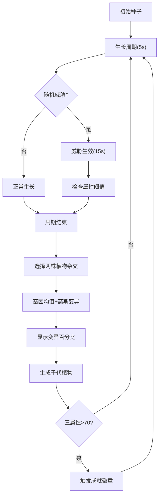

## 1. 产品概述
对抗性植物进化模拟器是一款基于2D Canvas的模拟游戏，玩家通过杂交和基因突变培育能够抵御各种环境威胁的变异植物。
- 核心玩法：基因组合 + 随机变异 + 环境威胁对抗
- 目标用户：模拟游戏爱好者、对遗传算法感兴趣的玩家

## 2. 核心特性

### 2.1 功能模块
1. **主游戏场景**：Canvas渲染的2D植物生长与环境威胁可视化
2. **控制面板**：基因编辑器、威胁选择器、植物信息展示、杂交面板
3. **谱系树系统**：展示祖代至当前代的基因传递路径
4. **成就系统**：三属性超70时触发徽章成就，保存至localStorage

### 2.2 页面详情
| 页面名称 | 模块名称 | 功能描述 |
|-----------|-------------|---------------------|
| 主页面 | 游戏Canvas区域 | 绘制植物主体、花瓣、根茎，处理悬停高亮、点击选择和生长动画，展示环境威胁效果 |
| 主页面 | 生长周期倒计时 | 左上角显示当前周期剩余时间，白色字体半透明背景衬底 |
| 主页面 | 右侧控制面板 | 基因编辑器（4属性条网格布局）、速度滑块、杂交面板、谱系树展开按钮、威胁状态展示 |
| 主页面 | 成就弹窗 | 金色渐变圆形徽章，底部上移弹性动画，白色对勾图标 |

## 3. 核心流程

玩家从初始种子开始，每个生长周期（5秒，可加速至0.5x或2x）内植物生长，期间随机触发环境威胁（干旱/虫灾/强风/霜冻，持续15秒）。周期结束后玩家选择两株植物杂交，子代基因取父母均值叠加高斯变异（标准差0.1）。植物属性低于阈值时受威胁加倍影响并变灰。当任意三属性均超过70时解锁成就。

## 4. 用户界面设计

### 4.1 设计风格
- **主题色**：深色主题，背景#0b1120，面板背景#1e293b
- **强调色**：金色#fbbf24（成就）、蓝色#3b82f6（滑块/交互）、红-绿渐变（属性条#ef4444→#22c55e）
- **植物色**：叶子#4ade80→#2563eb渐变，种子#5c3a1e，花朵由花色值决定
- **按钮样式**：圆角8px，悬浮放大1.05x+白色边框，点击收缩0.95x回弹，过渡0.15s
- **字体**：白色#e2e8f0，倒计时16px
- **布局**：桌面端左侧70%游戏区+右侧30%控制面板，<900px时面板移至底部横向布局

### 4.2 页面设计概述
| 页面名称 | 模块名称 | UI元素 |
|-----------|-------------|-------------|
| 主页面 | Canvas游戏区 | 自适应800x600~1920x1080，植物渲染、粒子效果、冰晶纹理、地面开裂、风向倾斜动画 |
| 主页面 | 基因编辑器 | 4条属性条100%宽度0-100刻度，红-绿渐变，0.2s宽度平滑过渡 |
| 主页面 | 速度滑块 | 半透明#64748b轨道+#3b82f6滑块，0.5x~2x范围 |
| 主页面 | 谱系树 | 默认收起，点击渐显展开，树干状图+周期数/突变幅度标注 |
| 主页面 | 成就弹窗 | 圆形直径60px金色渐变背景+白色对勾，底部上移0.3s弹性回弹 |

### 4.3 响应式
- 桌面端优先：>900px 左70%游戏区+右30%控制面板纵向布局
- 移动端：<900px 控制面板移至底部横向布局，Canvas自适应缩小
- Canvas最小800x600，最大1920x1080，窗口resize时自适应

### 4.4 性能预算
- Canvas渲染≥30fps
- 单株植物顶点≤200点
- 杂交计算≤100ms
- LocalStorage读写≤5ms/次
