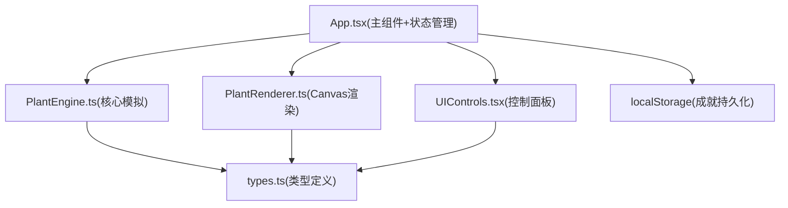
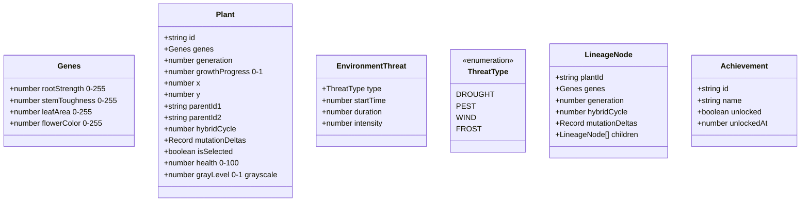

## 1. 架构设计

## 2. 技术描述
- **前端框架**：React 18 + TypeScript 严格模式(target ES2020)
- **构建工具**：Vite + @vitejs/plugin-react，开发服务器端口3000
- **状态管理**：React useState/useReducer（轻量场景，无需zustand）
- **渲染方案**：原生HTML5 Canvas 2D API（无额外渲染库）
- **数据持久化**：浏览器localStorage

## 3. 路由定义
| 路由 | 用途 |
|-------|---------|
| / | 单页应用主入口，全部功能在同一页面 |

## 4. 数据模型

### 4.1 类型定义(src/types.ts)

### 4.2 核心模块职责

| 模块 | 职责 | 关键方法 |
|------|------|----------|
| PlantEngine.ts | 基因组合、变异计算、生长逻辑、威胁判定 | `crossBreed(p1,p2)→Plant` `applyMutation(genes)→{genes,deltas}` `grow(plants,threat,dt)` `checkThreatEffects(plant,threat)→damage` |
| PlantRenderer.ts | Canvas绘制、动画、交互 | `render(ctx,plants,threat,time)` `drawPlant(plant,time,selected)` `handleHover(x,y)→Plant|null` `handleClick(x,y)→Plant|null` |
| App.tsx | 游戏循环、状态协调、杂交流程、成就检测 | `useGameLoop()` `handleHybrid()` `checkAchievements()` `saveAchievements()` |
| UIControls.tsx | UI控件、基因展示、杂交面板、谱系树 | `GeneEditor` `SpeedSlider` `HybridPanel` `LineageTree` `AchievementPopup` |

## 5. 性能优化要点
1. **渲染层**：requestAnimationFrame驱动，脏矩形/分层渲染，植物顶点数限制200
2. **计算层**：高斯变异用Box-Muller变换预计算，杂交计算同步完成≤100ms
3. **存储层**：成就数据JSON序列化后单次写入，debounce避免频繁IO
4. **动画层**：CSS transitions处理UI过渡，Canvas内植物摆动用sin函数插值
