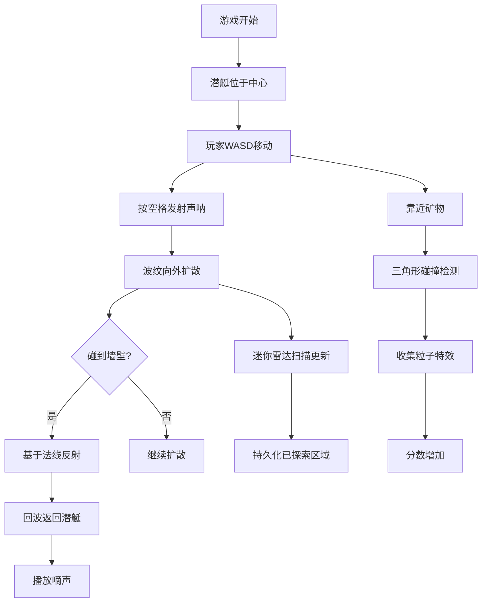

## 1. 产品概述

深海声呐探索是一款2D水下探险游戏，玩家控制潜艇在神秘海底遗迹中航行，利用声呐回波探索未知区域。游戏解决了水下探险游戏缺乏沉浸式声波交互与动态环境反馈的问题，通过真实的声呐反射机制和像素级碰撞检测，为玩家带来身临其境的深海探索体验。

- 核心玩法：潜艇移动 + 声呐探测 + 矿物收集 + 迷宫探索
- 目标用户：喜欢休闲探索类游戏的玩家
- 产品价值：独特的声呐交互体验，神秘的深海探索氛围

## 2. 核心功能

### 2.1 用户角色
| 角色 | 注册方式 | 核心权限 |
|------|---------|---------|
| 玩家 | 无需注册 | 完整游戏体验 |

### 2.2 功能模块
1. **主游戏界面**：游戏Canvas + 信息面板 + 迷你声呐扫描图
2. **潜艇控制系统**：WASD移动、尾迹粒子效果
3. **声呐系统**：脉冲发射、波纹扩散、墙壁反射、回波音效
4. **遗迹生成系统**：程序化迷宫墙壁、发光矿物
5. **收集系统**：矿物碰撞检测、收集特效、分数统计
6. **迷你地图系统**：已探索区域持久化存储、扫描动画

### 2.3 页面详情
| 页面名称 | 模块名称 | 功能描述 |
|---------|---------|---------|
| 主游戏页面 | 游戏Canvas | 800x600px主渲染区域，显示潜艇、声呐波纹、墙壁、矿物 |
| 主游戏页面 | 信息面板 | 深度显示、矿物计数、操作提示 |
| 主游戏页面 | 迷你声呐扫描图 | 120px直径圆形雷达，显示已探索区域轮廓 |

## 3. 核心流程

玩家进入游戏后，潜艇位于场景中心，周围被黑暗笼罩。玩家使用WASD控制潜艇移动，按空格键发射声呐脉冲。声呐波纹向外扩散，遇到墙壁会反射回来，回波到达潜艇时播放提示音。随着探索进行，迷你声呐扫描图逐渐显示已探索区域的轮廓。玩家在探索过程中收集发光矿物获得分数。

## 4. 用户界面设计

### 4.1 设计风格
- **主色调**：深海暗蓝 #0b1d28
- **辅助色**：深蓝 #1e3a5f
- **强调色**：荧光绿 #00ff88
- **整体风格**：神秘深海氛围，科技感与自然感结合
- **字体**：现代无衬线字体，清晰可读
- **动效**：cubic-bezier(0.25, 0.46, 0.45, 0.94) 缓动曲线

### 4.2 页面设计概述
| 页面名称 | 模块名称 | UI元素 |
|---------|---------|-------|
| 主游戏页面 | 布局 | 左右布局，左侧Canvas(800x600)，右侧信息面板(240px宽) |
| 主游戏页面 | 背景 | 径向渐变，从#0a1628（边界）到#1a3a5c（中心） |
| 主游戏页面 | 潜艇 | 等轴测三角形，#55aaff，带白色尾迹粒子 |
| 主游戏页面 | 声呐波纹 | 圆形扩散，#00ff88，透明度0.8到0渐隐 |
| 主游戏页面 | 墙壁 | 线宽4px，#4a6a8a，半透明0.6 |
| 主游戏页面 | 矿物 | 圆形发光，三色随机，呼吸动画 |
| 信息面板 | 深度 | 白色18px字体，显示当前深度 |
| 信息面板 | 分数 | 发光黄色数字，矿物收集计数 |
| 信息面板 | 操作提示 | 灰色#8899aa，12px字体 |
| 迷你雷达 | 背景 | 半透明黑色rgba(0,0,0,0.6) |
| 迷你雷达 | 扫描线 | 每2秒扫描一圈 |
| 迷你雷达 | 已探索 | 线条#33ffaa，线宽1px |

### 4.3 响应性
- 桌面端优先，固定尺寸布局
- 页面整体居中显示
- 不支持移动端触控操作

### 4.4 性能要求
- 主渲染循环维持60FPS
- 声呐波纹最多同时存在3个
- 粒子系统使用对象池复用
- 像素级碰撞检测优化
