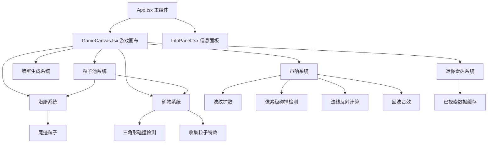

## 1. 架构设计



## 2. 技术说明

- **前端框架**：React 18 + TypeScript
- **构建工具**：Vite 5
- **渲染技术**：Canvas 2D API
- **音频技术**：Web Audio API
- **状态管理**：React useState/useRef
- **动画循环**：requestAnimationFrame + 60FPS控制

## 3. 文件结构

| 文件路径 | 用途 |
|---------|------|
| `/package.json` | 项目依赖与脚本 |
| `/vite.config.js` | Vite配置，端口3000 |
| `/tsconfig.json` | TypeScript严格模式，ES2020 |
| `/index.html` | 入口页面，标题"深海声呐探索" |
| `/src/App.tsx` | 主组件，管理游戏状态和布局 |
| `/src/GameCanvas.tsx` | 核心游戏组件，Canvas渲染和游戏逻辑 |
| `/src/InfoPanel.tsx` | 右侧信息面板组件 |
| `/src/types.ts` | 共享类型定义 |

## 4. 核心数据类型

### 4.1 潜艇状态
```typescript
interface Submarine {
  x: number;
  y: number;
  angle: number;
  speed: number;
}
```

### 4.2 声呐脉冲
```typescript
interface SonarPulse {
  x: number;
  y: number;
  radius: number;
  maxRadius: number;
  speed: number;
  opacity: number;
  reflections: SonarReflection[];
  startTime: number;
}

interface SonarReflection {
  x: number;
  y: number;
  radius: number;
  dx: number;
  dy: number;
  normalX: number;
  normalY: number;
  hasReturned: boolean;
}
```

### 4.3 矿物对象
```typescript
interface Mineral {
  x: number;
  y: number;
  radius: number;
  color: string;
  pulsePhase: number;
  pulseSpeed: number;
  collected: boolean;
  collectProgress: number;
}
```

### 4.4 粒子对象
```typescript
interface Particle {
  x: number;
  y: number;
  vx: number;
  vy: number;
  life: number;
  maxLife: number;
  size: number;
  color: string;
  active: boolean;
}
```

### 4.5 墙壁线段
```typescript
interface Wall {
  x1: number;
  y1: number;
  x2: number;
  y2: number;
}
```

## 5. 关键技术实现

### 5.1 声呐反射机制
- 使用墙壁线段法线计算反射方向
- 反射公式：R = D - 2 * (D · N) * N
- 像素级碰撞检测：沿波纹弧线采样检测墙壁像素
- 回波检测：反射波纹回到潜艇位置时触发音效

### 5.2 三角形碰撞检测
- 潜艇为三角形，根据朝向计算三个顶点
- 使用点在三角形内检测 + 圆与三角形距离计算
- 支持旋转后的三角形碰撞检测

### 5.3 粒子池系统
- 预分配粒子对象池
- 激活/回收机制，避免频繁GC
- 尾迹粒子和收集特效粒子共用对象池

### 5.4 迷你雷达持久化
- 使用离屏Canvas存储已探索区域
- 每次扫描增量更新已探索数据
- 未探索区域保持黑色，已探索区域显示轮廓

### 5.5 性能优化
- 最大3个同时存在的声呐波纹
- 60FPS固定帧率渲染循环
- 像素检测步长优化，平衡精度与性能
- 粒子池复用，减少对象创建销毁
