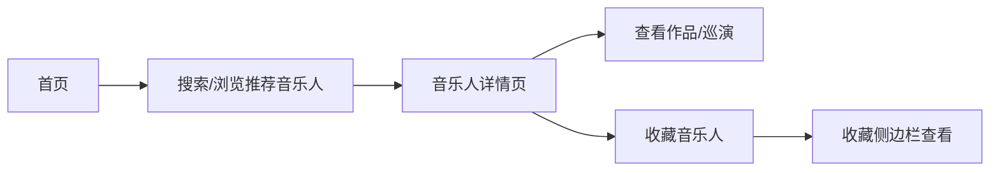
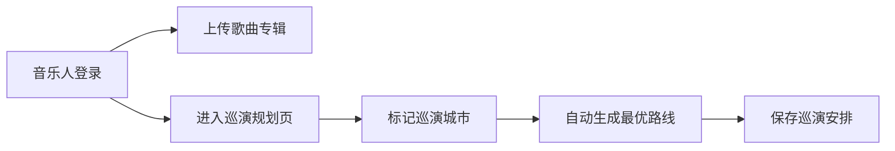

## 1. 产品概述
独立音乐人作品展示与巡演路线规划平台，连接音乐人与乐迷，提供作品展示、巡演地图规划、互动收藏等功能。
- 目标用户：独立音乐人（上传作品、规划巡演）、乐迷（浏览发现、查看巡演、收藏音乐人）
- 产品价值：为音乐人提供一站式作品管理与巡演规划工具，为乐迷提供发现优质独立音乐的平台

## 2. 核心功能

### 2.1 用户角色
| 角色 | 注册方式 | 核心权限 |
|------|---------|---------|
| 音乐人 | 注册账号 | 上传歌曲/专辑、管理巡演城市、规划路线 |
| 乐迷 | 注册账号/游客 | 浏览作品、查看巡演、搜索、收藏音乐人 |

### 2.2 功能模块
1. **首页**：推荐音乐人列表、搜索框、搜索历史
2. **音乐人详情页**：作品列表（网格卡片）、巡演地图
3. **巡演路线规划页**：地图标记、城市搜索、路线自动生成
4. **收藏侧边栏**：收藏列表展示、快速导航

### 2.3 页面详情
| 页面名称 | 模块名称 | 功能描述 |
|---------|---------|----------|
| 首页 | 推荐音乐人 | 展示6个推荐音乐人卡片，带入场动画 |
| 首页 | 搜索模块 | 模糊搜索音乐人、歌曲、风格标签，下拉建议，搜索历史 |
| 音乐人详情页 | 作品网格 | 220x280px卡片展示歌曲，hover动效，歌词展开动画 |
| 音乐人详情页 | 巡演地图 | Leaflet地图展示巡演城市，热力标记，路线折线 |
| 巡演规划页 | 地图交互 | 点击添加城市，拖拽标记，弹性动画 |
| 巡演规划页 | 路线规划 | 自动生成最优路线，折线连接 |
| 收藏侧边栏 | 收藏列表 | 头像、名称、收藏时间，心形按钮动画 |

## 3. 核心流程

乐迷浏览流程：

音乐人管理流程：

## 4. 用户界面设计

### 4.1 设计风格
- 主色调：紫色 #8b5cf6
- 辅助色：青色 #06b6d4
- 背景色：深色 #0f172a
- 卡片背景：白色 #ffffff
- 圆角：12px
- 过渡：0.2s ease-out
- 字体：现代无衬线字体，清晰层级

### 4.2 页面设计概览
| 页面名称 | 模块名称 | UI元素 |
|---------|---------|--------|
| 首页 | 推荐音乐人卡片 | 圆形头像80px带边框，简介，作品数量，入场淡入上移动画，依次延迟0.1s |
| 首页 | 搜索框 | 圆角12px，下拉建议320px最大高度，滑入动画0.2s，历史标签 |
| 音乐人详情页 | 歌曲卡片 | 220x280px，圆角12px，阴影hover加深，上移6px，歌词展开高度动画0.3s |
| 音乐人详情页 | 巡演地图 | 圆形标记半径16px，绿到红渐变色，弹性弹入0.5s，折线3px宽 #6366f1 |
| 巡演规划页 | 地图控制 | 半透明悬浮控制按钮 |
| 收藏侧边栏 | 收藏项 | 圆形头像40px，心形按钮灰色#9ca3af到红色#ef4444缩放动画 |

### 4.3 响应式
- 桌面端：最大宽度1200px居中，左右留白，多列网格
- 移动端（<768px）：单列网格，侧边栏折叠为底部导航

### 4.4 性能指标
- 首页加载 ≤ 1.5s
- 地图拖拽响应 < 100ms
- 搜索响应 < 200ms
