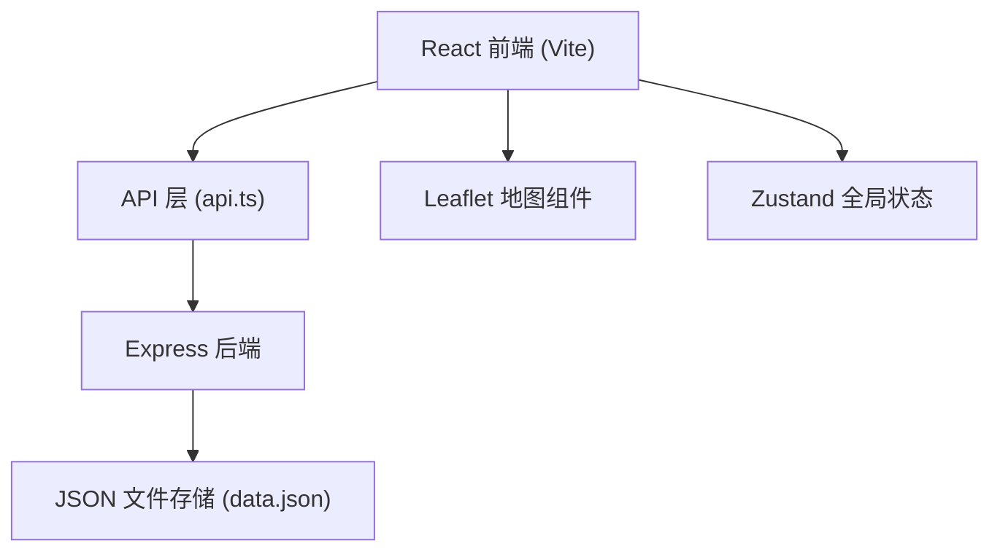
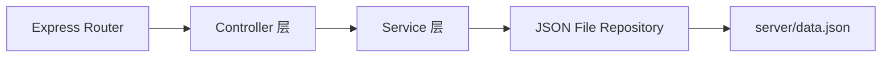
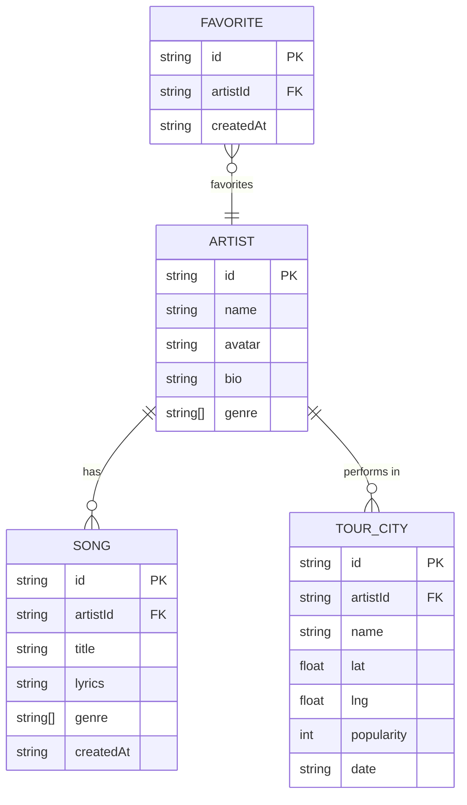

## 1. 架构设计



## 2. 技术描述
- 前端：React@18 + TypeScript + Vite + React Router + Zustand + Leaflet/react-leaflet
- 后端：Express@4 + TypeScript + CORS + UUID + Day.js
- 数据库：JSON 文件模拟存储
- UI：自定义 CSS（深色模式，紫色主色调）

## 3. 路由定义
| 路由 | 用途 |
|------|------|
| / | 首页 - 推荐音乐人 + 搜索 |
| /artist/:id | 音乐人详情页 - 作品列表 + 巡演地图 |
| /tour | 巡演路线规划页 - 地图交互 + 路线生成 |

## 4. API 定义

### 类型定义
```typescript
interface Artist {
  id: string;
  name: string;
  avatar: string;
  bio: string;
  genre: string[];
  songCount: number;
}

interface Song {
  id: string;
  artistId: string;
  title: string;
  lyrics: string;
  genre: string[];
  createdAt: string;
}

interface TourCity {
  id: string;
  artistId: string;
  name: string;
  lat: number;
  lng: number;
  popularity: number; // 0-100
  date: string;
}

interface Favorite {
  id: string;
  artistId: string;
  createdAt: string;
}
```

### API 端点
| 方法 | 路径 | 描述 |
|------|------|------|
| GET | /api/artists | 获取音乐人列表 |
| GET | /api/artists/:id | 获取音乐人详情 |
| GET | /api/artists/:id/songs | 获取音乐人歌曲 |
| POST | /api/artists/:id/songs | 上传歌曲 |
| GET | /api/artists/:id/tour | 获取巡演城市 |
| POST | /api/artists/:id/tour | 添加巡演城市 |
| DELETE | /api/tour/:cityId | 删除巡演城市 |
| GET | /api/search?q= | 模糊搜索 |
| GET | /api/favorites | 获取收藏列表 |
| POST | /api/favorites | 添加收藏 |
| DELETE | /api/favorites/:id | 取消收藏 |
| GET | /api/cities?search= | 搜索城市坐标 |

## 5. 服务器架构图



## 6. 数据模型

### 6.1 ER 图


### 6.2 初始数据结构 (data.json)
```json
{
  "artists": [...],
  "songs": [...],
  "tourCities": [...],
  "favorites": []
}
```

## 7. 文件结构
```
project/
├── package.json
├── vite.config.js
├── tsconfig.json
├── index.html
├── src/
│   ├── App.tsx
│   ├── main.tsx
│   ├── index.css
│   ├── types.ts
│   ├── store/
│   │   └── useStore.ts
│   ├── hooks/
│   │   ├── useArtists.ts
│   │   ├── useSongs.ts
│   │   ├── useTour.ts
│   │   └── useFavorites.ts
│   ├── api/
│   │   └── api.ts
│   ├── components/
│   │   ├── Header.tsx
│   │   ├── SearchBar.tsx
│   │   ├── ArtistCard.tsx
│   │   ├── SongCard.tsx
│   │   ├── TourMap.tsx
│   │   ├── FavoriteSidebar.tsx
│   │   └── CityMarker.tsx
│   ├── pages/
│   │   ├── HomePage.tsx
│   │   ├── ArtistPage.tsx
│   │   └── TourPage.tsx
│   └── utils/
│       └── routeOptimizer.ts
└── server/
    ├── index.ts
    ├── tsconfig.json
    └── data.json
```
