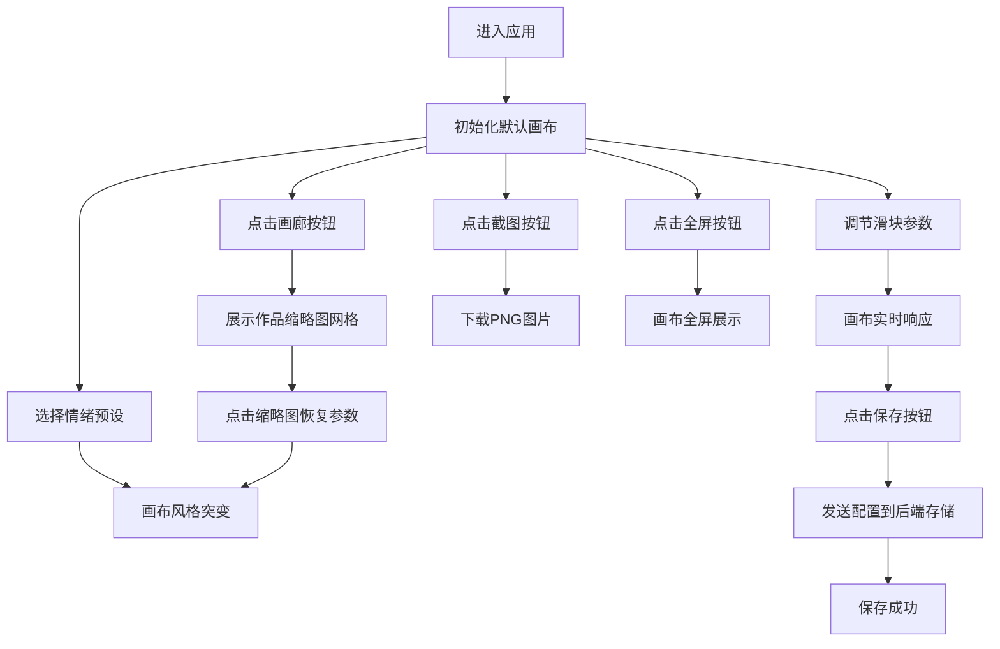

## 1. 产品概述

情绪驱动动态画布生成器是一款面向数字艺术家的交互式创作工具，用户通过选择基础情绪和调节视觉参数，实时生成动态演变的抽象画作。

- 核心目标：为艺术家提供可自由配置的Web工具，用于测试不同视觉参数组合的动态艺术效果
- 目标用户：数字艺术家、展览装置设计师、创意编程爱好者
- 市场价值：填补情绪可视化艺术创作工具的空白，为交互式展览提供快速原型验证能力

## 2. 核心功能

### 2.1 用户角色
| 角色 | 注册方式 | 核心权限 |
|------|----------|----------|
| 普通用户 | 无需注册 | 选择情绪、调节参数、保存作品、查看画廊、导出图片 |

### 2.2 功能模块
1. **主画布区域**：动态抽象画渲染、全屏模式、截图导出
2. **参数控制面板**：情绪选择下拉、速度滑块、色相偏移滑块、复杂度滑块、保存按钮、画廊按钮
3. **作品画廊模态框**：已保存作品缩略图网格、时间与情绪标签、参数恢复功能

### 2.3 页面详情
| 页面名称 | 模块名称 | 功能描述 |
|----------|----------|----------|
| 主页面 | 动态画布 | 使用Canvas API实时渲染抽象画，元素随时间演变，响应参数调节 |
| 主页面 | 控制面板 | 情绪选择（5种预设）、三个参数滑块（速度/色相/复杂度）、保存与画廊入口 |
| 画廊模态框 | 作品网格 | 展示已保存作品缩略图，支持点击恢复参数配置 |

## 3. 核心流程

用户进入应用后，默认画布开始渲染。用户可选择情绪预设触发画布风格突变，通过滑块微调视觉参数，满意时点击保存按钮将当前配置与快照存储至后端。随时可打开画廊查看历史作品，点击任意缩略图即可恢复该作品的完整参数状态，画布立即重现对应视觉效果。最后可通过截图按钮导出PNG图片，或进入全屏模式沉浸体验。

## 4. 用户界面设计

### 4.1 设计风格
- 主背景色：#111827（深邃夜空灰）
- 画布背景色：#1a1a2e（暗蓝紫渐变底色）
- 控制面板背景：#1f2937（深空灰蓝）
- 主色调：#6366f1（靛青紫）作为交互强调色
- 情绪色彩映射：快乐#fbbf24金黄、悲伤#6366f1靛蓝、愤怒#ef4444朱红、平静#34d399翠绿、焦虑#a78bfa紫罗兰
- 字体：现代无衬线字体，白色文字，按钮与标签使用14px加粗
- 圆角与间距：统一使用8-16px圆角，4px倍数的间距系统
- 微交互：悬停0.2s渐变色过渡，点击0.1s缩放0.95微动效

### 4.2 页面设计概述
| 页面名称 | 模块名称 | UI元素 |
|----------|----------|--------|
| 主页面 | 画布区域 | 960x640px，圆角16px，1px边框#333333，右下角全屏与截图图标按钮 |
| 主页面 | 控制面板 | 宽280px，背景#1f2937，圆角12px，内边距16px |
| 控制面板 | 情绪下拉菜单 | 宽100%，高40px，圆角8px，背景#374151，选中高亮#6366f1 |
| 控制面板 | 滑块组件 | 自定义track高6px圆角3px渐变背景，thumb直径18px圆形#6366f1，悬浮缩放1.15 |
| 控制面板 | 保存按钮 | 圆形直径40px，#6366f1背景，白色心形图标，悬浮#4f46e5 |
| 控制面板 | 画廊按钮 | 图标24px，透明背景，悬浮#374151 |
| 画廊模态框 | 作品卡片 | 180x140px缩略图，圆角8px，半透明遮罩#00000044，悬浮加深至#00000066 |

### 4.3 响应式适配
- 桌面端（≥1024px）：画布居左，控制面板居右横向布局
- 移动端（<1024px）：控制面板移至画布下方，宽度100%，画布保持16:10比例自适应宽度

## 5. 性能指标
- 画布渲染帧率：55-60 FPS
- 滑块响应延迟：≤50ms
- 画廊缩略图加载：≤500ms（10张以内）
