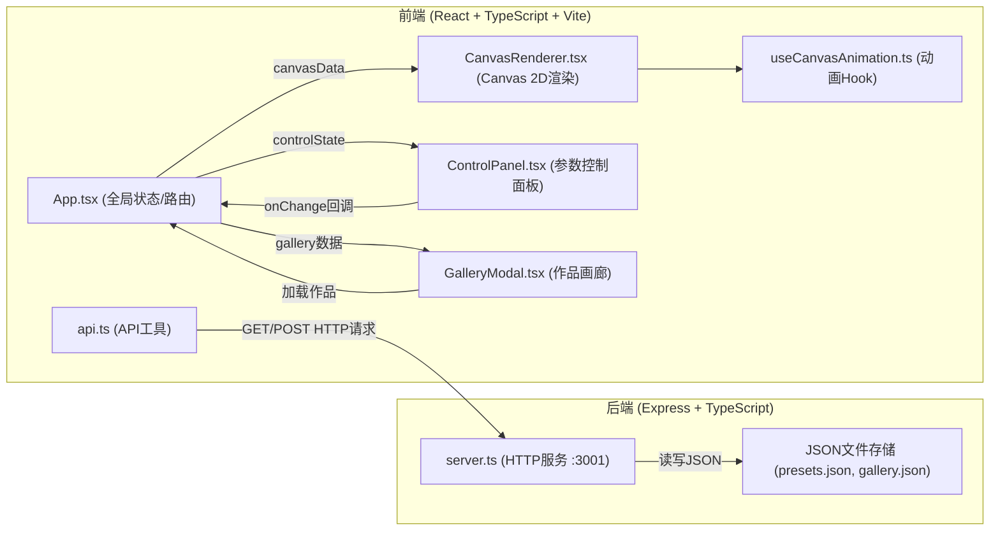
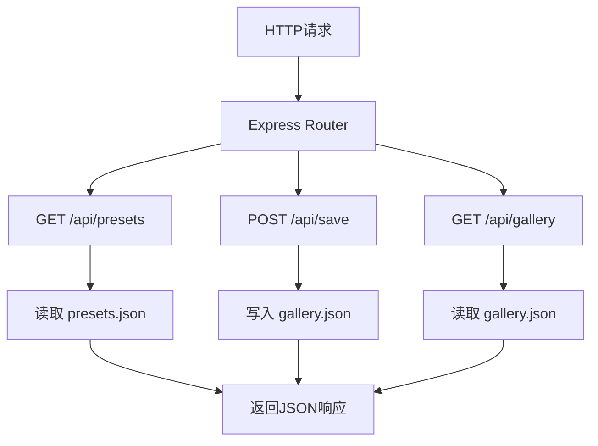
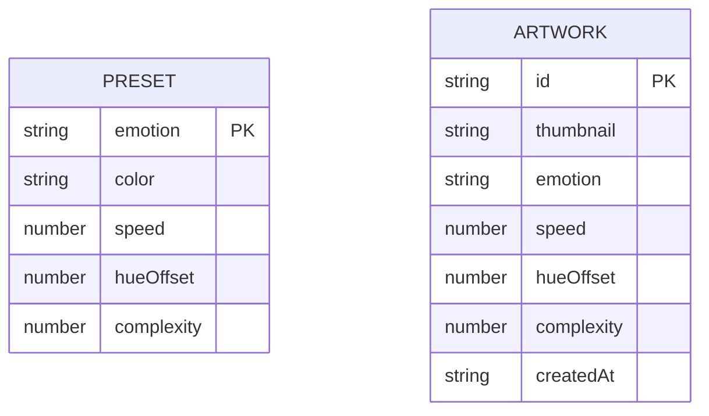

## 1. 架构设计



## 2. 技术说明
- 前端：React 18 + TypeScript + Vite，开发服务器端口3000
- 后端：Express 4 + TypeScript，监听端口3001，CORS跨域支持
- 数据存储：JSON文件存储预设情绪配置与用户保存作品
- 状态管理：React useState/useContext，无需额外状态库
- 路由：react-router-dom（单页应用）
- 工具库：uuid用于生成作品唯一ID

## 3. 路由定义
| 路由 | 用途 |
|------|------|
| / | 主页面，包含画布、控制面板、画廊入口 |

## 4. API 定义

```typescript
// 情绪类型
type Emotion = 'happy' | 'sad' | 'angry' | 'calm' | 'anxious';

// 画布控制状态
interface ControlState {
  emotion: Emotion;
  speed: number;      // 0.1 - 2.0
  hueOffset: number;  // 0 - 360
  complexity: number; // 1 - 10
}

// 预设配置
interface PresetConfig extends ControlState {
  emotion: Emotion;
  color: string;
}

// 保存的作品
interface SavedArtwork {
  id: string;
  thumbnail: string;  // DataURL
  emotion: Emotion;
  emotionLabel: string;
  speed: number;
  hueOffset: number;
  complexity: number;
  createdAt: string;
}

// GET /api/presets
// Response: PresetConfig[]

// POST /api/save
// Request Body: Omit<SavedArtwork, 'id' | 'createdAt'>
// Response: SavedArtwork

// GET /api/gallery
// Response: SavedArtwork[]
```

## 5. 服务端架构



## 6. 数据模型

### 6.1 数据结构



### 6.2 JSON 文件格式

**server/data/presets.json**
```json
[
  { "emotion": "happy", "color": "#fbbf24", "speed": 1.0, "hueOffset": 0, "complexity": 5 },
  { "emotion": "sad", "color": "#6366f1", "speed": 0.4, "hueOffset": 0, "complexity": 3 },
  { "emotion": "angry", "color": "#ef4444", "speed": 1.8, "hueOffset": 0, "complexity": 8 },
  { "emotion": "calm", "color": "#34d399", "speed": 0.3, "hueOffset": 0, "complexity": 2 },
  { "emotion": "anxious", "color": "#a78bfa", "speed": 1.5, "hueOffset": 0, "complexity": 7 }
]
```

**server/data/gallery.json**
```json
[]
```

## 7. 项目文件结构

```
auto23/
├── package.json
├── vite.config.js
├── tsconfig.json
├── index.html
├── src/
│   ├── App.tsx                    # 主组件，状态管理
│   ├── components/
│   │   ├── Canvas/
│   │   │   └── CanvasRenderer.tsx # 画布渲染核心
│   │   ├── ControlPanel/
│   │   │   └── ControlPanel.tsx   # 参数控制面板
│   │   └── Gallery/
│   │       └── GalleryModal.tsx   # 画廊模态框
│   ├── hooks/
│   │   └── useCanvasAnimation.ts  # 动画循环Hook
│   └── utils/
│       └── api.ts                 # API调用封装
└── server/
    ├── server.ts                  # Express服务
    └── data/
        ├── presets.json           # 情绪预设
        └── gallery.json           # 保存的作品
```

## 8. 数据流向

1. 应用启动：App.tsx → api.ts → GET /api/presets → server.ts → 读取presets.json → 返回预设 → 初始化ControlState
2. 参数调节：ControlPanel.tsx → 用户交互 → setState → 传递给CanvasRenderer → useCanvasAnimation → requestAnimationFrame → 重绘画布
3. 保存作品：ControlPanel 保存按钮 → Canvas.toDataURL() → api.ts → POST /api/save → server.ts → 写入gallery.json → 返回保存结果
4. 画廊恢复：GalleryModal.tsx 点击缩略图 → api.ts → GET /api/gallery → 获取作品配置 → 更新App全局state → CanvasRenderer重新渲染
