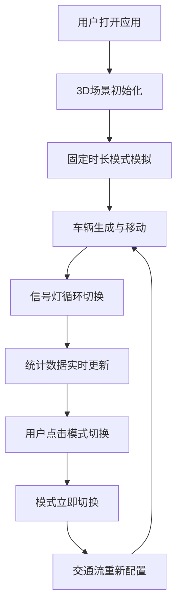

## 1. 产品概述

城市交通路口模拟系统，帮助城市规划学生直观理解不同信号灯配时方案对交通拥堵的影响。

- 解决问题：传统教学难以直观展示信号灯策略（固定时长、感应式、自适应协调控制）对路口通行效率和排队长度的影响
- 目标用户：城市规划专业学生、交通工程研究者
- 产品价值：通过3D可视化交互，沉浸式理解交通流演化过程

## 2. 核心功能

### 2.1 用户角色

| 角色 | 注册方式 | 核心权限 |
|------|----------|-----------|
| 普通用户 | 无需注册 | 浏览模拟场景、切换信号灯模式、查看实时统计数据 |

### 2.2 功能模块

1. **3D交通场景模块**：十字路口3D渲染、车辆生成与移动、信号灯可视化
2. **信号灯控制模块**：三种信号灯模式切换、配时方案执行
3. **实时统计模块**：交通数据采集与展示、数字滚动动画

### 2.3 页面详情

| 页面名称 | 模块名称 | 功能描述 |
|-----------|-------------|---------------------|
| 主模拟页 | 3D场景区域 | 等轴测视角显示双向八车道十字路口，车辆沿车道行驶，信号灯状态实时变化 |
| 主模拟页 | 控制面板 | 三个模式切换按钮，高亮当前选中模式 |
| 主模拟页 | 统计面板 | 实时显示总车辆数、平均等待时间、最大排队长度、通过率 |

## 3. 核心流程

用户打开应用 → 3D场景自动开始模拟 → 查看默认固定时长模式下的交通流 → 点击切换感应式/自适应协调模式 → 观察交通流变化 → 对比不同模式下的统计数据

## 4. 用户界面设计

### 4.1 设计风格

- 主色调：深灰色#2d3436、半透明黑色#1e272e
- 强调色：青绿色#00b894、红色#ff4757、黄色#ffa502、绿色#2ed573
- 车辆颜色：#ff6b6b, #4ecdc4, #45b7d1, #f9ca24, #6c5ce7
- 字体：现代无衬线字体，数字使用等宽字体
- 按钮风格：圆角卡片，半透明背景，hover和选中状态高亮边框
- 布局：弹性布局flex-wrap，响应式适配

### 4.2 页面设计概述

| 页面名称 | 模块名称 | UI元素 |
|-----------|-------------|----------|
| 主模拟页 | 3D场景 | 等轴测视角45度俯角，可手动旋转30-60度，地面深灰配白色车道线 |
| 主模拟页 | 模式切换卡片 | 左上角180px宽，圆角10px，半透明背景，选中模式青绿色边框 |
| 主模拟页 | 统计面板 | 左下角220px宽，圆角12px，半透明背景，数字青绿色，标签浅灰色 |

### 4.3 响应性

- 桌面端优先设计，最小宽度1024px
- 弹性布局flex-wrap，UI元素自适应屏幕尺寸
- 模式切换时场景0.5秒淡入淡出过渡

### 4.4 3D场景设计

- 环境：深灰色地面，白色车道标线，浅灰色人行道
- 光照：环境光+方向光，模拟日间光照效果
- 摄像机：固定45度俯角，可手动旋转视角30-60度
- 车辆：立方体（长2单位、宽1单位、高0.6单位），颜色随机
- 信号灯：圆柱体（高0.8单位，半径0.15单位），发光效果渐变过渡
- 动画：车辆匀速行驶，信号灯发光0.2秒渐变，数字滚动0.3秒动画
- 性能：60FPS流畅运行，车辆上限200辆
