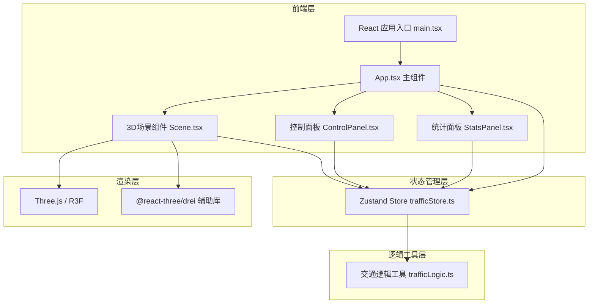

## 1. 架构设计



## 2. 技术描述

- 前端框架：React 18 + TypeScript
- 3D渲染：Three.js + @react-three/fiber + @react-three/drei
- 状态管理：Zustand
- 构建工具：Vite
- 开发服务器端口：3000
- UI组件：自定义样式（不使用Tailwind），使用Leva（可选）
- 后端：无（纯前端模拟）

## 3. 项目结构

| 文件路径 | 用途 |
|---------|------|
| package.json | 项目依赖与脚本配置 |
| vite.config.js | Vite构建配置 |
| tsconfig.json | TypeScript配置 |
| index.html | 入口HTML页面 |
| src/main.tsx | React应用挂载点 |
| src/App.tsx | 主应用组件，管理布局与模式切换 |
| src/store/trafficStore.ts | Zustand状态管理 |
| src/components/Scene.tsx | 3D场景组件 |
| src/components/ControlPanel.tsx | 控制面板组件 |
| src/components/StatsPanel.tsx | 统计面板组件 |
| src/utils/trafficLogic.ts | 交通逻辑纯函数工具 |

## 4. 核心数据模型

### 4.1 车辆数据模型

```typescript
interface Vehicle {
  id: string;
  position: [number, number, number]; // [x, y, z]
  direction: 'north' | 'south' | 'east' | 'west';
  speed: number;
  color: string;
  isWaiting: boolean;
  waitStartTime: number;
  lane: number;
}
```

### 4.2 信号灯状态

```typescript
type LightColor = 'red' | 'yellow' | 'green';

interface TrafficLight {
  northSouth: LightColor;
  eastWest: LightColor;
  remainingTime: number;
  transitionProgress: number;
}
```

### 4.3 统计数据

```typescript
interface Statistics {
  totalVehicles: number;
  averageWaitTime: number;
  maxQueueLength: number;
  throughput: number;
  passedVehicles: number;
  startTime: number;
}
```

### 4.4 信号灯模式

```typescript
type TrafficMode = 'fixed' | 'actuated' | 'adaptive';
```

## 5. 状态管理数据流

1. App组件初始化，调用store.startSimulation()
2. store每帧调用trafficLogic.updateVehicles()更新车辆位置
3. store根据模式调用对应信号灯逻辑更新信号灯状态
4. Scene组件订阅store中的vehicles和trafficLight状态进行渲染
5. ControlPanel组件调用store.setMode()切换模式
6. StatsPanel组件订阅store中的statistics状态进行展示
7. 统计数据每2秒刷新一次

## 6. 核心算法

### 6.1 车辆生成算法
- 每个方向按随机时间间隔（0.5-2秒）生成车辆
- 车辆颜色从预设颜色池中随机选取
- 车辆分配到对应方向的车道

### 6.2 固定时长信号灯
- 绿灯30秒 → 黄灯3秒 → 红灯30秒 → 循环
- 南北向与东西向相位交替

### 6.3 感应式信号灯
- 基础配时同固定时长
- 绿灯阶段检测排队车辆>5辆时，延长绿灯15秒
- 最多延长1次

### 6.4 自适应协调控制
- 根据各方向车流量动态调整绿灯时长
- 绿灯时长范围：15-45秒
- 周期时长根据总流量调整

### 6.5 车辆移动逻辑
- 正常行驶：0.3单位/帧
- 进入路口：减速至0.15单位/帧
- 红灯排队：车距保持0.5单位
- 绿灯启动：每0.3秒启动一辆

## 7. 性能优化

- 车辆上限200辆，超出时销毁最远车辆
- 使用R3F的<instancedMesh>优化大量车辆渲染
- 状态更新使用批量处理
- 统计数据节流更新（每2秒）
- 动画使用requestAnimationFrame帧同步
