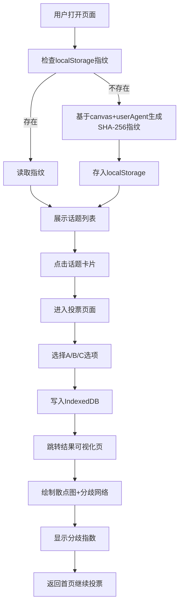

## 1. 产品概述
基于浏览器指纹的匿名投票与观点分歧可视化应用，用户无需注册登录即可通过浏览器生成的唯一标识参与话题投票，并查看整体意见分布和观点分歧网络。
- 解决传统投票需要注册登录的痛点，提供完全匿名的参与体验
- 通过可视化散点图和分歧网络直观展示群体观点分布和分歧程度

## 2. 核心功能

### 2.1 功能模块
1. **首页**：指纹标识展示、话题卡片网格
2. **投票页**：话题详情、三选一投票按钮、实时统计
3. **结果页**：Canvas散点图、分歧网络可视化、分歧指数

### 2.2 页面详情
| 页面名称 | 模块名称 | 功能描述 |
|-----------|-------------|---------------------|
| 首页 | 指纹标识栏 | 页面顶部显示用户部分指纹前8位作为匿名标识 |
| 首页 | 话题卡片网格 | 以网格布局展示12个话题卡片，每张卡片含标题、描述、投票人数 |
| 投票页 | 话题详情区 | 展示话题完整描述、当前投票人数 |
| 投票页 | 三选一投票 | A/B/C三个选项按钮，选中后显示百分比并实时更新总人数 |
| 结果页 | Canvas散点图 | 720x480区域，X轴A占比Y轴B占比，6px圆点，颜色按选项区分 |
| 结果页 | 分歧网络 | 用户观点不同时半透明灰色连线，右上角显示分歧指数 |
| 全局 | 统计数据栏 | 底部固定栏显示总投票数、活跃话题数、平均分歧指数、实时更新时间 |

## 3. 核心流程
用户打开页面 → 自动生成/读取浏览器指纹 → 浏览话题卡片 → 点击话题进入投票页 → 选择A/B/C之一 → 提交投票并写入IndexedDB → 跳转结果页 → 查看散点图、分歧网络和分歧指数 → 可返回首页继续投票

## 4. 用户界面设计
### 4.1 设计风格
- 主背景：深灰色 #111827
- 卡片背景：白色 #ffffff，阴影 0 2px 8px rgba(0,0,0,0.08)，圆角 12px
- 主题色：A选项红 #ef4444，B选项蓝 #3b82f6，C选项绿 #22c55e
- 统计栏背景：深灰色 #1f2937，文字白色 #ffffff
- 按钮未选背景：浅灰 #374151，悬停：中灰 #4b5563

### 4.2 页面设计概览
| 页面名称 | 模块名称 | UI元素 |
|-----------|-------------|-------------|
| 首页 | 指纹标识栏 | 顶部细条，左侧显示指纹图标+前8位哈希值 |
| 首页 | 话题卡片网格 | 宽240px高180px卡片，间距16px，桌面多列/移动2列 |
| 投票页 | 页面标题 | 24px加粗，颜色 #f3f4f6 |
| 投票页 | 选项按钮 | 圆角8px，点击弹性动画（0.15s缩小至0.95倍） |
| 结果页 | Canvas区域 | 720x480，点渐入动画（0.5s扩散），连线0.3s渐显 |
| 全局 | 底部统计栏 | 高度60px，左/中/右三栏布局 |

### 4.3 响应式
桌面端卡片多列网格，小于768px屏幕切换为两列布局，Canvas区域自适应缩放。
