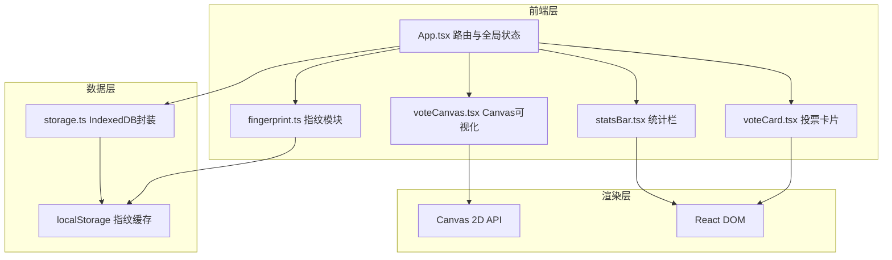
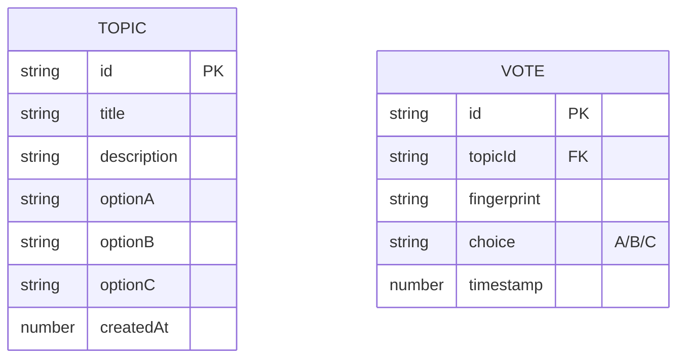

## 1. 架构设计

## 2. 技术描述
- 前端框架：React 18 + TypeScript
- 构建工具：Vite（开发端口3000）
- 状态管理：React useState/useContext（轻量全局状态）
- 数据持久化：IndexedDB（投票记录）+ localStorage（指纹缓存）
- 图形渲染：原生 Canvas 2D API
- 哈希算法：Web Crypto API (SHA-256)
- 唯一ID生成：uuid

## 3. 路由定义
| 路由 | 用途 |
|-------|---------|
| / | 首页，话题卡片列表 |
| /vote/:topicId | 投票页面，三选一投票 |
| /result/:topicId | 结果可视化页面，散点图+分歧网络 |

## 4. 数据模型

### 4.1 数据模型定义

### 4.2 IndexedDB 存储结构
- 数据库名：AnonymousVoteDB
- 版本：1
- 对象仓库：
  - topics：存储话题列表，keyPath=id
  - votes：存储投票记录，keyPath=id，索引：topicId, fingerprint+topicId（唯一约束）

## 5. 核心算法
1. **指纹生成**：canvas指纹（绘制图形取dataURL）+ userAgent + screen.width + screen.height → 拼接字符串 → SHA-256哈希 → hex字符串
2. **分歧指数**：遍历所有用户对，统计选择不同的对数 / C(n,2) × 100
3. **散点图坐标计算**：
   - 统计每个用户在所有话题中选A、选B、选C的累计次数占比
   - X = A占比 × 画布宽度，Y = B占比 × 画布高度
4. **分歧连线**：双重循环比较用户选择，不同则绘制半透明灰线
