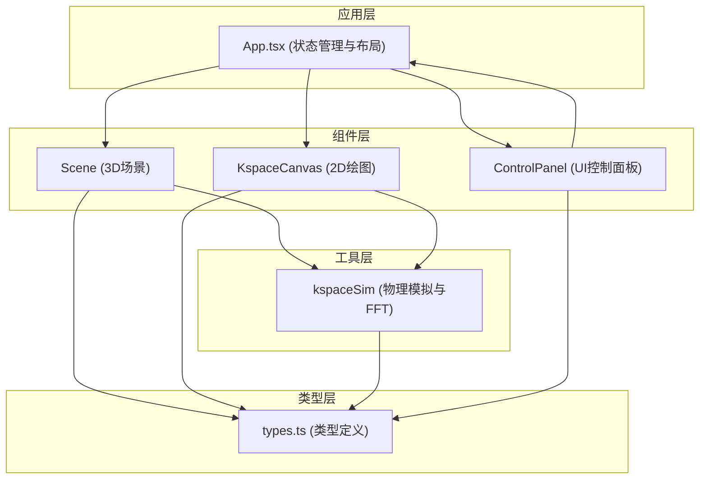

## 1. 架构设计

前端单页应用，采用React组件化架构，状态提升至父组件管理，3D渲染通过React Three Fiber (R3F) 对接Three.js。



## 2. 技术描述

- **前端框架**：React 18 + TypeScript
- **构建工具**：Vite 5
- **3D渲染**：Three.js + @react-three/fiber (R3F) + @react-three/drei
- **样式方案**：CSS-in-JS (style对象)，无额外依赖
- **状态管理**：React useState/useCallback（状态提升至App组件）
- **数学计算**：TypedArray优化，手动实现FFT

### 核心依赖

| 依赖包 | 版本 | 用途 |
|--------|------|------|
| react | ^18.2.0 | UI框架 |
| react-dom | ^18.2.0 | DOM渲染 |
| three | ^0.160.0 | 3D引擎 |
| @react-three/fiber | ^8.15.0 | React-Three.js桥接 |
| @react-three/drei | ^9.92.0 | R3F常用组件 |
| typescript | ^5.3.0 | 类型系统 |
| vite | ^5.0.0 | 构建工具 |
| @vitejs/plugin-react | ^4.2.0 | Vite React插件 |

## 3. 项目结构

```
├── package.json
├── index.html
├── vite.config.js
├── tsconfig.json
└── src/
    ├── main.tsx          # React入口
    ├── App.tsx           # 主组件，状态管理与布局
    ├── components/
    │   ├── Scene.tsx     # 3D场景组件
    │   ├── ControlPanel.tsx  # 控制面板组件
    │   └── KspaceCanvas.tsx  # k空间Canvas组件
    ├── utils/
    │   └── kspaceSim.ts  # 物理模拟与FFT工具
    └── types.ts          # 类型定义
```

## 4. 数据模型

### 4.1 类型定义

```typescript
// 脉冲序列参数
interface SequenceParams {
  TR: number;      // 重复时间 (ms)
  TE: number;      // 回波时间 (ms)
  flipAngle: number; // 翻转角 (度)
}

// k空间采样点
interface KspacePoint {
  x: number;       // kx坐标
  y: number;       // ky坐标
  value: number;   // 信号强度
  phase: number;   // 相位
}

// 重建图像数据
interface ImageData {
  width: number;
  height: number;
  pixels: Uint8ClampedArray; // 灰度像素值
}

// 质子数据
interface ProtonData {
  x: number;
  y: number;
  z: number;
  phase: number;
  frequency: number;
}
```

## 5. 核心算法

### 5.1 k空间模拟

1. 根据质子位置和梯度强度计算各质子的进动频率
2. 模拟自旋回波序列：90°脉冲 → 散相 → 180°重聚脉冲 → 回波形成
3. 按笛卡尔网格采样k空间数据
4. 使用TypedArray存储复数形式的k空间数据

### 5.2 FFT图像重建

1. 实现快速傅里叶逆变换（IFFT）
2. 将k空间复数数据转换为空间域图像
3. 应用对比度调整：TR影响纵向恢复，TE影响横向衰减
4. 量化为8位灰度图像

### 5.3 性能优化

- 使用Float32Array/Float64Array存储计算数据，减少GC
- requestAnimationFrame驱动动画循环
- 质子粒子系统使用BufferGeometry一次性渲染
- 图像重建算法使用迭代FFT，复杂度O(N log N)
