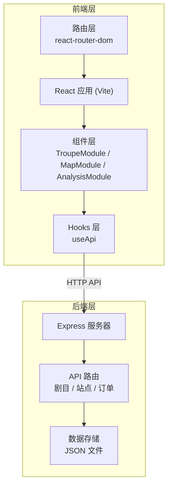
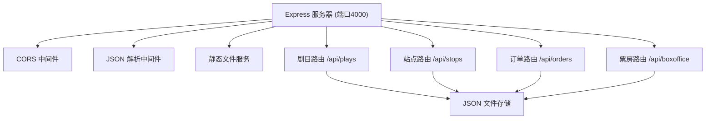
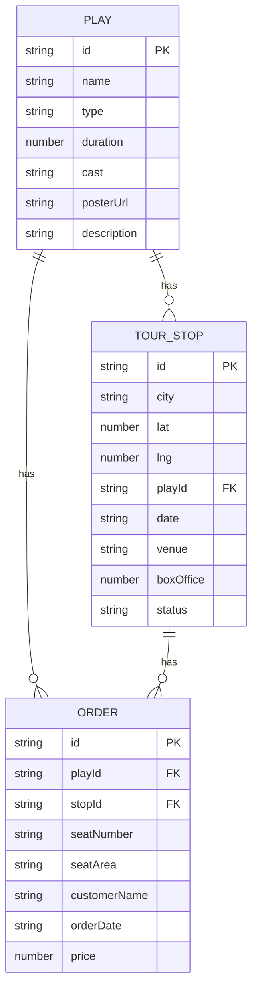

## 1. 架构设计



## 2. 技术描述

- **前端**：React 18 + TypeScript + Vite
- **状态管理**：React Hooks + Context
- **路由**：react-router-dom
- **地图**：leaflet + react-leaflet
- **图表**：recharts
- **后端**：Express 4
- **数据存储**：JSON 文件（剧目、巡演站点、订单、观众数据）
- **唯一标识**：uuid

## 3. 路由定义

| 路由路径 | 页面/组件 | 用途 |
|----------|-----------|------|
| / | 首页/导航 | 应用入口，模块导航 |
| /troupe | TroupeModule | 剧目管理 |
| /map | MapModule | 巡演地图 |
| /analysis | AnalysisModule | 数据分析 |
| /tickets | 购票模块 | 观众购票与电子票 |

## 4. API 定义

### 4.1 剧目相关

```typescript
interface Play {
  id: string;
  name: string;
  type: '话剧' | '戏曲' | '儿童剧';
  duration: number; // 分钟
  cast: string[];
  posterUrl: string;
  description: string;
}

// GET /api/plays - 获取剧目列表
// GET /api/plays/:id - 获取单个剧目
// POST /api/plays - 创建剧目
// PUT /api/plays/:id - 更新剧目
// DELETE /api/plays/:id - 删除剧目
```

### 4.2 巡演站点相关

```typescript
interface TourStop {
  id: string;
  city: string;
  lat: number;
  lng: number;
  playId: string;
  date: string;
  venue: string;
  boxOffice: number;
  status: '已演出' | '计划中';
}

// GET /api/stops - 获取站点列表
// GET /api/stops/:id - 获取单个站点
// POST /api/stops - 创建站点
// PUT /api/stops/:id - 更新站点
```

### 4.3 订单相关

```typescript
interface Order {
  id: string;
  playId: string;
  stopId: string;
  seatNumber: string;
  seatArea: 'front' | 'middle' | 'back';
  customerName: string;
  orderDate: string;
  price: number;
}

// GET /api/orders - 获取订单列表
// POST /api/orders - 创建订单
// GET /api/orders/:id - 获取订单详情
```

### 4.4 票房数据

```typescript
interface BoxOfficeData {
  date: string;
  ticketsSold: number;
  revenue: number;
}

// GET /api/boxoffice?playId=xxx&range=week - 获取票房数据
```

## 5. 服务器架构



## 6. 数据模型

### 6.1 数据模型定义



### 6.2 数据文件结构

- `data/plays.json` - 剧目数据
- `data/stops.json` - 巡演站点数据
- `data/orders.json` - 订单数据

## 7. 项目文件结构

```
.
├── package.json
├── index.html
├── vite.config.js
├── tsconfig.json
├── server.js
├── data/
│   ├── plays.json
│   ├── stops.json
│   └── orders.json
└── src/
    ├── App.tsx
    ├── components/
    │   ├── TroupeModule.tsx
    │   ├── MapModule.tsx
    │   └── AnalysisModule.tsx
    └── hooks/
        └── useApi.ts
```
