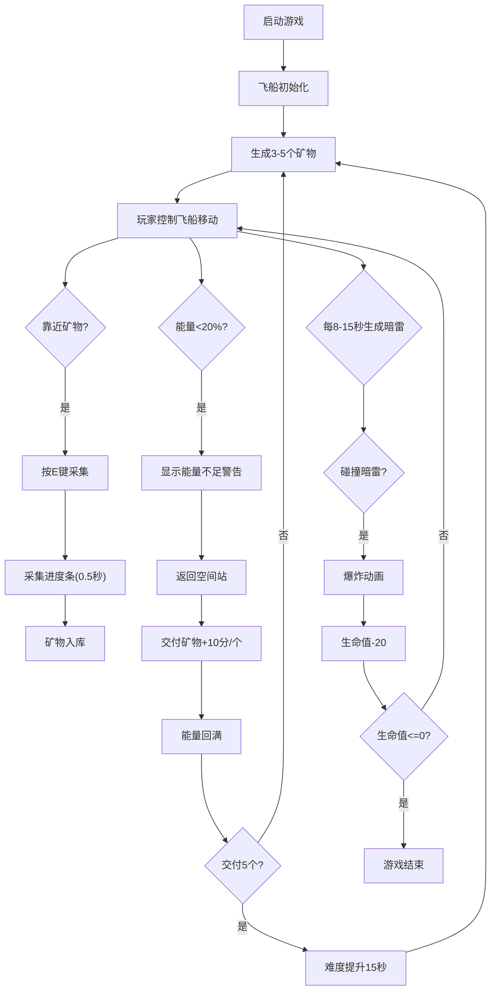

## 1. 产品概述

太空采矿模拟器是一款2D俯视视角的太空采矿游戏，玩家驾驶飞船在危险的小行星带采集稀有矿物，躲避暗雷和能量风暴，安全返回空间站交付资源。

- **主要目的**：解决传统太空采矿游戏缺乏动态威胁生成与资源竞争机制的问题，提供紧张刺激的沉浸式采矿体验
- **目标用户**：休闲游戏玩家、太空题材爱好者
- **核心价值**：动态难度系统、实时威胁生成、资源管理与风险评估的策略玩法

## 2. 核心功能

### 2.1 用户角色
| 角色 | 注册方式 | 核心权限 |
|------|----------|----------|
| 玩家 | 无需注册，直接进入 | 完整游戏体验、操控飞船、采集矿物、躲避威胁 |

### 2.2 功能模块
1. **游戏主场景**：飞船控制、粒子系统、背景渲染、碰撞检测
2. **资源采集系统**：矿物生成、采集交互、进度反馈、库存管理
3. **威胁生成系统**：暗雷随机生成、碰撞伤害、爆炸特效
4. **能量风暴系统**：难度递增、风暴粒子、动态参数调整
5. **UI信息面板**：生命值、矿物数、能量条、雷达小地图、警告提示
6. **空间站交互**：能量补充、矿物交付、积分计算

### 2.3 页面详情
| 页面名称 | 模块名称 | 功能描述 |
|----------|----------|----------|
| 游戏主界面 | 飞船控制 | 方向键移动，螺旋桨动画，尾焰粒子效果 |
| 游戏主界面 | 场景渲染 | 暗色星云渐变背景，矿物/暗雷/空间站绘制 |
| 游戏主界面 | 采集系统 | 按E键采集，进度条显示，矿物入库 |
| 游戏主界面 | 威胁系统 | 暗雷随机生成，碰撞爆炸，生命值扣除 |
| 右侧信息面板 | 状态显示 | 红色血条、黄色矿物数、蓝色能量条 |
| 右侧信息面板 | 雷达小地图 | 150x150半透明雷达，显示所有实体位置，脉冲扫描线 |
| 游戏主界面 | 警告系统 | 能量不足红色闪烁警告 |
| 游戏主界面 | 难度系统 | 交付5个矿物后难度提升，持续15秒 |

## 3. 核心流程

玩家启动游戏 → 控制飞船移动 → 寻找矿物节点 → 靠近后按E采集 → 躲避随机生成的暗雷 → 监控能量值 → 能量不足时返回空间站 → 交付矿物获得积分 → 能量回满继续采矿 → 每交付5个触发难度提升 → 循环游戏

## 4. 用户界面设计

### 4.1 设计风格
- **主色调**：深空主题，主背景#0d1117，画布背景从#0a0015到#1a0533渐变
- **强调色**：飞船#4fc3f7、矿物#ffd54f、暗雷#8e24aa、空间站#00e676、尾焰#ff9800→#ffeb3b
- **字体**：数字使用monospace，主色#e6edf3
- **布局风格**：画布居中800×600px，右侧紧贴200px信息面板，四周半透明深灰衬托
- **动画效果**：螺旋桨旋转、尾焰粒子、矿物呼吸闪烁、暗雷脉冲、爆炸扩散、雷达扫描线、画面抖动

### 4.2 页面设计概述
| 页面名称 | 模块名称 | UI元素 |
|----------|----------|---------|
| 游戏主界面 | 飞船 | 六边形图标，底30px高20px，#4fc3f7，螺旋桨每帧转15度 |
| 游戏主界面 | 矿物节点 | 八边形，外接圆半径25px，#ffd54f金色描边，2秒呼吸闪烁 |
| 游戏主界面 | 暗雷 | 紫色五边形，半径12px，#8e24aa，0.3秒半透明脉冲 |
| 游戏主界面 | 空间站 | 绿色六边形，底35px高25px，#00e676，呼吸光晕半径50px |
| 游戏主界面 | 尾焰粒子 | 大小2-4px，颜色#ff9800→#ffeb3b渐变，每帧5个，0.6秒消失 |
| 游戏主界面 | 爆炸动画 | 半径10px→60px，颜色#ff1744→#ff9100，透明度1→0，0.4秒 |
| 右侧信息面板 | 生命值条 | 渐变红到橙，100点 |
| 右侧信息面板 | 矿物计数 | 黄色monospace数字 |
| 右侧信息面板 | 能量条 | 渐变蓝到紫，100点，每秒-1 |
| 右侧信息面板 | 雷达小地图 | 150×150px半透明黑背景，5帧/次刷新，1秒循环扫描线 |
| 游戏主界面 | 警告文字 | 能量不足时左上角红色闪烁2秒 |
| 游戏主界面 | 风暴粒子 | 黑色絮状，1-3px，30-80px/s从右向左飘 |

### 4.3 响应式
- 桌面端优先设计，支持1.5x缩放不丢失细节
- Canvas使用devicePixelRatio适配高清屏
- 所有绘制基于比例计算，支持动态缩放

### 4.4 性能要求
- 游戏循环稳定45FPS以上
- 粒子数量峰值不超过300个
- 避免内存泄漏，及时清理过期粒子和实体
