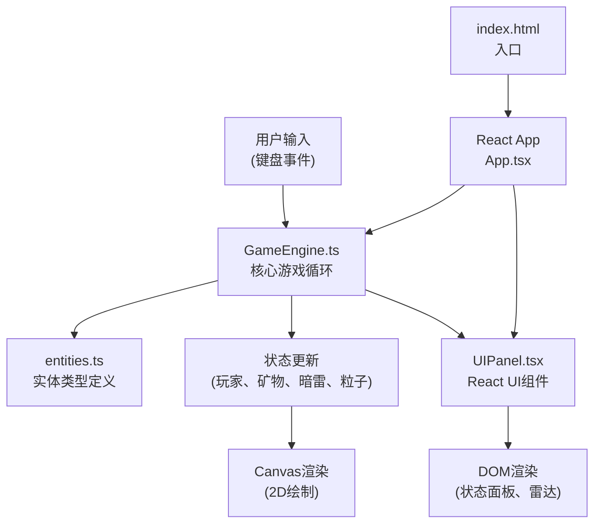

## 1. 架构设计



## 2. 技术描述

- **前端**：React 18 + TypeScript + Vite
- **初始化工具**：Vite
- **后端**：无（纯前端游戏）
- **数据库**：无
- **渲染引擎**：Canvas 2D API
- **状态管理**：GameEngine内部状态 + React props传递

## 3. 目录结构

```
auto35/
├── index.html                 # 入口页面
├── package.json               # 项目依赖
├── tsconfig.json              # TypeScript配置
├── vite.config.js             # Vite配置
└── src/
    ├── main.tsx               # React入口
    ├── App.tsx                # 主应用组件
    ├── GameEngine.ts          # 核心游戏引擎
    ├── UIPanel.tsx            # UI信息面板组件
    ├── entities.ts            # 实体类型与常量定义
    └── index.css              # 全局样式
```

## 4. 核心文件说明

### 4.1 entities.ts - 实体类型定义
```typescript
// 位置接口
interface Position {
  x: number;
  y: number;
}

// 飞船实体
interface Ship extends Position {
  angle: number;           // 朝向角度
  speed: number;           // 移动速度 120px/s
  health: number;          // 生命值 0-100
  energy: number;          // 能量值 0-100
  minerals: number;        // 矿物库存
  score: number;           // 总分数
  propellerAngle: number;  // 螺旋桨角度
}

// 矿物节点
interface Mineral extends Position {
  radius: number;          // 外接圆半径25px
  pulsePhase: number;      // 闪烁相位
  isCollecting: boolean;   // 是否正在采集
  collectProgress: number; // 采集进度 0-1
}

// 暗雷
interface Mine extends Position {
  radius: number;          // 半径12px
  pulsePhase: number;      // 脉冲相位
  opacity: number;         // 透明度
}

// 空间站
interface SpaceStation extends Position {
  width: number;           // 底边长35px
  height: number;          // 高25px
  glowPhase: number;       // 光晕相位
}

// 粒子类型
type ParticleType = 'exhaust' | 'explosion' | 'storm';

// 粒子
interface Particle extends Position {
  type: ParticleType;
  vx: number;              // x方向速度
  vy: number;              // y方向速度
  size: number;            // 大小
  color: string;           // 颜色
  life: number;            // 剩余生命周期
  maxLife: number;         // 最大生命周期
}

// 爆炸效果
interface Explosion extends Position {
  radius: number;          // 当前半径
  maxRadius: number;       // 最大半径60px
  life: number;            // 剩余生命周期
  maxLife: number;         // 总生命周期0.4秒
}

// 游戏状态
interface GameState {
  ship: Ship;
  minerals: Mineral[];
  mines: Mine[];
  station: SpaceStation;
  particles: Particle[];
  explosions: Explosion[];
  lastMineSpawn: number;   // 上次暗雷生成时间
  mineSpawnInterval: number; // 暗雷生成间隔
  mineralPulseSpeed: number; // 矿物闪烁速度倍率
  stormDensity: number;    // 风暴密度倍率
  difficultyBoostEnd: number; // 难度提升结束时间
  showLowEnergyWarning: boolean;
  warningEndTime: number;
  screenShake: number;     // 屏幕抖动剩余时间
  frameCount: number;      // 帧计数器
  gameOver: boolean;
  deliveryCount: number;   // 本轮交付计数
}

// 游戏常量
const CANVAS_WIDTH = 800;
const CANVAS_HEIGHT = 600;
const SHIP_SPEED = 120;
const SHIP_BASE = 30;
const SHIP_HEIGHT = 20;
const SHIP_COLOR = '#4fc3f7';
const MINERAL_RADIUS = 25;
const MINERAL_COLOR = '#ffd54f';
const MINE_RADIUS = 12;
const MINE_COLOR = '#8e24aa';
const STATION_BASE = 35;
const STATION_HEIGHT = 25;
const STATION_COLOR = '#00e676';
const EXHAUST_LIFE = 0.6;
const EXPLOSION_LIFE = 0.4;
const ENERGY_DRAIN_RATE = 1;
const COLLECT_DURATION = 0.5;
const WARNING_DURATION = 2;
const DIFFICULTY_DURATION = 15;
const SCREEN_SHAKE_DURATION = 0.3;
const MINE_SPAWN_MIN = 8;
const MINE_SPAWN_MAX = 15;
const MIN_MINE_SPAWN_INTERVAL = 4;
const MAX_PARTICLES = 300;
const TARGET_FPS = 60;
```

### 4.2 GameEngine.ts - 核心游戏引擎
- **游戏循环**：requestAnimationFrame驱动，固定时间步长更新
- **输入处理**：键盘事件监听，方向键控制移动，E键采集
- **碰撞检测**：圆形碰撞检测，飞船与暗雷、矿物、空间站
- **实体更新**：飞船移动、粒子更新、矿物闪烁、暗雷脉冲
- **Canvas渲染**：背景、飞船、矿物、暗雷、空间站、粒子、爆炸效果

### 4.3 UIPanel.tsx - React UI组件
- **生命值条**：红色到橙色渐变，100点显示
- **矿物计数**：黄色monospace字体显示
- **能量条**：蓝色到紫色渐变，100点显示，每秒消耗1点
- **雷达小地图**：150×150px半透明黑色背景，显示所有实体位置，1秒循环脉冲扫描线，5帧刷新一次
- **警告文字**：能量不足时左上角红色闪烁

## 5. 性能优化策略

1. **对象池模式**：粒子对象重用，避免频繁GC
2. **限制粒子数量**：峰值不超过300个，超出时优先移除最老的
3. **高效渲染**：离屏Canvas预渲染静态背景
4. **状态批量更新**：减少React重渲染次数
5. **及时清理**：每帧清理过期粒子和实体
6. **防抖节流**：雷达地图5帧刷新一次，而非每帧

## 6. 响应式适配

- Canvas元素使用CSS transform进行1.5x缩放
- 所有绘制坐标基于逻辑尺寸(800×600)计算
- 使用devicePixelRatio适配高清屏，避免模糊
- 信息面板使用flex布局，自动适应高度
