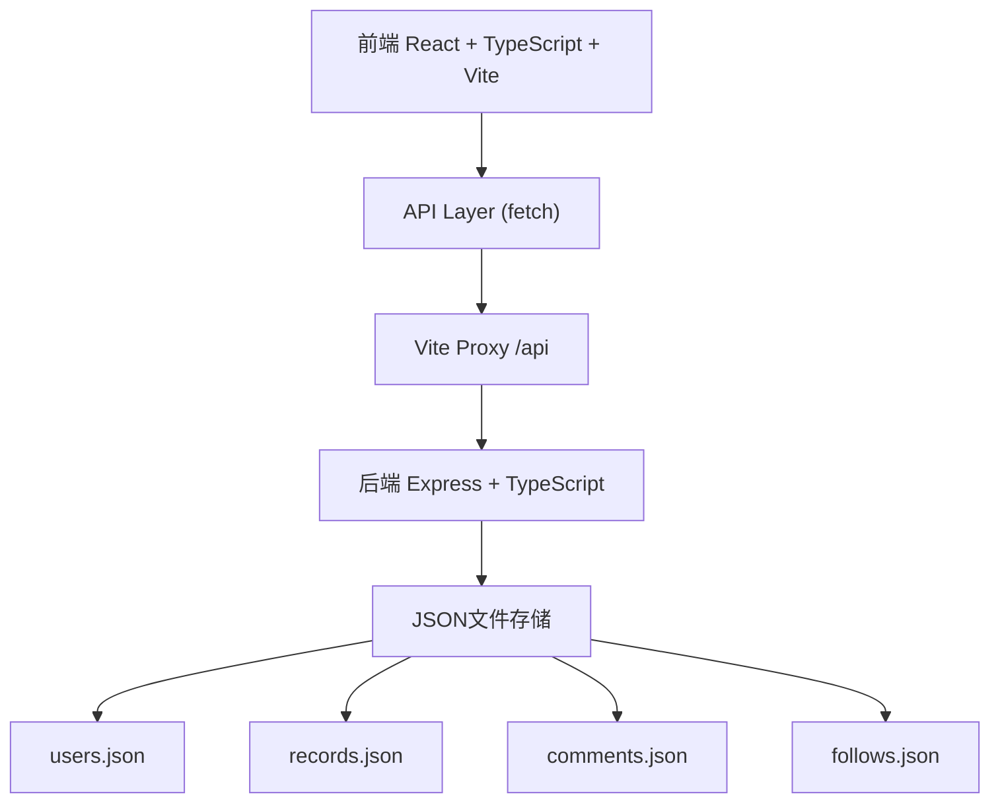
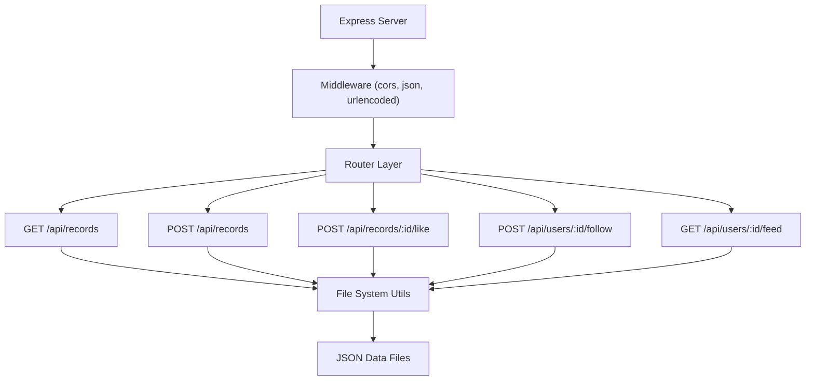
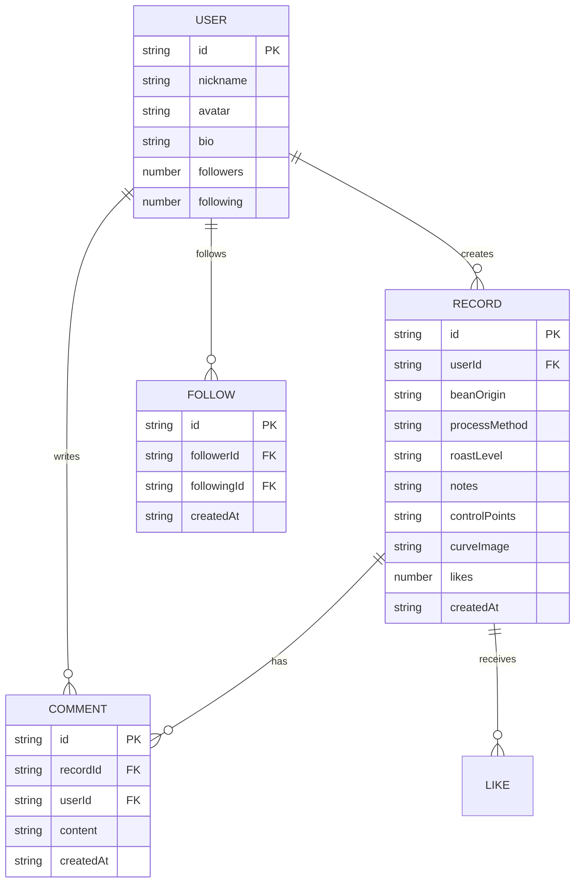

## 1. 架构设计



## 2. 技术描述

- **前端**：React@18 + TypeScript + Vite@5 + React Router@6
- **后端**：Express@4 + TypeScript + CORS
- **数据存储**：JSON文件（users.json, records.json, comments.json, follows.json）
- **开发工具**：ts-node（运行后端TS）、concurrently（同时启动前后端）
- **样式方案**：原生CSS + CSS Variables（无Tailwind，按用户需求）
- **图标库**：lucide-react
- **日期处理**：dayjs
- **唯一ID**：uuid

## 3. 路由定义

| 路由 | 页面 | 用途 |
|-------|------|------|
| `/` | HomePage | 首页瀑布流展示烘焙记录 |
| `/record/:id` | RecordDetailPage | 单条烘焙记录详情页 |
| `/create` | CreateRecordPage | 创建新烘焙记录页 |

## 4. API 定义

```typescript
// 类型定义
interface User {
  id: string;
  nickname: string;
  avatar: string;
  bio: string;
  followers: number;
  following: number;
}

interface ControlPoint {
  time: number;      // 0-15 分钟
  temperature: number; // 100-250 °C
}

interface FlavorTag {
  id: string;
  name: string;
  selected: boolean;
}

interface RoastRecord {
  id: string;
  userId: string;
  user: User;
  beanOrigin: string;
  processMethod: string;
  roastLevel: 'light' | 'medium' | 'dark';
  flavorTags: FlavorTag[];
  notes: string;
  controlPoints: ControlPoint[];
  curveImage: string;  // base64 data URL
  likes: number;
  likedBy: string[];
  createdAt: string;
}

interface Comment {
  id: string;
  recordId: string;
  userId: string;
  user: User;
  content: string;
  createdAt: string;
}

interface Follow {
  id: string;
  followerId: string;
  followingId: string;
  createdAt: string;
}

// API 端点
// GET /api/records?page=1&limit=10
// Response: { records: RoastRecord[], hasMore: boolean }

// POST /api/records
// Request: Omit<RoastRecord, 'id' | 'likes' | 'likedBy' | 'createdAt' | 'user'>
// Response: RoastRecord

// POST /api/records/:id/like
// Request: { userId: string }
// Response: { success: boolean; likes: number; liked: boolean }

// POST /api/users/:id/follow
// Request: { followerId: string }
// Response: { success: boolean; following: boolean }

// GET /api/users/:id/feed
// Response: { records: RoastRecord[] }
```

## 5. 服务器架构图



## 6. 数据模型

### 6.1 数据模型定义



### 6.2 JSON 文件结构

```json
// users.json
{
  "users": [
    {
      "id": "user-1",
      "nickname": "咖啡烘焙师小王",
      "avatar": "data:image/svg+xml,...",
      "bio": "热爱咖啡烘焙，专注浅烘",
      "followers": 128,
      "following": 45
    }
  ]
}

// records.json
{
  "records": [
    {
      "id": "record-1",
      "userId": "user-1",
      "beanOrigin": "埃塞俄比亚 耶加雪菲",
      "processMethod": "水洗处理",
      "roastLevel": "light",
      "flavorTags": [
        { "id": "tag-1", "name": "花香味", "selected": true },
        { "id": "tag-2", "name": "水果味", "selected": true }
      ],
      "notes": "一爆开始后2分钟下豆，花香明显...",
      "controlPoints": [
        { "time": 0, "temperature": 150 },
        { "time": 5, "temperature": 180 },
        { "time": 10, "temperature": 210 },
        { "time": 15, "temperature": 230 }
      ],
      "curveImage": "data:image/png;base64,...",
      "likes": 42,
      "likedBy": ["user-2", "user-3"],
      "createdAt": "2026-06-17T10:30:00Z"
    }
  ]
}
```

## 7. 前端文件结构

```
src/
├── main.tsx              # 入口文件，路由配置
├── pages/
│   ├── HomePage.tsx      # 首页瀑布流
│   ├── RecordDetailPage.tsx  # 记录详情页
│   └── CreateRecordPage.tsx  # 创建记录页
├── components/
│   ├── CurveCanvas.tsx   # Canvas曲线绘制组件
│   ├── ShareCard.tsx     # 分享卡片组件
│   ├── Navbar.tsx        # 导航栏组件
│   ├── RecordCard.tsx    # 记录卡片组件
│   ├── CommentList.tsx   # 评论列表组件
│   └── FlavorTagSelector.tsx  # 风味标签选择器
├── hooks/
│   └── useApi.ts         # API请求自定义Hook
├── utils/
│   └── colors.ts         # 温度颜色映射工具
├── types/
│   └── index.ts          # 全局类型定义
└── styles/
    ├── global.css        # 全局样式
    └── variables.css     # CSS变量定义
```

## 8. 性能优化点

1. **首页瀑布流懒加载**：使用IntersectionObserver，预加载下一屏数据
2. **图片懒加载**：curveImage使用loading="lazy"属性
3. **Canvas绘制优化**：requestAnimationFrame批量绘制，避免重绘
4. **防抖处理**：搜索、滚动等高频操作使用防抖
5. **组件懒加载**：非首屏组件使用React.lazy
6. **CSS动画优化**：使用transform和opacity属性，避免触发重排
