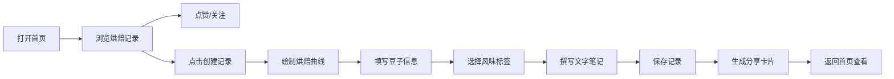

## 1. 产品概述

咖啡烘焙曲线记录与分享平台，让咖啡爱好者像品酒师记录品酒笔记一样，精确记录每次烘焙咖啡豆的温度曲线，并与同好交流烘焙经验。

- **核心价值**：为咖啡烘焙爱好者提供专业的曲线记录工具和社区交流平台
- **目标用户**：咖啡烘焙爱好者、家庭烘焙师、专业咖啡师
- **市场定位**：垂直领域的专业工具+社交平台，填补咖啡烘焙数字化记录的空白

## 2. 核心功能

### 2.1 用户角色

| 角色 | 注册方式 | 核心权限 |
|------|----------|----------|
| 普通用户 | 默认访客身份（模拟登录） | 浏览烘焙记录、创建记录、点赞评论、关注他人 |

### 2.2 功能模块

1. **首页**：瀑布流展示所有公开烘焙记录、懒加载、点赞、关注
2. **创建记录页**：Canvas曲线绘制、豆子信息录入、风味标签、文字笔记
3. **记录详情页**：完整曲线展示、评论列表、分享卡片预览

### 2.3 页面详情

| 页面名称 | 模块名称 | 功能描述 |
|-----------|-------------|---------------------|
| 首页 | 瀑布流卡片列表 | IntersectionObserver懒加载，每屏预加载，三列→两列→单列响应式 |
| 首页 | 卡片交互 | 点赞爱心动画、悬浮阴影上移效果、跳转详情 |
| 创建记录页 | 曲线画布 | 600×400px Canvas，拖拽控制点调整三次贝塞尔曲线，温度渐变颜色 |
| 创建记录页 | 豆子信息 | 产地、处理法、烘焙度（浅/中/深）选择器 |
| 创建记录页 | 风味标签 | 花香味、水果味、巧克力味等可切换标签 |
| 创建记录页 | 文字笔记 | 最多500字输入框 |
| 创建记录页 | 分享卡片 | 自动生成600×800px分享卡片预览 |
| 记录详情页 | 曲线展示 | 完整烘焙曲线展示 |
| 记录详情页 | 评论列表 | 查看和发布评论 |

## 3. 核心流程

用户打开首页 → 浏览瀑布流烘焙记录 → 点赞/关注感兴趣的烘焙师 → 点击创建新记录 → 在Canvas上拖拽控制点绘制烘焙曲线 → 填写豆子信息和风味标签 → 撰写文字笔记 → 保存记录 → 系统自动生成分享卡片 → 返回首页查看新记录

## 4. 用户界面设计

### 4.1 设计风格

- **主色调**：#795548（深咖啡棕）、#8d6e63（浅咖啡棕）
- **强调色**：#ff8f00（暖橙色）
- **背景色**：#faf0e6（暖米色）
- **按钮风格**：圆角8px，悬浮态颜色加深，过渡0.2s ease
- **字体**：显示字体使用Playfair Display，正文字体使用Noto Sans SC，营造温暖专业的咖啡文化氛围
- **布局风格**：卡片式设计，圆角16px，柔和阴影，大量留白
- **图标风格**：lucide-react线性图标，与咖啡主题匹配

### 4.2 页面设计概要

| 页面名称 | 模块名称 | UI元素 |
|-----------|-------------|----------|
| 首页 | 导航栏 | Logo、搜索、用户头像，移动端汉堡菜单 |
| 首页 | 瀑布流卡片 | 320px宽卡片，间距24px，悬浮上移8px加深阴影 |
| 首页 | 点赞按钮 | 爱心图标，点击跳动变大动画 |
| 创建记录页 | Canvas画布 | 浅灰背景#f5f5f5，50px网格线#e0e0e0 |
| 创建记录页 | 控制点 | 可拖拽，悬停显示温度时间提示框 |
| 创建记录页 | 风味标签 | 圆角小方块，背景#ffe0b2，文字#e65100，选中态切换 |
| 分享卡片 | 卡片布局 | 600×800px白底，顶部曲线截图，中部信息标签，底部用户信息 |

### 4.3 响应式

- **桌面端（≥1024px）**：瀑布流三列布局，完整导航栏
- **平板（768-1023px）**：瀑布流两列布局，导航栏简化
- **移动端（<768px）**：瀑布流单列布局，汉堡菜单，卡片全宽

### 4.4 动画与交互

- **页面加载**：卡片交错淡入，animation-delay递增
- **卡片悬浮**：上移8px，阴影从0 4px 20px变为0 8px 30px，0.3s ease
- **点赞动画**：爱心从#d32f2f跳动变大1.3倍再恢复，0.2s ease
- **按钮悬浮**：颜色加深10%，0.2s ease
- **控制点拖拽**：实时更新曲线形状，平滑过渡
