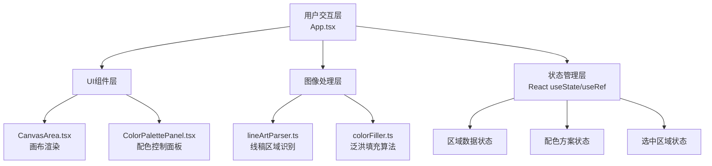

## 1. 架构设计



## 2. 技术描述

- **前端框架**：React 18 + TypeScript
- **构建工具**：Vite 5（开发端口3000）
- **Canvas渲染**：HTML5 Canvas 2D API
- **状态管理**：React Hooks（useState, useRef, useCallback, useMemo）
- **样式方案**：原生CSS + CSS变量（无Tailwind依赖，按用户需求定制）

## 3. 文件结构

```
auto38/
├── package.json
├── vite.config.js
├── tsconfig.json
├── index.html
└── src/
    ├── App.tsx
    ├── main.tsx
    ├── index.css
    └── modules/
        ├── imageProcessor/
        │   ├── lineArtParser.ts
        │   └── colorFiller.ts
        └── ui/
            ├── CanvasArea.tsx
            └── ColorPalettePanel.tsx
```

## 4. 核心数据结构

### 4.1 区域数据类型

```typescript
interface Region {
  id: number;
  seedPoint: { x: number; y: number };
  boundary: { x: number; y: number }[];
  color: string;
  bounds: { minX: number; minY: number; maxX: number; maxY: number };
}
```

### 4.2 配色方案类型

```typescript
interface ColorScheme {
  name: string;
  colors: string[];
}

interface SavedScheme {
  regions: {
    id: number;
    hex: string;
    seedPoint: { x: number; y: number };
  }[];
  timestamp: number;
}
```

### 4.3 预设色板

```typescript
const PRESET_PALETTES: ColorScheme[] = [
  { name: "赛博朋克", colors: ["#ff006e", "#8338ec", "#3a86ff", "#06ffa5", "#ffbe0b", ...] },
  { name: "日式和风", colors: ["#c73e3a", "#e0a96d", "#7d8a6e", "#4a5568", "#f4e8d6", ...] },
  // ... 共12套
];
```

## 5. 关键算法说明

### 5.1 封闭区域识别（lineArtParser.ts）
- 使用Canvas `getImageData` 获取像素数据
- 基于扫描线算法检测黑色线条边界
- 使用BFS（广度优先搜索）标记每个独立封闭区域
- 计算每个区域的种子点（区域内任意点）和边界矩形

### 5.2 泛洪填充算法（colorFiller.ts）
- 基于种子点的4连通/8连通泛洪填充
- 遇到黑色线条像素（阈值判断）停止填充
- 使用队列优化避免栈溢出
- 支持0.3秒RGBA渐变动画（requestAnimationFrame）

## 6. 性能优化策略

1. **区域识别缓存**：线稿解析结果缓存，重复上传直接读取
2. **增量填充**：仅重绘修改区域，而非全Canvas刷新
3. **离屏Canvas**：使用双缓冲技术，填充完成后一次性拷贝显示
4. **节流处理**：HSV拾色器拖动使用requestAnimationFrame节流
5. **像素批量处理**：使用Uint32Array批量操作像素数据，减少GC开销
