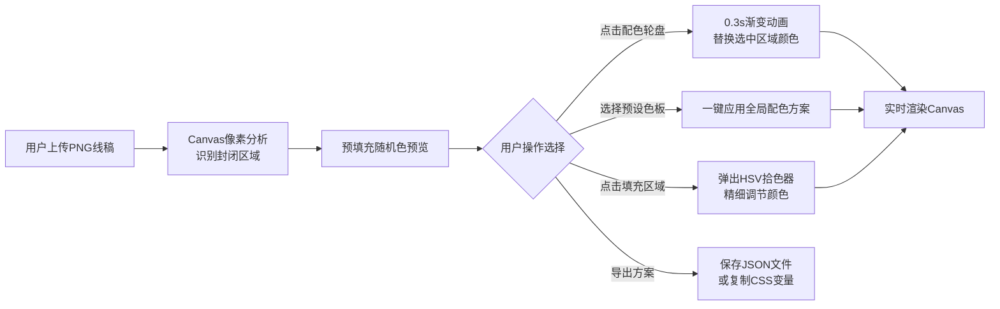

## 1. 产品概述

线稿智能上色应用（LineArt Color Studio）是一款面向插画师的专业配色工具，帮助用户快速将手绘静态线稿转化为多彩插画，并生成多套配色方案供选择。

- 解决的核心问题：手绘线稿上色耗时耗力、配色灵感枯竭、配色方案难以复用
- 目标用户：插画师、平面设计师、UI设计师、数字艺术创作者
- 产品价值：将数小时的上色工作缩短至分钟级，提供12套专业风格色板激发灵感，配色方案可导出为Web开发标准格式

## 2. 核心功能

### 2.1 功能模块

1. **线稿解析模块**：上传PNG线稿图片，自动识别封闭区域并预填充预览色
2. **配色轮盘模块**：圆形色轮快速选择颜色，点击即时替换选中区域填充色
3. **预设色板模块**：12套专业风格色板（5x2色块矩阵），一键应用全局配色
4. **HSV拾色器模块**：色相-饱和度-明度圆形拾色器，精细调节单区域颜色
5. **导出模块**：保存配色方案为JSON，一键复制为CSS变量格式

### 2.2 页面详情

| 页面名称 | 模块名称 | 功能描述 |
|---------|---------|---------|
| 主应用页 | 上传区域 | 拖拽或点击上传PNG线稿图片，支持512x512像素纯白背景黑线稿 |
| 主应用页 | 画布区域 | 600x600 Canvas画布，显示线稿与填充效果，支持点击选择区域 |
| 主应用页 | 配色轮盘 | 顶部圆形色轮，点击色块实时替换选中区域颜色，0.3秒渐变动画 |
| 主应用页 | 预设色板网格 | 中间12套风格色板（赛博朋克/日式和风/莫兰迪/波普等），5x2色块展示 |
| 主应用页 | HSV拾色器 | 底部200px直径圆形拾色器，拖动滑块即时更新区域颜色 |
| 主应用页 | 操作按钮区 | 保存JSON、复制CSS变量、重置配色等操作按钮 |

## 3. 核心流程

## 4. 用户界面设计

### 4.1 设计风格

- **主色调**：#1e1e1e（深黑灰背景），#64ffda（薄荷绿强调色），#e0e0e0（浅灰文字）
- **按钮风格**：圆角8px，背景色#64ffda，文字色#1e1e1e，hover时亮度增加10%
- **字体方案**：标题使用Space Grotesk，正文使用Inter，代码区使用JetBrains Mono
- **布局风格**：左右分栏（画布600px + 控制面板320px），桌面端横向布局，移动端上下堆叠
- **动效风格**：配色切换0.3秒渐变过渡，按钮hover微光效果，区域选中高亮描边

### 4.2 页面设计概览

| 页面名称 | 模块名称 | UI元素 |
|---------|---------|--------|
| 主应用页 | 画布区域 | 600x600深色Canvas，区域选中时青色描边，填充色渐变过渡 |
| 主应用页 | 配色控制面板 | 320px宽浅灰背景，纵向三等分布局：轮盘区/色板区/拾色器区 |
| 主应用页 | 配色轮盘 | 环形色相渐变+中心饱和度渐变，点击色块即时反馈 |
| 主应用页 | 预设色板 | 12组5x2色块卡片，hover放大1.05倍，选中时青色边框 |
| 主应用页 | HSV拾色器 | 200px直径圆形色盘+明度滑块，拖动实时预览 |

### 4.3 响应式设计

- **桌面端（≥900px）**：左右分栏布局，画布居左，控制面板居右
- **移动端（<900px）**：上下堆叠布局，画布在上，控制面板在下
- **触摸优化**：按钮最小触控区域44px，色块增大间距便于点击

## 5. 性能要求

- 线稿区域识别耗时：≤2秒
- 配色切换动画帧率：≥55fps
- Canvas渲染响应延迟：≤16ms
- 单次颜色填充操作：≤50ms
