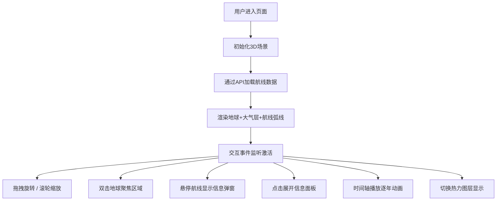

## 1. 产品概述

全球航运碳排放3D可视化应用，面向数据新闻编辑与环境研究人员，通过三维地球模型直观展示全球主要航运航线的船舶流量与碳排放趋势，支持时间轴动态播放与区域数据深度分析。

- 核心价值：将枯燥的船舶航线与排放数据转化为沉浸式3D叙事体验，助力环保议题传播与数据决策
- 目标用户：数据新闻工作者、环境分析师、航运从业者、教育工作者

## 2. 核心功能

### 2.1 用户角色

| 角色 | 注册方式 | 核心权限 |
|------|---------|---------|
| 普通用户 | 无需注册 | 浏览3D可视化场景、播放时间轴、查看航线详情、切换热力图层 |

### 2.2 功能模块

1. **3D地球渲染模块**：带真实纹理的旋转地球、大气层光晕、轨道视角控制、双击聚焦
2. **航线可视化模块**：10条全球主要航线的三维贝塞尔弧线、碳排放颜色映射、悬停高亮与信息弹窗
3. **时间轴播放模块**：2020-2030年时间滑块、自动播放、动态碳排放趋势呈现
4. **热力图层模块**：基于区域碳排放总量的动态热力图叠加、显示/隐藏切换
5. **数据统计面板**：航线详细数据展示、近5年碳排放柱状图、可折叠侧边栏

### 2.3 页面详情

| 页面名称 | 模块名称 | 功能描述 |
|---------|---------|---------|
| 主页面 | 3D地球场景 | 渲染带纹理的PBR材质地球（半径5，分段64），半透明大气层光晕，OrbitControls支持拖拽旋转与缩放（范围2-20单位），双击聚焦 |
| 主页面 | 航线弧线层 | 10条大圆贝塞尔弧线，弧高0.2-1.5动态计算，颜色映射#4ecdc4→#ff6b6b，线宽0.03，悬停高亮+悬浮信息窗 |
| 主页面 | 时间轴组件 | 水平布局600x60px，深灰背景#2a2a3a，圆角8px，11年刻度，每秒前进1年自动播放 |
| 主页面 | 热力图叠加层 | 半透明（不透明度0.4）热力图层，颜色#00ff88→#ffcc00→#ff3300，每5帧刷新，右上角开关控制 |
| 主页面 | 信息面板 | 右侧固定280px，折叠后40px，半透明#0d1117aa，显示航线详情+5年柱状图（柱宽40间距8） |
| 主页面 | 状态指示器 | 左上角Logo标题，右下角FPS与数据更新时间戳 |

## 3. 核心流程

用户进入页面 → 3D场景初始化并加载航线数据 → 地球渲染与航线绘制完成 → 用户拖拽/缩放浏览全局 → 双击聚焦某区域查看区域航线摘要 → 悬停弧线查看单条航线详情 → 点击信息面板展开完整数据 → 点击时间轴播放按钮逐年观看碳排放变化趋势 → 切换热力图层开关观察排放热点分布

## 4. 用户界面设计

### 4.1 设计风格

- **主色调**：深空背景 `#0d1117`，卡片/面板 `#161b22`
- **辅色/渐变**：碳排放低 `#4ecdc4`（青蓝）→ 高 `#ff6b6b`（珊瑚红），热力图 `#00ff88`→`#ffcc00`→`#ff3300`
- **文字**：浅灰 `#c9d1d9`，次要文字 `#8b949e`
- **按钮风格**：圆角6px，白底 `#ffffff`，悬停 `#e0e0e0`，文字深灰 `#333333`
- **字体**：正文使用 SF Mono / JetBrains Mono 等现代等宽字体，标题使用 Inter / Helvetica Neue，营造科技数据感
- **布局**：居中对称，3D场景占据主体，信息面板右侧固定，时间轴底部居中，控制面板右上角悬浮
- **阴影/圆角**：卡片阴影 `0 4px 24px rgba(0,0,0,0.4)`，圆角12px
- **图标风格**：使用 lucide-react 线性图标，统一描边风格

### 4.2 页面设计概览

| 页面名称 | 模块名称 | UI元素 |
|---------|---------|--------|
| 主页面 | 全局布局 | 深色#0d1117背景，800x500最小3D区域，所有元素居中对齐 |
| 主页面 | 顶部左侧 | Logo图标+"全球航运碳排放"标题，半透明玻璃质感 |
| 主页面 | 顶部右侧 | 热力图切换按钮（圆角6px白底），悬停状态过渡动画 |
| 主页面 | 3D场景 | 居中Canvas，地球自转微动画，航线呼吸光效 |
| 主页面 | 右侧面板 | 半透明背景#0d1117aa，折叠/展开过渡动画，柱状图渐变着色 |
| 主页面 | 底部时间轴 | 深灰#2a2a3a圆角8px，年份刻度，播放/暂停按钮，进度指示条 |
| 主页面 | 右下角 | 帧率显示+更新时间戳，等宽字体淡色显示 |
| 主页面 | 悬浮弹窗 | 跟随鼠标，半透明深色卡片，航线名加粗高亮 |

### 4.3 响应式设计

- **桌面优先**：以1280x800以上分辨率为基准设计
- **移动端适配**：
  - 时间轴高度自动增加至80px，按钮/滑块点击区域扩大至44x44px
  - 信息面板默认折叠，改为底部上滑面板
  - 触控事件 `touchstart/touchend` 替代鼠标事件
  - 3D场景最小尺寸调整为适配视口宽度
- **触控优化**：使用 PointerEvents 统一处理鼠标与触摸，OrbitControls 启用触屏手势

### 4.4 3D场景设计指引

- **环境与氛围**：深空暗背景配合微弱星点粒子场，营造宇宙视角；地球采用真实卫星蓝大理石纹理贴图
- **光照设置**：主光源（方向光）模拟太阳光从右上方45°照射，强度1.2；环境光 HemisphereLight（天空蓝#4488ff / 地深#332211）强度0.4；航线弧线自发光材质
- **相机设置**：PerspectiveCamera，初始距离12单位，fov 45°，近裁0.1远裁100；OrbitControls 阻尼0.08，禁用平移
- **构图与焦点**：地球位于场景正中央，航线弧线向外延伸形成视觉张力；热点区域（马六甲海峡、苏伊士运河）通过热力图与高亮弧线引导视觉
- **交互与动画**：地球缓慢自转（0.001rad/帧），用户交互时暂停；航线弧线随时间轴更新颜色产生流动光效；悬停弧线产生径向光晕脉冲
- **后处理效果**：Bloom泛光使弧线与热力图发光更柔和，FXAA抗锯齿提升边缘质量
- **资产与性能**：地球纹理使用CDN在线贴图，尺寸压缩至1024x512；热力图每5帧更新一次；弧线使用LineSegments + BufferGeometry批量绘制；目标帧率≥30fps，复杂区域≥20fps
