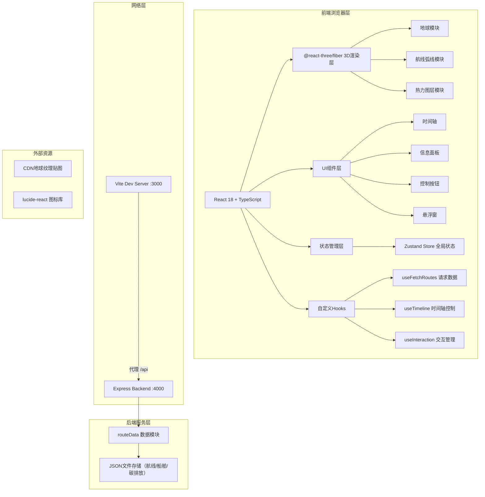
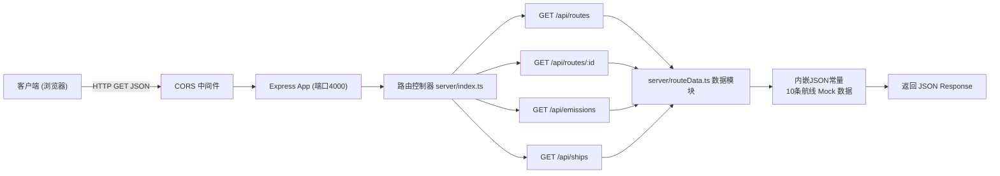
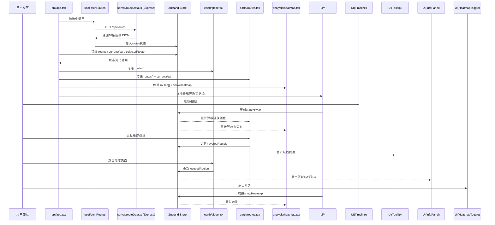

## 1. 架构设计



## 2. 技术描述

- **前端框架**：React 18 + TypeScript（严格模式，target ES2020）
- **3D引擎**：Three.js + @react-three/fiber 声明式渲染 + @react-three/drei 辅助组件（OrbitControls等）
- **构建工具**：Vite 5.x + @vitejs/plugin-react，开发端口3000，代理/api到4000端口
- **后端服务**：Express 4.x + TypeScript + CORS中间件，端口4000，基于JSON文件模拟数据库
- **状态管理**：Zustand 轻量全局Store
- **HTTP请求**：Axios 封装在自定义Hook中
- **图标**：lucide-react 线性图标
- **样式方案**：原生CSS Modules + CSS自定义变量（遵循项目约束，不引入Tailwind）

## 3. 路由定义

| 路由 | 用途 |
|------|------|
| / | 主页面，包含完整3D场景与所有交互组件 |
| /api/routes | GET：获取所有航线基础数据（10条全球航线） |
| /api/routes/:id | GET：获取单条航线详细数据与年度碳排放历史 |
| /api/emissions?year=YYYY | GET：获取指定年份的全球碳排放聚合数据 |
| /api/ships | GET：获取船舶类型统计信息 |

## 4. API定义

### 4.1 类型定义（src/types.ts）

```typescript
export interface RoutePoint {
  lat: number;
  lng: number;
}

export interface YearlyEmission {
  year: number;
  emission: number;
  shipCount: number;
}

export interface ShippingRoute {
  id: string;
  name: string;
  fromPort: string;
  toPort: string;
  from: RoutePoint;
  to: RoutePoint;
  distanceKm: number;
  avgShipsPerYear: number;
  totalEmissionTons: number;
  region: string;
  yearlyData: YearlyEmission[];
}

export interface EmissionAggregate {
  year: number;
  totalEmissionTons: number;
  totalShips: number;
  regionBreakdown: { region: string; emission: number }[];
}

export interface ShipInfo {
  type: string;
  count: number;
  avgEmissionPerShip: number;
}
```

### 4.2 请求/响应模式

**GET /api/routes**
```
Response: { success: boolean; data: ShippingRoute[]; timestamp: string }
```

**GET /api/routes/:id**
```
Response: { success: boolean; data: ShippingRoute; timestamp: string }
```

**GET /api/emissions?year=2025**
```
Response: { success: boolean; data: EmissionAggregate; timestamp: string }
```

**GET /api/ships**
```
Response: { success: boolean; data: ShipInfo[]; timestamp: string }
```

## 5. 服务端架构图



## 6. 数据模型

### 6.1 实体关系图

```mermaid
erDiagram
    SHIPPING_ROUTE {
        string id PK
        string name
        string fromPort
        string toPort
        number fromLat
        number fromLng
        number toLat
        number toLng
        number distanceKm
        number avgShipsPerYear
        number totalEmissionTons
        string region
    }
    YEARLY_EMISSION {
        number year PK
        string routeId PK_FK
        number emission
        number shipCount
    }
    SHIP_INFO {
        string type PK
        number count
        number avgEmissionPerShip
    }
    SHIPPING_ROUTE ||--o{ YEARLY_EMISSION : "包含11年数据(2020-2030)"
```

### 6.2 模拟数据规范

**10条全球主要航线（覆盖关键航道）**：
1. 上海 → 洛杉矶（跨太平洋）
2. 新加坡 → 鹿特丹（马六甲-苏伊士）
3. 迪拜 → 汉堡（波斯湾-欧洲）
4. 釜山 → 纽约（东亚-北美东）
5. 深圳 → 悉尼（亚太）
6. 里约热内卢 → 开普敦（南美-南非）
7. 孟买 → 科伦坡（印度洋）
8. 洛杉矶 → 巴拿马城（巴拿马运河）
9. 阿姆斯特丹 → 伦敦（北海近洋）
10. 广州 → 胡志明市（东南亚近洋）

**年度数据跨度**：2020-2030共11年，碳排放呈逐年递增3-5%的趋势模拟，2025年后增速加快以展现紧迫感。

---

## 7. 文件结构与调用关系

```
├── package.json                  # 前端+后端统一依赖与启动脚本
├── vite.config.js                # Vite配置: 端口3000, 代理/api->4000
├── tsconfig.json                 # TS严格模式 ES2020
├── index.html                    # 入口页面 (挂载点#root, 深色背景)
├── server/
│   ├── index.ts                  # Express入口: CORS, 注册路由, 端口4000
│   └── routeData.ts              # 数据模块: 内嵌10条航线Mock数据, 聚合函数
└── src/
    ├── main.tsx                  # React入口: 渲染<App/>, StrictMode
    ├── app.tsx                   # 主应用组件: 组装所有模块, 协调状态
    ├── types.ts                  # 类型定义: RoutePoint/ShippingRoute等
    ├── hooks/
    │   ├── useFetchRoutes.ts     # 自定义Hook: axios调用/api/routes等
    │   ├── useTimeline.ts        # 时间轴Hook: 播放/暂停/步进/年份状态
    │   └── useInteraction.ts     # 交互Hook: 悬停/双击/面板折叠
    ├── store/
    │   └── useGlobalStore.ts     # Zustand全局Store
    ├── earth/
    │   ├── globe.tsx             # 3D地球组件: <Sphere> + PBR材质 + 大气层
    │   ├── routes.tsx            # 航线弧线组件: 贝塞尔曲线+颜色映射
    │   └── atmosphere.tsx        # 大气层光晕: 半透明BackSide球体
    ├── analysis/
    │   ├── heatmap.tsx           # 热力图组件: Canvas纹理+球面映射
    │   └── colorScale.ts         # 颜色工具: 碳排放渐变色插值函数
    ├── ui/
    │   ├── timeline.tsx          # 时间轴UI: 滑块+播放按钮+刻度
    │   ├── infoPanel.tsx         # 信息面板: 航线详情+柱状图
    │   ├── heatmapToggle.tsx     # 热力图开关按钮
    │   ├── routeTooltip.tsx      # 航线悬停悬浮窗
    │   ├── header.tsx            # 顶部Logo标题栏
    │   └── statusBar.tsx         # 右下角FPS+时间戳
    └── utils/
        ├── geoMath.ts            # 地理数学: 经纬度→XYZ, 大圆路径计算
        └── performance.ts        # 性能工具: FPS统计, 节流函数
```

### 数据流向图


