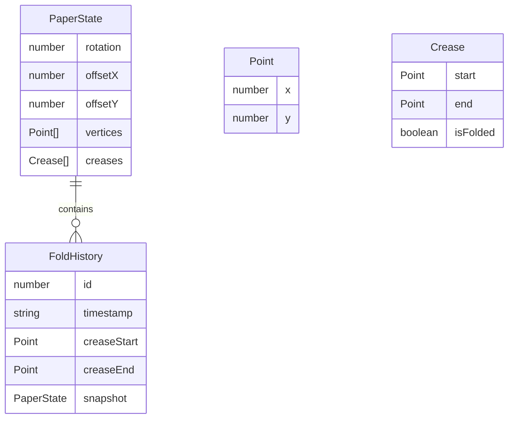

## 1. 架构设计

```mermaid
graph TD
    "前端 - React + TypeScript" --> "Canvas渲染层"
    "前端 - React + TypeScript" --> "状态管理层 - Zustand"
    "前端 - React + TypeScript" --> "折叠引擎 - FoldEngine"
    "前端 - React + TypeScript" --> "PDF导出 - PDFExporter"
    "Canvas渲染层" --> "PaperGrid组件"
    "状态管理层 - Zustand" --> "App根组件"
    "App根组件" --> "FoldToolbar"
    "App根组件" --> "PaperGrid"
    "App根组件" --> "HistoryPanel"
    "FoldEngine" --> "fold方法"
    "FoldEngine" --> "rotate方法"
    "FoldEngine" --> "translate方法"
    "PDFExporter" --> "jspdf"
```

## 2. 技术说明
- 前端：React@18 + TypeScript + Vite
- 初始化工具：vite-init (react-ts模板)
- 状态管理：Zustand
- PDF导出：jspdf
- 样式：Tailwind CSS
- 后端：无
- 数据库：无

## 3. 路由定义
| 路由 | 用途 |
|------|------|
| / | 主应用页面（单页应用，无路由切换） |

## 4. API定义
不适用 - 纯前端应用，无后端API

## 5. 服务器架构图
不适用 - 纯前端应用

## 6. 数据模型

### 6.1 数据模型定义



### 6.2 数据定义语言

```typescript
interface Point {
  x: number;
  y: number;
}

interface Crease {
  start: Point;
  end: Point;
  isFolded: boolean;
}

interface PaperState {
  vertices: Point[];
  creases: Crease[];
  rotation: number;
  offsetX: number;
  offsetY: number;
}

interface FoldRecord {
  id: number;
  timestamp: string;
  creaseStart: Point;
  creaseEnd: Point;
  snapshot: PaperState;
}

type ToolMode = 'select' | 'fold' | 'rotate';
```
