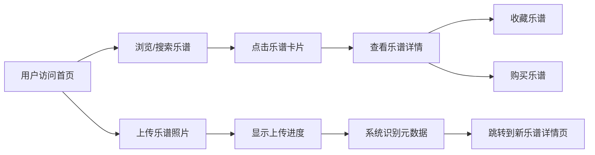

## 1. 产品概述

二手乐谱交易与乐谱识别平台是一个面向音乐爱好者的社区平台，用户可以上传闲置乐谱照片，系统自动识别乐谱标题和作曲家信息，生成可搜索条目，其他用户可浏览、收藏和购买二手乐谱。

- **目标用户**：音乐学习者、教师、演奏者等音乐爱好者
- **核心价值**：简化二手乐谱流通，通过图像识别降低信息录入门槛，建立乐谱交易社区

## 2. 核心功能

### 2.1 用户角色

| 角色 | 注册方式 | 核心权限 |
|------|----------|----------|
| 普通用户 | 无需注册（访客模式） | 浏览乐谱、搜索乐谱、上传乐谱、收藏乐谱、购买乐谱 |

### 2.2 功能模块

1. **首页**：搜索框、瀑布流乐谱卡片展示、匹配数量显示
2. **详情页**：乐谱原始照片展示、元数据面板、收藏按钮、购买按钮
3. **上传功能**：文件选择、上传进度条、自动跳转详情页

### 2.3 页面详情

| 页面名称 | 模块名称 | 功能描述 |
|----------|----------|----------|
| 首页 | 搜索框 | 支持按标题或作曲家实时搜索，显示匹配数量，搜索结果实时过滤 |
| 首页 | 瀑布流卡片 | 左侧缩略图60%宽度，右侧标题、作曲家、价格，鼠标悬停上移5px加深阴影 |
| 详情页 | 照片展示区 | 左侧最大宽度400px原始乐谱照片 |
| 详情页 | 元数据面板 | 标题、作曲家、出版年份、页数，标签浅灰值深灰 |
| 详情页 | 收藏按钮 | 心形图标，未收藏灰色悬浮粉色，已收藏实心粉色 |
| 详情页 | 购买按钮 | 圆角8px，暖金色背景，悬浮变深色 |
| 上传功能 | 文件选择 | 支持jpg/png，最大5MB |
| 上传功能 | 进度条 | 高度8px，背景浅灰，进度色暖金，动画0.5s |

## 3. 核心流程

用户浏览和搜索乐谱 → 点击卡片查看详情 → 收藏或购买乐谱

用户上传乐谱照片 → 系统识别元数据 → 生成新条目 → 自动跳转到详情页

## 4. 用户界面设计

### 4.1 设计风格

- **主色调**：暖金色 #b8860b
- **辅助色**：米白色 #f5f0e8
- **强调色**：珊瑚红 #ff6b6b
- **卡片背景**：淡米色 #faf6f0
- **按钮样式**：微圆角（8px-12px），柔和阴影，悬停过渡动画
- **字体**：衬线体用于标题，无衬线体用于正文，温暖复古风格
- **布局风格**：卡片式布局，顶部搜索居中，页面左右自适应边距（120px-240px）
- **图标风格**：线性图标，心形收藏图标

### 4.2 页面设计概览

| 页面名称 | 模块名称 | UI 元素 |
|----------|----------|----------|
| 首页 | 搜索框 | 宽400px高44px，圆角22px，边框2px solid #d4c5a9，聚焦边框#b8860b |
| 首页 | 乐谱卡片 | 宽200px高自适应，圆角12px，背景#faf6f0，阴影0 2px 8px rgba(0,0,0,0.1)，悬停上移5px阴影0 8px 24px rgba(0,0,0,0.18)，过渡0.3s ease-out |
| 详情页 | 照片展示 | 最大宽400px，圆角8px |
| 详情页 | 元数据面板 | 背景白色，标签#999999，值#333333 |
| 详情页 | 收藏按钮 | 心形图标，未收藏#cccccc悬浮#ff6b6b，已收藏#ff6b6b |
| 详情页 | 购买按钮 | 圆角8px，背景#b8860b文字白色，悬浮#8b6914，过渡0.2s |
| 上传功能 | 进度条 | 高8px，背景#e0e0e0，进度色#b8860b，动画0.5s ease |

### 4.3 响应式设计

- 桌面端（>768px）：瀑布流多列布局，卡片宽度200px
- 平板/手机端（≤768px）：卡片宽度180px或单列布局
- 触摸优化：增大点击区域，移除悬停效果改用点击反馈

