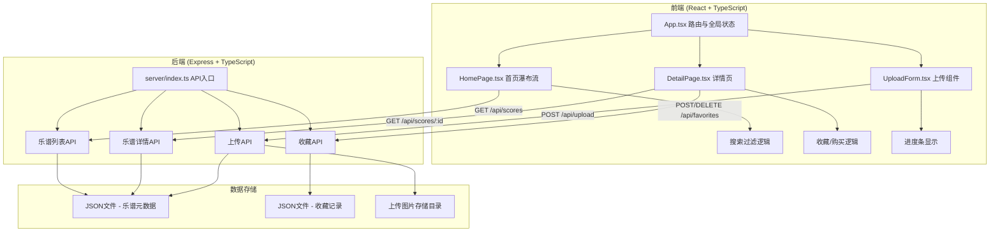
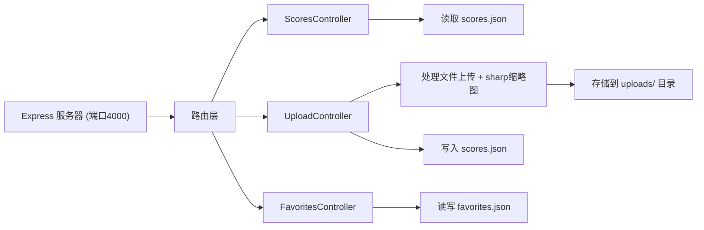
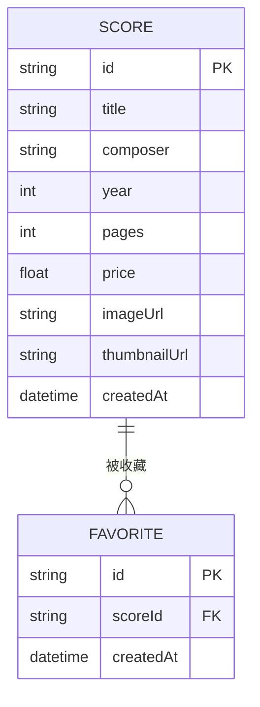

## 1. 架构设计



## 2. 技术描述

- **前端框架**：React@18 + TypeScript
- **构建工具**：Vite（开发服务器端口3000，/api代理到后端4000端口）
- **路由**：react-router-dom
- **后端框架**：Express@4 + TypeScript
- **文件上传**：multer
- **图片处理**：sharp（生成缩略图）
- **数据存储**：JSON文件存储乐谱元数据和用户收藏记录
- **唯一ID**：uuid
- **跨域**：cors

## 3. 路由定义

| 路由 | 用途 |
|------|------|
| / | 首页，瀑布流展示所有乐谱卡片 |
| /score/:id | 乐谱详情页，展示照片和元数据 |

## 4. API 定义

### TypeScript 类型定义

```typescript
interface Score {
  id: string;
  title: string;
  composer: string;
  year?: number;
  pages?: number;
  price: number;
  imageUrl: string;
  thumbnailUrl: string;
  createdAt: string;
}

interface Favorite {
  id: string;
  scoreId: string;
  createdAt: string;
}
```

### API 接口

| 方法 | 路径 | 描述 | 请求 | 响应 |
|------|------|------|------|------|
| GET | /api/scores | 获取所有乐谱列表 | - | Score[] |
| GET | /api/scores/:id | 获取单个乐谱详情 | - | Score |
| POST | /api/upload | 上传乐谱照片 | FormData (file) | Score |
| GET | /api/favorites | 获取收藏列表 | - | Favorite[] |
| POST | /api/favorites | 添加收藏 | { scoreId: string } | Favorite |
| DELETE | /api/favorites/:id | 取消收藏 | - | { success: boolean } |

## 5. 服务器架构



## 6. 数据模型

### 6.1 数据模型定义



### 6.2 初始数据

**scores.json** - 预置6-8条示例乐谱数据，包含不同作曲家和标题，便于展示搜索和瀑布流效果。

**favorites.json** - 预置0-2条收藏记录。

## 7. 项目文件结构

```
├── package.json
├── vite.config.js
├── tsconfig.json
├── index.html
├── src/
│   ├── App.tsx
│   ├── pages/
│   │   ├── HomePage.tsx
│   │   └── DetailPage.tsx
│   ├── components/
│   │   └── UploadForm.tsx
│   └── types.ts
├── server/
│   ├── index.ts
│   └── data/
│       ├── scores.json
│       └── favorites.json
└── uploads/
```

