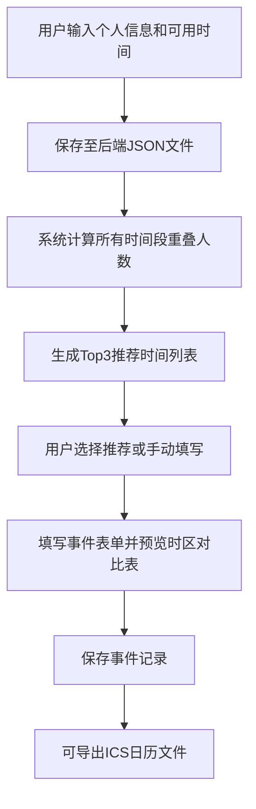

## 1. 产品概述
跨时区团队会议时间协调与智能推荐应用，解决远程办公团队因时差导致的会议时间协调难题。
- 主要目标：帮助全球分布的团队成员快速找到最佳重叠会议时段，自动生成时区对比表并支持日历导出
- 目标用户：跨国远程团队、分布式协作组织、跨时区项目组

## 2. 核心功能

### 2.1 用户角色
| 角色 | 注册方式 | 核心权限 |
|------|---------|---------|
| 团队成员 | 表单填写（姓名+时区+可用时间） | 配置个人时间段、查看推荐、创建/导出事件 |

### 2.2 功能模块
1. **用户配置模块**：时区选择、可用时间段网格配置
2. **时间网格热力图**：7天×48格Canvas可视化，展示各时段空闲人数
3. **智能推荐模块**：基于重叠算法推荐Top3最优会议时间
4. **事件创建模块**：表单填写+时区对比表预览
5. **日历导出模块**：ICS文件生成与下载
6. **事件管理模块**：事件列表展示+详情展开

### 2.3 页面详情
| 页面名称 | 模块名称 | 功能描述 |
|---------|---------|---------|
| 首页 | 顶部导航栏 | 应用名称、刷新数据按钮 |
| 首页 | 左侧配置面板 | 用户信息表单、时间段网格选择器 |
| 首页 | 右侧内容区 | 智能推荐卡片、时间热力图、创建事件表单、事件列表 |
| 首页 | 事件列表 | 分页展示、卡片展开详情、日历导出按钮 |

## 3. 核心流程
用户注册并配置个人可用时间段 → 系统计算所有成员重叠空闲窗口 → 推荐Top3最优会议时间 → 用户选择推荐时间或手动填写 → 创建事件并预览时区对比表 → 保存事件并支持导出ICS日历文件

## 4. 用户界面设计

### 4.1 设计风格
- 主色调：蓝色#3b82f6，灰色#e5e7eb，深色导航#1e293b
- 热力图颜色：灰#e5e7eb、浅绿#bbf7d0、中绿#86efac、深绿#22c55e
- 按钮风格：圆角8px，悬停过渡0.2s ease-out
- 字体：系统无衬线字体，层级清晰（标题bold、正文regular、辅助文字small）
- 布局：左右分栏（左侧320px配置面板，右侧内容区），顶部固定导航60px
- 卡片样式：圆角12px，白色背景，柔和阴影0 2px 10px rgba(0,0,0,0.08)

### 4.2 页面设计概览
| 页面名称 | 模块名称 | UI元素 |
|---------|---------|--------|
| 首页 | 顶部导航 | 深色背景#1e293b，白色文字，刷新按钮hover#334155 |
| 首页 | 左侧面板 | 宽320px，用户信息表单+时间段网格 |
| 首页 | 推荐卡片 | 320×160px，圆角12px，左侧排名色条（金#f59e0b/绿#a3e635/蓝#38bdf8） |
| 首页 | 时间网格 | Canvas 40×20px格子，网格线#d1d5db，选中态#dbeafe边框#3b82f6 |
| 首页 | 时区对比表 | 斑马纹背景，0.8rem字体，移动端横向滚动 |
| 首页 | 事件列表 | 100%宽100px高，圆角8px，浅灰#f3f4f6背景 |

### 4.3 响应式设计
- 桌面端优先（≥768px）：左右分栏布局
- 平板/移动端（<768px）：左侧面板折叠为汉堡菜单
- 表格适配（<600px）：支持横向滚动，表头固定
- 触控优化：按钮最小点击区域40×40px

## 5. 性能约束
- 推荐计算：5用户×10时间段响应≤1.5s
- Canvas渲染：7×48网格60FPS流畅交互
- 事件列表：前端分页缓存，每页10条，切换无刷新
