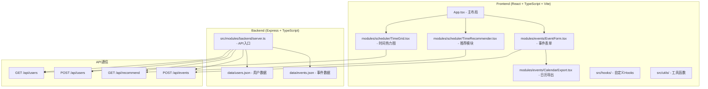
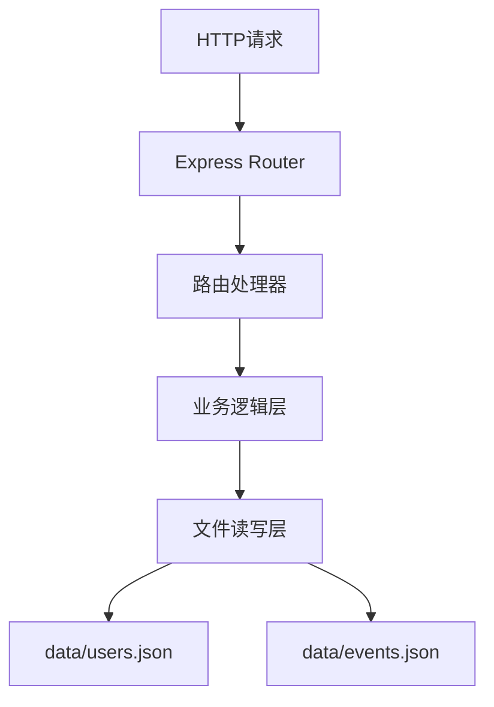
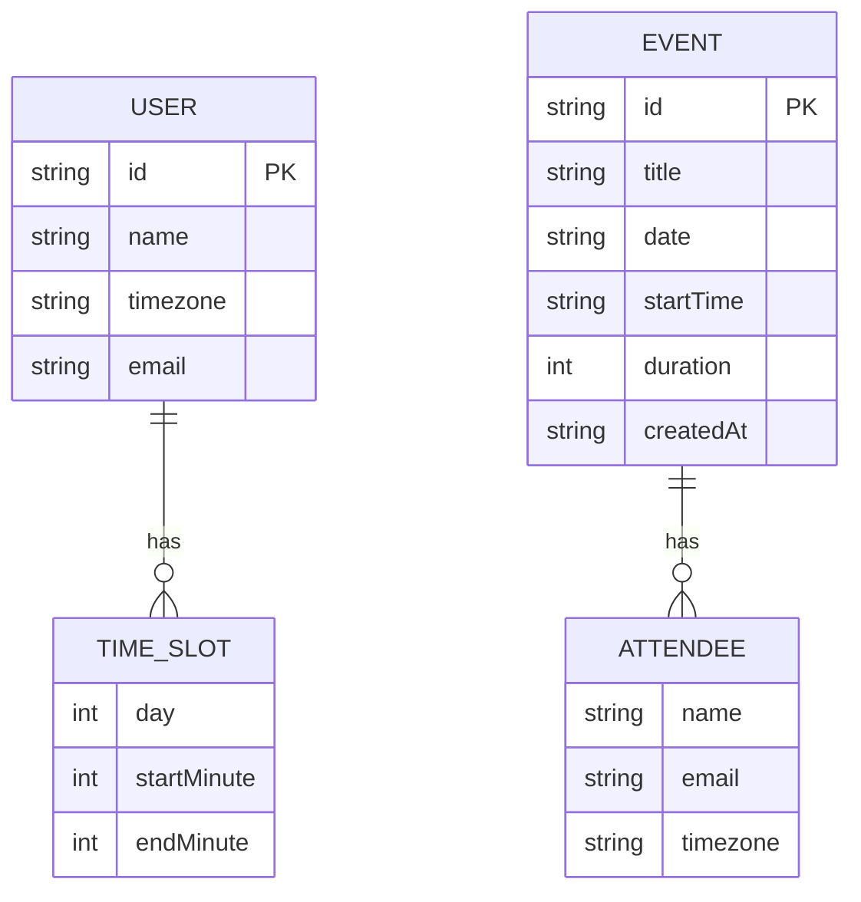

## 1. 架构设计


## 2. 技术描述
- 前端：React 18 + TypeScript + Vite
- 初始化工具：Vite
- 后端：Express 4 + TypeScript
- 数据库：JSON文件存储（data/users.json, data/events.json）
- 状态管理：React Hooks（useState, useEffect, useMemo）+ 组件本地状态
- 时间处理：dayjs
- 唯一ID：uuid
- 跨域：cors
- 路由：react-router-dom（单页应用）

## 3. 路由定义
| 路由 | 用途 |
|------|------|
| / | 首页（主应用，包含所有功能模块） |

## 4. API定义

### 类型定义
```typescript
interface User {
  id: string;
  name: string;
  timezone: string; // e.g., "UTC+8", "UTC-5"
  availability: TimeSlot[];
  email?: string;
}

interface TimeSlot {
  day: number; // 0-4 (周一到周五)
  startMinute: number; // 0-1410 (以30分钟为粒度: 0, 30, 60...)
  endMinute: number;
}

interface Recommendation {
  day: number;
  startTime: string; // "HH:mm"
  endTime: string;
  availableCount: number;
  conflictingUsers: string[];
  availableUsers: string[];
}

interface Event {
  id: string;
  title: string;
  date: string; // "YYYY-MM-DD"
  startTime: string; // "HH:mm"
  duration: number; // 分钟
  attendees: Attendee[];
  timezoneTable: TimezoneTableRow[];
  createdAt: string;
}

interface Attendee {
  name: string;
  email: string;
  timezone: string;
}

interface TimezoneTableRow {
  utcTime: string;
  localTimes: { [timezone: string]: string };
}
```

### API Schema

#### GET /api/users
- Response: `{ users: User[] }`

#### POST /api/users
- Request Body: `{ name: string, timezone: string, availability: TimeSlot[], email?: string }`
- Response: `{ success: boolean, user: User }`

#### GET /api/recommend
- Response: `{ recommendations: Recommendation[] }` (Top 3, 按人数降序)

#### POST /api/events
- Request Body: `{ title, date, startTime, duration, attendees }`
- Response: `{ success: boolean, event: Event }`

## 5. 服务端架构


## 6. 数据模型

### 6.1 数据模型ER图


### 6.2 JSON数据结构

**data/users.json:**
```json
{
  "users": [
    {
      "id": "uuid-1",
      "name": "张三",
      "timezone": "UTC+8",
      "email": "zhangsan@example.com",
      "availability": [
        { "day": 0, "startMinute": 540, "endMinute": 720 },
        { "day": 1, "startMinute": 540, "endMinute": 720 }
      ]
    }
  ]
}
```

**data/events.json:**
```json
{
  "events": [
    {
      "id": "uuid-event-1",
      "title": "项目周会",
      "date": "2025-01-20",
      "startTime": "09:00",
      "duration": 60,
      "attendees": [
        { "name": "张三", "email": "zhangsan@example.com", "timezone": "UTC+8" }
      ],
      "timezoneTable": [],
      "createdAt": "2025-01-15T10:00:00.000Z"
    }
  ]
}
```

## 7. 文件结构与调用关系
```
project-root/
├── package.json
├── vite.config.js
├── tsconfig.json
├── index.html
├── data/
│   ├── users.json          ← server.ts 读写
│   └── events.json         ← server.ts 读写
└── src/
    ├── main.tsx            ← 入口，渲染App
    ├── App.tsx             ← 主布局，组合所有模块
    ├── styles.css          ← 全局样式
    ├── modules/
    │   ├── scheduler/
    │   │   ├── TimeGrid.tsx        ← App.tsx 调用
    │   │   └── TimeRecommender.tsx ← App.tsx 调用
    │   ├── events/
    │   │   ├── EventForm.tsx       ← App.tsx 调用
    │   │   └── CalendarExport.tsx  ← EventForm.tsx & 事件列表调用
    │   └── backend/
    │       └── server.ts           ← Express API服务
    ├── hooks/
    │   └── useToast.ts             ← 全局通知Hook
    ├── utils/
    │   ├── timezone.ts             ← 时区转换工具
    │   └── ics.ts                  ← ICS文件生成
    └── types/
        └── index.ts                ← 全局类型定义
```

## 8. 开发脚本
- `npm run dev`: 同时启动前端Vite开发服务器(3000端口)和后端Express服务(4000端口)
