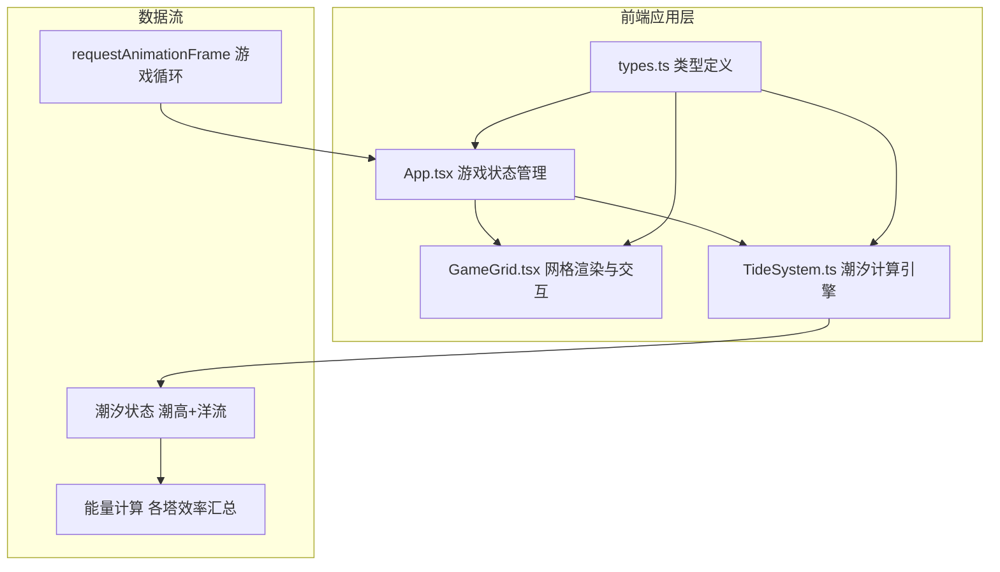
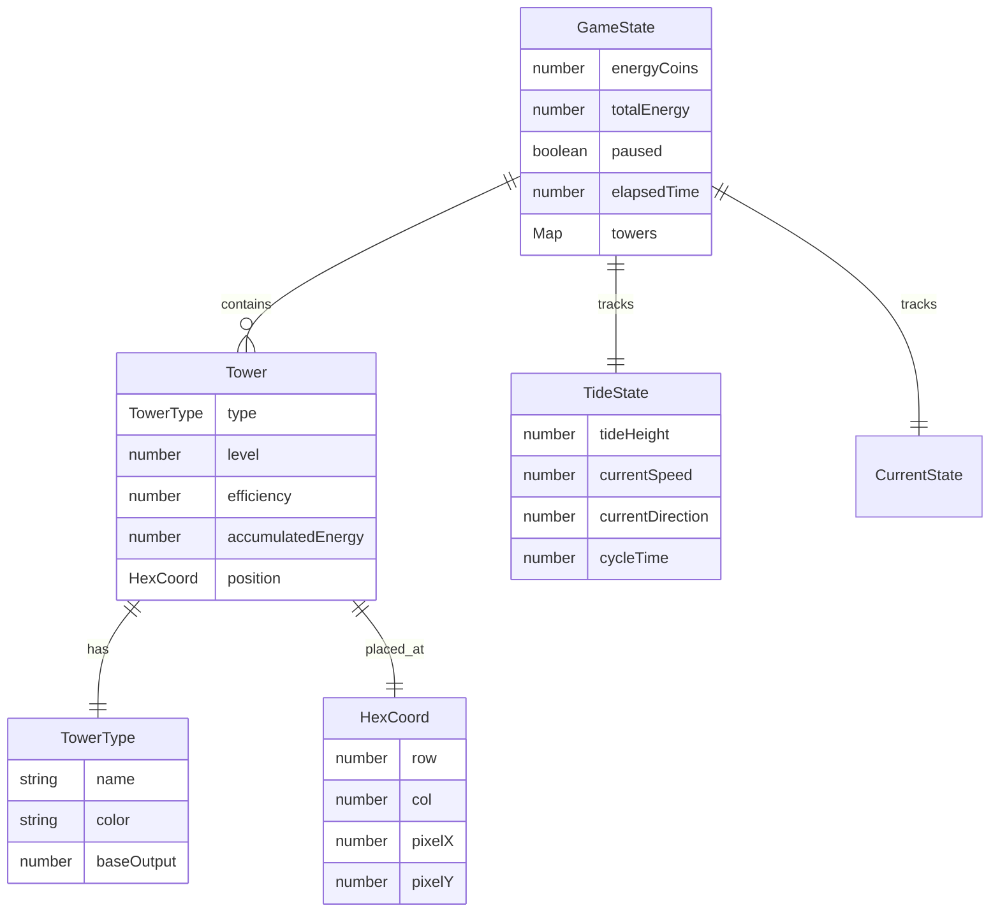

## 1. 架构设计



## 2. 技术说明

- 前端：React@18 + TypeScript + Vite
- 初始化工具：Vite
- 后端：无
- 数据库：无（纯前端状态管理）
- 渲染：Canvas绘制六边形网格与塔图标，React管理UI层

## 3. 路由定义

| 路由 | 用途 |
|------|------|
| / | 游戏主页面（单页应用） |

## 4. 数据模型

### 4.1 核心数据结构



### 4.2 文件结构

```
├── package.json
├── vite.config.js
├── tsconfig.json
├── index.html
└── src/
    ├── App.tsx          # 主应用组件，游戏状态、游戏循环、整体布局
    ├── types.ts         # 所有TypeScript类型定义
    ├── GameGrid.tsx     # Canvas网格渲染、交互处理
    └── TideSystem.ts    # 纯函数潮汐计算模块
```

### 4.3 性能策略

- 游戏循环使用 requestAnimationFrame，帧率锁定60fps
- Canvas批量绘制所有六边形和塔，避免DOM操作
- 潮汐计算为纯函数，无副作用
- 状态更新使用React setState批量处理
- 悬浮信息卡和放置菜单使用DOM元素（绝对定位），覆盖在Canvas之上
