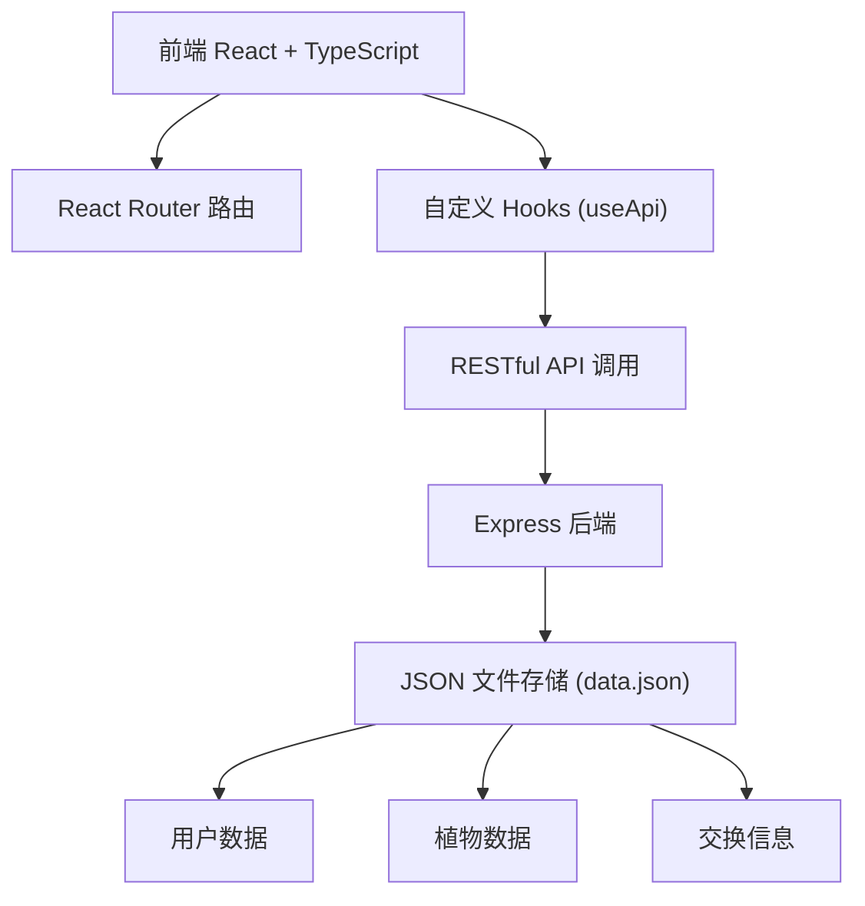
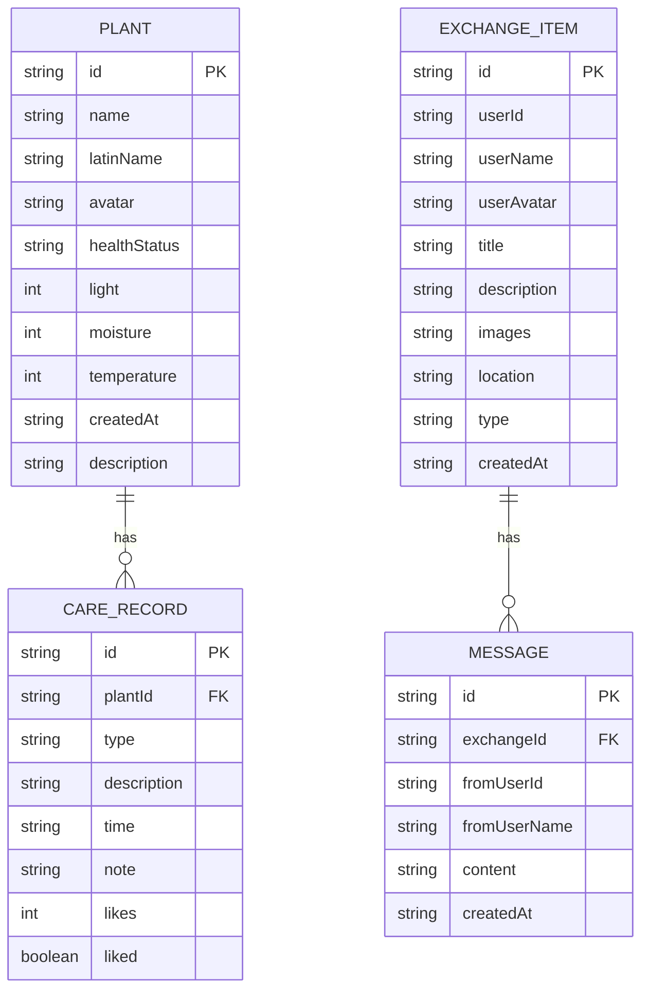

## 1. 架构设计



## 2. 技术选型

- **前端框架**：React 18 + TypeScript
- **构建工具**：Vite
- **路由管理**：React Router DOM v6
- **HTTP 请求**：原生 fetch + 自定义 useApi Hook
- **日期处理**：dayjs
- **唯一ID生成**：uuid
- **后端**：Express 4
- **数据存储**：JSON 文件（data.json）
- **跨域**：cors 中间件

## 3. 目录结构

```
src/
├── App.tsx              # 根组件，路由和布局
├── pages/
│   ├── HomePage.tsx     # 首页三栏布局
│   ├── PlantDetail.tsx  # 植物详情页
│   └── ExchangePage.tsx # 交换广场
├── components/
│   ├── PlantCard.tsx    # 植物卡片组件
│   ├── TimelineItem.tsx # 时间线条目组件
│   └── ImageGrid.tsx    # 图片网格组件
├── hooks/
│   └── useApi.ts        # API 请求 Hook
├── backend/
│   ├── server.ts        # Express 后端
│   └── data.json        # 初始数据
```

## 4. 路由定义

| 路由 | 页面 | 说明 |
|------|------|------|
| `/` | 首页 | 三栏布局：植物概览、消息流、推荐交换 |
| `/plant/:id` | 植物详情页 | 养护时间线、操作记录 |
| `/exchange` | 交换广场 | 交换列表、发布交换、私信弹窗 |

## 5. API 定义

### 5.1 植物相关

```typescript
// 植物数据类型
interface Plant {
  id: string;
  name: string;
  latinName: string;
  avatar: string;
  healthStatus: 'healthy' | 'warning' | 'danger';
  light: number;      // 光照强度 0-100
  moisture: number;   // 土壤湿度 0-100
  temperature: number; // 温度 0-100
  createdAt: string;
  description?: string;
}

// GET /api/plants - 获取所有植物
// Response: Plant[]

// GET /api/plants/:id - 获取单株植物详情
// Response: Plant

// POST /api/plants - 添加植物
// Request: Omit<Plant, 'id' | 'createdAt'>
// Response: Plant
```

### 5.2 养护记录相关

```typescript
interface CareRecord {
  id: string;
  plantId: string;
  type: 'water' | 'fertilize' | 'repot' | 'prune' | 'other';
  description: string;
  time: string;
  note?: string;
  likes: number;
  liked: boolean;
}

// GET /api/plants/:id/records - 获取植物养护记录
// Response: CareRecord[]

// POST /api/plants/:id/records - 添加养护记录
// Request: Omit<CareRecord, 'id' | 'likes' | 'liked'>
// Response: CareRecord

// POST /api/records/:id/like - 点赞记录
// Response: { likes: number; liked: boolean }
```

### 5.3 交换相关

```typescript
interface ExchangeItem {
  id: string;
  userId: string;
  userName: string;
  userAvatar: string;
  title: string;
  description: string;
  images: string[];
  location: { lat: number; lng: number; address: string };
  type: 'give' | 'want' | 'exchange';
  createdAt: string;
}

// GET /api/exchanges - 获取交换列表
// Response: ExchangeItem[]

// POST /api/exchanges - 发布交换
// Request: Omit<ExchangeItem, 'id' | 'createdAt'>
// Response: ExchangeItem
```

### 5.4 消息相关

```typescript
interface Message {
  id: string;
  exchangeId: string;
  fromUserId: string;
  fromUserName: string;
  content: string;
  createdAt: string;
}

// POST /api/exchanges/:id/messages - 发送私信
// Request: { fromUserId: string; fromUserName: string; content: string }
// Response: Message
```

## 6. 数据模型

### 6.1 ER 图



### 6.2 初始数据

在 `data.json` 中预置：
- 5-6 株示例植物（不同健康状态）
- 每株植物 5-8 条养护记录
- 4-5 条交换信息（含图片和位置）

## 7. 性能优化

1. **懒加载**：使用 Intersection Observer 实现植物卡片懒加载
2. **代码分割**：路由级别的代码分割
3. **图片优化**：使用占位图 + 懒加载
4. **首屏优化**：优先渲染可见区域内容
5. **动画优化**：使用 transform 和 opacity 动画，避免重排重绘

## 8. 响应式断点

- **>980px**：三栏布局
- **768px-980px**：两栏布局
- **<768px**：单栏布局
