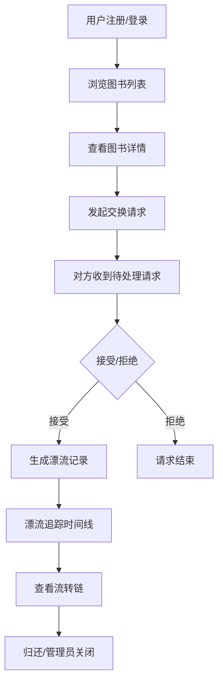

## 1. 产品概述

社区图书漂流与交换追踪应用，为读书爱好者团体提供线上图书登记、交换请求和漂流记录管理服务。
- 解决线下交换活动中书单手工登记、无法提前预知交换内容、效率低下的问题，面向社区读书爱好者
- 通过数字化管理提升图书交换效率，建立图书漂流历史可追溯性

## 2. 核心功能

### 2.1 用户角色
| 角色 | 注册方式 | 核心权限 |
|------|----------|----------|
| 普通用户 | 邮箱注册 | 浏览图书、发布图书、发起/接受交换请求、查看漂流记录 |
| 管理员 | 预置账号（admin/admin123） | 查看所有漂流记录、强制关闭交换、查看统计数据 |

### 2.2 功能模块
1. **首页**: 最近上架图书网格、最近漂流动态、导航栏
2. **图书浏览页**: 图书搜索、图书瀑布流展示、图书详情
3. **漂流追踪页**: 时间线展示交换记录、流转链展开
4. **个人中心**: 头像/昵称编辑、积分显示、待处理请求、发布图书

### 2.3 页面详情
| 页面名称 | 模块名称 | 功能描述 |
|----------|----------|----------|
| 首页 | 导航栏 | 固定顶部56px，Logo、导航链接、登录/注册按钮 |
| 首页 | 最近上架图书 | 8本图书卡片网格展示，hover升起+阴影加深动画 |
| 首页 | 最近漂流动态 | 3条最新漂流记录展示 |
| 图书浏览页 | 搜索框 | 按书名或作者实时过滤 |
| 图书浏览页 | 图书瀑布流 | 响应式网格，卡片180x260px |
| 图书详情页 | 请求交换按钮 | 检查持有人非本人后发送请求 |
| 漂流追踪页 | 时间线 | 左右交替布局，淡入入场动画 |
| 漂流追踪页 | 流转链展开 | 点击卡片查看完整交接历史 |
| 个人中心 | 头像上传 | 圆形80px，可点击上传新图片 |
| 个人中心 | 待处理请求列表 | 水平条目展示，接受/拒绝按钮 |
| 个人中心 | 发布图书表单 | 上传封面URL、书名、作者、ISBN、书况描述 |
| 管理员面板 | 统计概览 | 图书总数、交换中、已完成交换数 |
| 管理员面板 | 漂流记录表格 | 所有漂流记录列表，强制关闭按钮 |

## 3. 核心流程

用户注册登录 → 浏览/发布图书 → 发起交换请求 → 对方接受/拒绝 → 生成漂流记录 → 追踪漂流历史

## 4. 用户界面设计

### 4.1 设计风格
- 主色调: 琥珀色 #d97706（按钮、链接）
- 背景色: 暖白 #fafaf9
- 卡片背景: 白色 #ffffff
- 文字主色: 深棕 #292524
- 边框分割线: #e7e5e4
- 状态标签: 进行中蓝色 #3b82f6、已归还绿色 #22c55e
- 按钮风格: 圆角、悬停升起5px + 阴影加深
- 字体: Inter
- 布局: 固定顶部导航栏，卡片式网格布局
- 图标风格: 使用 lucide-react 线性图标

### 4.2 页面设计概览
| 页面名称 | 模块名称 | UI元素 |
|----------|----------|--------|
| 首页 | 图书卡片 | 180x260px，圆角12px，白色背景，阴影0 2px 8px rgba(0,0,0,0.08)，hover升起5px，阴影加深 |
| 首页 | 漂流动态 | 简洁卡片，时间+事件描述 |
| 图书浏览页 | 搜索框 | 圆角输入框，琥珀色聚焦边框 |
| 漂流追踪页 | 时间线节点 | 左侧日期图标，右侧卡片，左右交替布局，淡入动画 |
| 个人中心 | 待处理请求 | 水平条目，头像+书名+时间+操作按钮 |
| 个人中心 | 积分显示 | 醒目的数字展示 |

### 4.3 响应式
- Desktop-first 设计
- 768px 以上正常布局
- 移动端 <768px 导航栏变汉堡菜单，卡片网格改为2列

### 4.4 动画效果
- 卡片悬停: 升起5px + 阴影加深，0.3s cubic-bezier(0.4, 0, 0.2, 1)
- 按钮点击: scale(0.97)，0.1s
- 导航链接悬停: 下划线从中间展开，0.2s ease
- 时间线入场: 从底部向上20px淡入，0.4s ease
