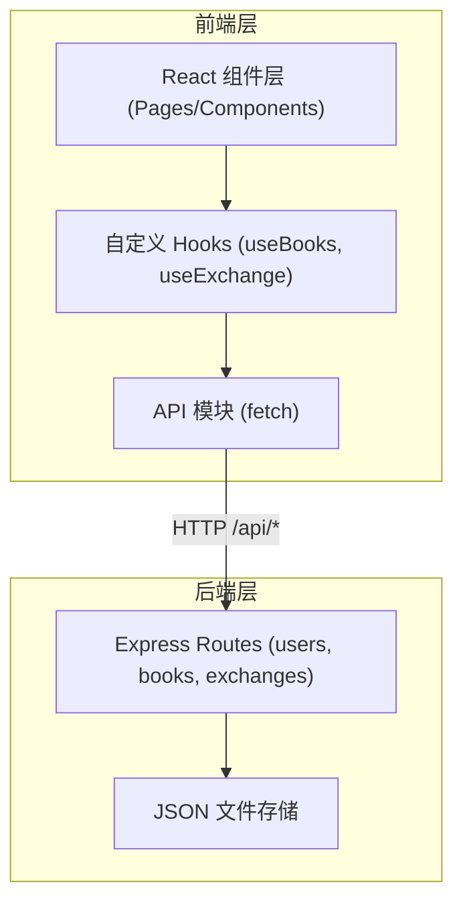
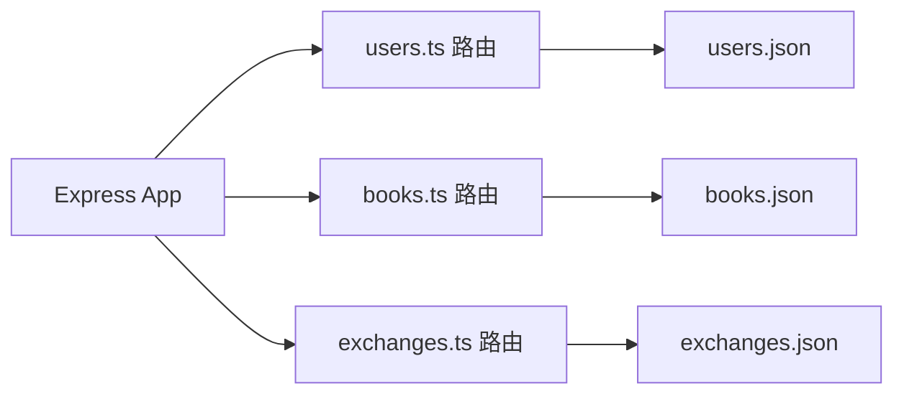

## 1. 架构设计



## 2. 技术说明

- 前端: React@18 + TypeScript + Vite
- 路由: react-router-dom@6
- 后端: Express@4 + TypeScript
- 数据存储: JSON 文件（server/data/）
- 工具库: uuid, dayjs, cors
- 前端开发服务器端口: 3000
- 后端服务端口: 3001
- API 代理: Vite 代理 /api 到 3001

## 3. 路由定义

| 前端路由 | 用途 |
|----------|------|
| /home | 首页 |
| /books | 图书浏览与搜索 |
| /books/:id | 图书详情 |
| /tracker | 漂流追踪 |
| /profile | 个人中心 |
| /login | 登录页 |
| /register | 注册页 |
| /admin | 管理员面板 |

## 4. API 定义

### 用户模块
- POST /api/users/register - 用户注册
- POST /api/users/login - 用户登录
- GET /api/users/:id - 获取用户信息
- PUT /api/users/:id - 更新用户信息

### 图书模块
- GET /api/books - 获取所有图书
- GET /api/books/recent - 获取最近上架图书
- GET /api/books/:id - 获取图书详情
- POST /api/books - 发布图书
- GET /api/books/search?q= - 搜索图书

### 交换模块
- GET /api/exchanges - 获取用户交换记录
- GET /api/exchanges/recent - 获取最近漂流动态
- POST /api/exchanges/request - 创建交换请求
- PUT /api/exchanges/:id/respond - 响应交换请求
- GET /api/exchanges/:id/history - 获取漂流历史
- PUT /api/exchanges/:id/close - 关闭漂流记录（管理员）

### 数据模型定义

```typescript
interface User {
  id: string;
  nickname: string;
  email: string;
  password: string;
  avatar: string;
  points: number;
  isAdmin: boolean;
  createdAt: string;
}

interface Book {
  id: string;
  title: string;
  author: string;
  isbn: string;
  coverUrl: string;
  condition: string;
  ownerId: string;
  createdAt: string;
}

interface ExchangeRequest {
  id: string;
  bookId: string;
  requesterId: string;
  ownerId: string;
  status: 'pending' | 'accepted' | 'rejected';
  createdAt: string;
}

interface ExchangeRecord {
  id: string;
  bookId: string;
  currentHolderId: string;
  previousHolderId: string;
  lentAt: string;
  expectedReturnAt: string;
  returnedAt: string | null;
  status: 'active' | 'completed' | 'closed';
  chain: TransferNode[];
}

interface TransferNode {
  fromUserId: string;
  toUserId: string;
  timestamp: string;
  note: string;
}
```

## 5. 服务端架构图



## 6. 项目文件结构

```
├── package.json
├── vite.config.js
├── tsconfig.json
├── index.html
├── client/
│   └── src/
│       ├── App.tsx
│       ├── main.tsx
│       ├── api/
│       │   ├── index.ts
│       │   ├── users.ts
│       │   ├── books.ts
│       │   └── exchanges.ts
│       ├── components/
│       │   ├── Navbar.tsx
│       │   ├── BookCard.tsx
│       │   ├── TimelineItem.tsx
│       │   └── ...
│       ├── hooks/
│       │   ├── useBooks.ts
│       │   ├── useExchange.ts
│       │   └── useAuth.ts
│       ├── pages/
│       │   ├── HomePage.tsx
│       │   ├── BooksPage.tsx
│       │   ├── BookDetailPage.tsx
│       │   ├── ExchangeTracker.tsx
│       │   ├── ProfilePage.tsx
│       │   ├── LoginPage.tsx
│       │   ├── RegisterPage.tsx
│       │   └── AdminPage.tsx
│       ├── types/
│       │   └── index.ts
│       └── utils/
│           └── index.ts
└── server/
    ├── index.ts
    ├── routes/
    │   ├── users.ts
    │   ├── books.ts
    │   └── exchanges.ts
    └── data/
    │   ├── users.json
    │   ├── books.json
    │   └── exchanges.json
    └── utils/
        └── fileStorage.ts
```

## 7. 性能优化

- 图片懒加载: IntersectionObserver
- 搜索防抖: 500ms 响应时间
- 首屏渲染: <1.5s
- 动画帧率: 30fps+
